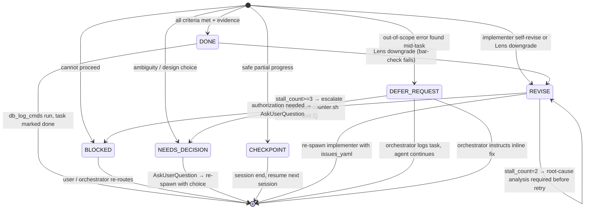

# Completion-Marker Routing State Machine

Full detail behind the completion-marker routing table in `SKILL.md`. Canonical source:
`docs/agents/CONTRACT.md`.

## `status` ↔ `completion_marker` mapping

| `status` value | Expected `completion_marker` | Notes |
|---|---|---|
| `complete` | `## NEXUS:DONE` | All acceptance criteria met, all verifications passing |
| `partial` | `## NEXUS:CHECKPOINT` | Safe resume point reached; remaining work in `notes` |
| `blocked` | `## NEXUS:BLOCKED` | Blocker described in `blockers`; requires user or re-route |
| `needs-decision` | `## NEXUS:NEEDS-DECISION` | `decisions_needed` populated; orchestrator asks user |
| `revise-requested` | `## NEXUS:REVISE` | Actionable issue list required immediately after marker |
| `partial` | `## NEXUS:DEFER-REQUEST` | Out-of-scope error found; orchestrator resolves before continuing |

The `completion_marker` is the **routing field** — the orchestrator routes on
`completion_marker`, not `status`. A mismatch between the two fields is a CONTRACT
VIOLATION; `completion_marker` wins.

## The state machine



**State notes:**
- `DONE → REVISE`: Lens can downgrade a DONE to REVISE when the bar-check fails. The
  original implementer is re-spawned with the Lens issue list.
- `REVISE → REVISE stall cap`: `stall-counter.sh` tracks consecutive REVISE/BLOCKED
  markers per persona per task. At `stall_count=2` it emits an advisory requiring a
  root-cause analysis before retry and mandating a model-tier escalation on the SAME
  persona. At `stall_count>=3` it hard-blocks (exit 2) and escalates to the user.
- `DEFER-REQUEST` is **orchestrator-routed only** — it is intentionally absent from the
  `return-validator.py` marker-detection regex. The orchestrator handles the routing
  logic for DEFER-REQUEST via its own parsing; the return-validator does not validate it
  structurally. See DEFER-REQUEST section below for body requirements.

## NEXUS:REVISE — actionable-detail mandate (anti-stall)

A bare or vague `## NEXUS:REVISE` is a CONTRACT VIOLATION. Every `## NEXUS:REVISE` (from
Lens, lens-fast, or an implementer) MUST be immediately followed — on the next line(s), in
the prose response body, NOT only buried in the JSON — by a list of specific, actionable
issues.

### REVISE issue schema

```yaml
- file: "<path/to/file>"
  line: <line number or range, e.g. 42 or "38-45">
  issue: "<what is wrong — verbatim error message or failing assertion>"
  fix: "<what to change — concrete, not a bare verb>"
```

Each issue MUST carry:
- **WHERE** — `file:line` (or the exact gate name + command, e.g. `tsc exit 1`) so the
  implementer can navigate directly.
- **WHAT** — what is wrong, with the verbatim error message / failing assertion /
  expected-vs-actual.
- **FIX** — what to change. A bare verb (`tsc failed`, `tests broke`, `clean it up`) does
  NOT meet the bar.

Why this is HARD: a detail-less REVISE forces the orchestrator to re-dispatch the
implementer blind, which produces a guess, which REVISEs again — a churn loop. The
actionable list is what the orchestrator re-injects as the re-dispatch context, so the
next attempt is targeted, not a guess.

## NEXUS:DEFER-REQUEST

`## NEXUS:DEFER-REQUEST` is a **canonical governance completion-marker** — orchestrator-
routed (not hook-validated by `return-validator.py`). When an agent discovers an
out-of-scope error mid-task and wants to defer fixing it, they MUST surface that
explicitly with this marker. The response body MUST include:
- The error description (what was found)
- Why it is out of the current task's scope
- Estimated effort to fix in-line vs. defer

The orchestrator then either: (1) **approves the defer** — logs a task, agent continues
with original goal; (2) **instructs inline fix** — agent amends delivery to include the
fix; (3) **escalates to user** — via AskUserQuestion if authorization is needed.

**Default behavior:** if an agent does NOT use this marker but ALSO does not fix a
discovered issue, that is a **CONTRACT VIOLATION** and triggers automatic re-delegation.

## Fallback Output Ladder

The orchestrator grades every `## NEXUS:DONE` return against a three-rung evidence
ladder, **in descending strength**:

1. **JSON block with verbatim `verification_result`** — a fenced JSON block containing a
   `verification_result` key whose value is the *verbatim* terminal output of every
   `verification_required` command (non-empty, non-placeholder). This is the strongest
   form and the form Rule 3 requires.
2. **Verbatim passing code block** — a fenced shell/output block (no JSON wrapper) that
   carries a recognisable PASS signal (`passed`, `no issues`, `exit code 0`, etc.),
   co-occurring with a command echo or a structured result summary. Accepted as fallback
   evidence when the JSON wrapper is absent or unparseable.
3. **Plain `## NEXUS:DONE` with neither** — the marker is present but neither rung 1 nor
   rung 2 evidence appears. This is **UNVERIFIED**: `return-validator.py` fires an
   advisory and the orchestrator MUST NOT accept this DONE without re-checking.

**Narrative is not evidence.** A `verification_result` that reads "all checks passed" in
prose — without the actual command output — is a placeholder (rung 3, UNVERIFIED). The
structural proof is the *terminal text*, not a summary of it.

**Orchestrator obligation.** On receiving a rung-3 DONE, the orchestrator MUST either
obtain the verbatim output from the agent or dispatch Lens to validate. Accepting a
rung-3 DONE at face value is a CONTRACT VIOLATION.

## WARNING — `parallel([...]).filter(Boolean)` silently drops failed returns

When a dynamic Workflow fans out to parallel teammates and the result is filtered with
`.filter(Boolean)` (or any equivalent falsy-drop), a teammate that returns `null`,
`undefined`, `false`, or an empty string is **silently removed** from the result array.
There is **no error, no log entry, and no signal to the orchestrator** that a teammate
was lost.

This means:
- A crashed or context-exhausted teammate produces a falsy return that vanishes without a
  trace.
- The orchestrator sees a shorter result array and may incorrectly infer all K teammates
  completed.
- Partial results (e.g., 3 of 5 files changed) can be treated as a full delivery.

**Brief authors and orchestrators MUST explicitly count returned results against
dispatched count.** If `results.length < dispatched_count`, treat the shortfall as a
blocking failure and surface it as `## NEXUS:BLOCKED` — do not silently proceed with
partial output. When you need to distinguish "teammate returned empty" from "teammate was
dropped," use an explicit sentinel (`{ ok: false, reason: "..." }`) rather than a falsy
return.
