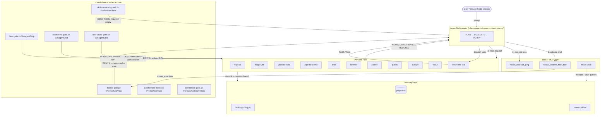

# Nexus Architecture Overview

> One-page orientation. Read this first, then `docs/NEXUS-OPERATING-MANUAL.md` for
> operating detail and `docs/CONSTITUTION.md` for governance.

---

## What Nexus solves

Large Claude Code sessions collapse when the orchestrator both **plans** and **writes** —
context balloons, files diverge, roles blur, and validation is ad-hoc. Nexus enforces a
three-role separation so the orchestrator stays small and every code-touching action is
gateable, attributable, and revertable.

The three roles are hard-wired, not advisory:

| Role | Actor | Capability |
|---|---|---|
| **PLAN** | Nexus orchestrator | Classify work, author briefs, drive the session |
| **DELEGATE** | Nexus → persona sub-agent via `Task` | Write / Edit / NotebookEdit (DENIED to Nexus) |
| **VERIFY** | Lens / lens-fast | Deterministic gates + semantic audit; approves DONE |

Nexus has `Write`, `Edit`, and `NotebookEdit` in its `disallowedTools` — the denial is
mechanical, not advisory. Any source authoring must flow through a delegated persona.

---

## System diagram

---

## Persona ownership

Each persona owns an exclusive write surface. Cross-writes are prevented by design
(`do-not-touch-guard.sh` advisory + the broker registry).

| Persona | Owns | Pairs with |
|---|---|---|
| **forge-ui** | `app/apps/dashboard/src` components, RSC pages, Tremor UI | palette (required), quill-ts |
| **forge-wire** | `app/api/**`, server actions, AI-SDK wiring, DuckDB read-side | quill-ts |
| **pipeline-data** | Polars transforms, DuckDB write pipelines, Pydantic models | quill-py |
| **pipeline-async** | Dramatiq workers, Redis, httpx async clients, AI enrichment | quill-py |
| **atlas** | DuckDB schema (`postgres`), Malloy semantic models | — |
| **hermes** | Auth wrappers, env-var plumbing, MCP server registration, Docker topology | — |
| **palette** | Visual contract, design specs, Tailwind tokens | forge-ui (required) |
| **quill-ts** | TS/TSX tests (vitest + RTL) | forge-ui, forge-wire |
| **quill-py** | Python tests (pytest, Polars fixtures) | pipeline-data, pipeline-async |
| **scout** | Read-only investigation — heavy SocratiCode search, graph, impact | — |
| **lens / lens-fast** | Validation reports only — lint, tsc, semantic RCA | every code-touching persona |

**Escalation is a dispatch-time model override, not a separate persona.** There are
no separate `-pro` agent files (`forge-ui-pro`, `forge-wire-pro`, `pipeline-data-pro`,
`pipeline-async-pro` are RETIRED names) — re-dispatch the SAME base persona with
`model: opus, effort: xhigh` when the task is Complex, when `stall_count > 0`, or
after a Lens `NEXUS:REVISE`.

---

## Broker MCP gate

Every `Task` dispatch is hard-gated by `broker-gate.py` (PreToolUse/Task). The gate
is **FAIL-CLOSED**: a missing or unreadable `broker_state.json` blocks the dispatch
(exit 2) — a down broker is loud, not silently bypassed.

**F1-04 token-authoritative (default).** One `nexus_validate_brief_tool` call per
task/plan mints a TTL-bounded (4h) capability token scoped to the dispatched
persona as a PASS side-effect; that valid token alone is the dispatch evidence — no
per-dispatch notepad/ping repetition, no turn-freshness window. **Rollback flag**
`NEXUS_RITUAL_AUTHORITY=1` (kept 1 release) restores the pre-F1-04 ritual verbatim:

1. `nexus_validate_brief_tool` — validates persona legality + brief JSON; writes `broker_state.json` with `approved:true` and `called_at`.
2. `python3 .memory/log.py notepad list --topic <scope>` then `nexus_notepad_ping` — records `notepad_logged_at`.
3. Issue the `Task` within 300 seconds (DEC-068) of step 1.

**Transition:** a broker server process mints tokens only after it is restarted /
the MCP connection is re-established — set `NEXUS_RITUAL_AUTHORITY=1` until that is
confirmed.

The broker MCP server is `python -m broker.server` (FastMCP, `nexus-broker/src/broker/server.py`).
The vault server is `python -m broker.vault.stdio`. Both are wired in `.mcp.json`.

---

## Memory layer

| File / store | What lives there |
|---|---|
| `.memory/project.db` | Live runtime state — tasks, sessions, decisions, validation log, notepad |
| `.memory/log.py` | CLI for all DB operations: `session start/end`, `task update`, `decision add`, `notepad add/list`, `health` |
| `.memory/.nexus-version` | Single-line installed version string (e.g. `1.14.2`) |
| `.nexus-ledger.json` | `{version, installed_at, updated_at, source}` — stamped by `install.sh` at install/update time |
| `.memory/files/` | Session scratchpad — `progress.md`, `session_state.md`, `broker_state.json`, `reflections/` |
| `.memory/health.py` | Per-tier PASS/WARN/FAIL checks; invoked by `log.py health` |

---

## Hook chain

Hooks fire on Claude Code lifecycle events and enforce the Constitution mechanically.
They are wired in `.claude/settings.json`.

| Hook | Event | Enforcement |
|---|---|---|
| `broker-gate.py` | PreToolUse/Task | **DENY** if brief not validated or state stale |
| `skills-required-guard.sh` | PreToolUse/Task | **DENY** if `skills_required` empty for code-writing persona |
| `persona-alias-resolver.sh` | PreToolUse/Task | **DENY** if retired base name (`forge`, `pipeline`, `quill`) cannot be resolved |
| `parallel-first-check.sh` | PreToolUse/Task | NUDGE — walks the Art. XIII.d threshold ladder |
| `socraticode-gate.sh` | PreToolUse/Bash+Read | **DENY** grep/rg/find until SocratiCode discovery returns results |
| `lens-gate.sh` | SubagentStop | **DENY** DONE without a Lens validation row in project.db |
| `no-deferral-gate.sh` | SubagentStop | **DENY** deferred fix without authorization (Art. XI) |
| `root-cause-gate.sh` | SubagentStop | **DENY** fix-task DONE/REVISE without `## Root Cause Analysis` |
| `secret-path-guard.sh` | PreToolUse/Write+Edit | **DENY** writes to `.env`, `*.pem`, `*.key`, etc. |
| `precompact-reinject.py` | PreCompact | Re-injects role line + Constitution headings + open tasks after compaction |
| `health-banner.sh` | SessionStart | Surfaces FAIL/WARN checks on session open |

---

## Session-branch commit-as-checkpoint

Nexus works directly on the **session branch** — the branch active when the session
started, detected via `git branch --show-current`. This may be `main` or any other branch;
it is never hardcoded. The model:

- **One commit per task** is the revertable checkpoint. No per-task feature branches,
  no PR-for-merge ceremony. A registered DEC-008 worktree per leg is the DEFAULT
  isolation for parallel multi-part work (RDEC-018 Option 3); a single indivisible
  task stays on the session branch with no worktree.
- **Sub-agents commit** on the session branch but do **not push** — only the orchestrator
  or the user pushes (an explicit user-authorized bypass token allows a sub-agent push).
- **REMOTE/PRODUCTION deploy** is a human handoff: the orchestrator stops and a human
  approves the release (Constitution Art. XII/XIV). A LOCAL `docker compose up --build`
  / restart to verify already-committed code is part of verification and needs no handoff.

---

## Completion markers

Six canonical markers are returned by personas and interpreted by Nexus:

| Marker | Meaning | Nexus action |
|---|---|---|
| `## NEXUS:DONE` | Work complete and verified | Accept only when DONE bar is fully met |
| `## NEXUS:REVISE` | Lens found issues | Re-spawn implementer (cap 3 iterations) |
| `## NEXUS:BLOCKED` | Persona cannot proceed | Re-route or escalate to user |
| `## NEXUS:NEEDS-DECISION` | Choice requires user/orchestrator | `AskUserQuestion`; log decision; re-spawn |
| `## NEXUS:CHECKPOINT` | Pause point mid-work | Write checkpoint to `.memory/`; resume next session |
| `## NEXUS:DEFER-REQUEST` | Persona proposes deferring an item | Deferral is mid-task only; item must be resolved or tracked before completion |

The DONE bar: (1) verbatim `verification_result` is present and passing (`rtk tsc` + `rtk lint` for TS; `uv run ruff check` for Python); (2) every `acceptance_criteria` item is `acceptance_met: true`; (3) a `validation_log` row from `agent_validated='lens'` exists in `project.db` for code-touching Simple+ tasks.

---

Companion references: `docs/NEXUS-OPERATING-MANUAL.md` · `docs/CONSTITUTION.md` · `docs/ORCHESTRATOR-GATES.md`
