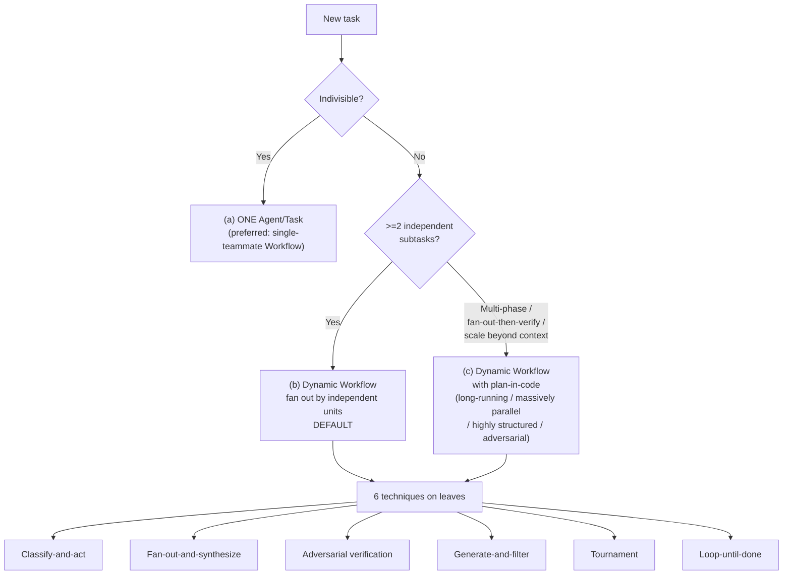
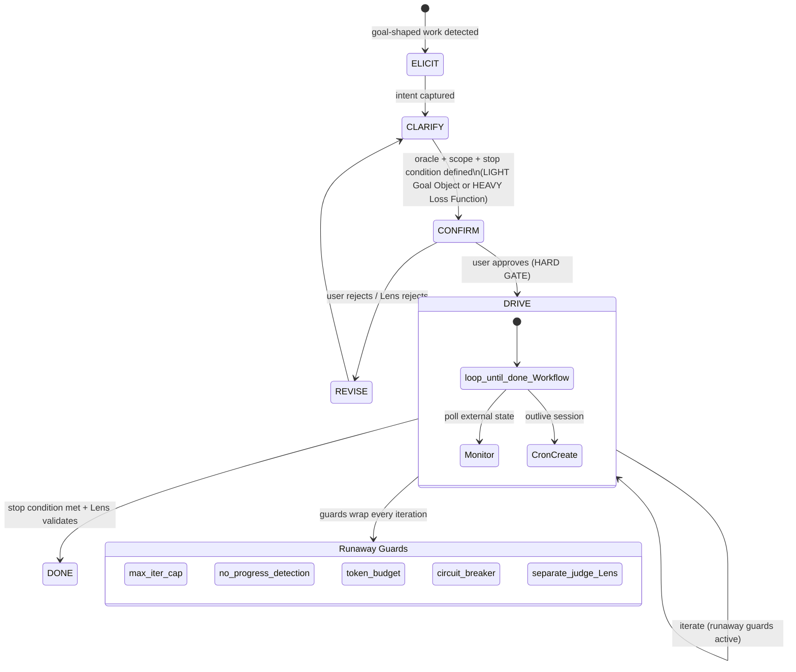
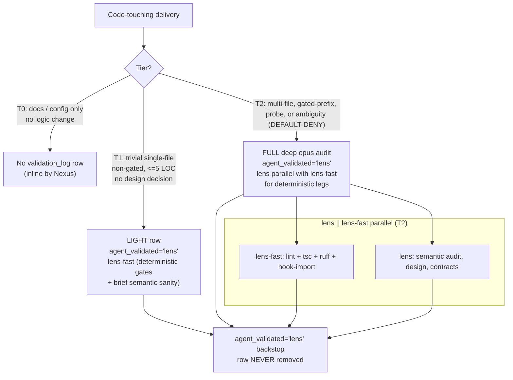

# Project Constitution

**Version:** 1.1  
**Date:** 2026-05-30  
**Authority:** Highest governance document. Supersedes all `docs/`, nested `CLAUDE.md` files, and agent contracts when they conflict. Only `project.db` has higher precedence (live runtime state).

---

## Article I — Spec-First Mandate

No implementation begins without a spec file at `docs/features/FEAT-XXX.md` that satisfies all of:
- User stories with GWT acceptance criteria written and accepted
- No `[NEEDS CLARIFICATION]` markers remaining
- Constitution check checklist completed (all 14 articles)

**Gate:** `python3 .memory/log.py planning-gate check --feat FEAT-XXX` must return PASS.

**Verification gating is non-bypassable for Simple+ tier.** Every Simple, Standard, and Complex task MUST pass Lens validation before the task is marked done. The Trivial tier (≤1 file, ≤5 LOC, no logic change, no design decision) is exempt from Lens gating — handled inline by Nexus and audit-logged via `context snapshot --action-type trivial-fix`. Trivial-tier tasks MUST NOT touch production logic; if any logic change is discovered, the tier MUST be promoted to Simple and Lens dispatched.

---

## Article II — Test-First Imperative

Test stubs written by Quill and confirmed failing *before* Forge or Pipeline write production code.

**Exception:** Integration tests requiring a live external service (e.g. a remote API or observability backend) may follow implementation stubs but must be confirmed passing before the task is marked done.

**Gate:** Planning gate item 7 — test file existence check.

---

## Article III — SocratiCode-Before-Planning

Semantic search run before any multi-file design decision. The file watcher keeps the index current — this gate means *searching*, not re-indexing.

**Exempt:** Single-file changes with completely obvious scope.

**DEC-027 — Free grep for non-code-writing actors.** The `socraticode-gate.sh` enforcement exempts non-code-writing actors — the orchestrator (nexus), scout, lens, lens-fast, and palette — from both grep and Read blocking (exit 0 short-circuit before either mode). Code-writing personas (forge-*, pipeline-*, atlas, hermes, quill-*, and every `-pro` variant) still hit the gate.

---

## Article IV — Schema Lock

DuckDB schema documented in the feature spec before any ingestion or query code begins. Schema section must contain the DDL (`CREATE TABLE` statements).

---

## Article V — Type Safety

Before any task is marked done:
- TypeScript: `rtk tsc` → zero errors
- Python (ingestion `src/`): `uv run ruff check src/` → zero warnings
- Hook files (`.claude/hooks/*.py`, `.claude/hooks/*.sh` with Python bodies): `python3 -m py_compile` and `bash -n` on every touched file
- Broker source (`nexus-broker/src/`): `uv run ruff check` (run from `nexus-broker/`)

No exceptions for "just a quick fix."

---

## Article VI — Single Writer

DuckDB has exactly one writer process at any time. Ingestion workers are the sole writers. The Next.js app connects in read-only mode. This is a data-integrity constraint, not a style preference.

---

## Article VII — Context Preservation

Sub-agents receive file-based briefs and write file-based outputs. Agents must not rely on conversation context from prior turns or sessions. All durable state lives in files or `project.db`.

---

## Article VIII — Constitution Check

Every feature plan includes an explicit 14-article checklist before tasks are generated. No article may be skipped as "not applicable" without written justification in the spec.

A spec template (available in the Plexus meta-repo at `docs/templates/SPEC_TEMPLATE.md`) includes the checklist; it is not shipped with the installed Nexus package.

---

## Article IX — Idempotency

All data pipeline operations (ingestion, DuckDB writes, parquet generation) are safe to re-run without corrupting state. Use `INSERT OR REPLACE` patterns. No destructive-only operations.

---

## Article X — Root Cause Mandate

Every error-fix response MUST state a root cause — the true underlying cause, not just the symptom. A fix that resolves the symptom but not the cause is a contract violation. The depth of the why-chain is at the fixer's discretion; there is **no mechanical minimum count**. When uncertain whether the root cause has been found, continue investigating — do NOT mark the task done. If the architectural pattern that allowed the bug class to recur is identified, it must be flagged AND addressed before the task closes. The orchestrator OR Lens MAY demand a deeper pass on recurring or high-severity fixes.

**Enforcement:** `root-cause-gate.sh` is ADVISORY-only on why-chain depth (exit 0 always for count). Persona-aware exemption: `scout`, `lens`, `lens-fast`, and `palette` personas are fully exempt on `REVISE` or `BLOCKED` markers — the gate returns 0 immediately for them.

**Violation:** Closing a task with a symptom-only fix — no root cause stated at all — is a contract violation. Nexus must reject the delivery and return it to the implementing agent.

---

## Article XI — No Deferral of Discovered Errors

When an agent (Scout, Forge, Pipeline, Hermes, Atlas, Lens, Quill, Palette) or the Nexus orchestrator discovers an error, anomaly, or contract violation while doing other work, that issue MUST be fixed immediately in the same delivery. Filing it as a follow-up task is FORBIDDEN unless the user explicitly authorizes the defer via AskUserQuestion. The default is FIX, not FILE.

**Enforcement:** The `no-deferral-gate.sh` SubagentStop hook blocks (exit 2) a fixing-agent return that contains a deferral-of-a-fix phrase without a sanctioned `## NEXUS:NEEDS-DECISION` marker or explicit user authorization.

**No deferral beyond task completion (DEC-005).** Deferral is permitted mid-task, but a task MUST NOT be marked complete while any item it surfaced is unresolved. Completion requires a deferral sweep: every surfaced item is either resolved inline OR converted to an explicit user-visible tracked task (native `TaskCreate`, mirrored to `project.db`). Noted-for-later without a tracked task is forbidden.

**Violation:** A follow-up task created without explicit user authorization is a contract violation. Nexus must reopen the deferring task and require the fix in the current delivery.

---

## Article XII — Visual & End-to-End Verification Gate

"Tests pass" is not done. Done requires evidence at the real process boundary:

- **UI changes:** an `aside repl` screenshot showing the before AND after state, included in the PR body or implementation response. Capture with `const p = await openTab(url); await p.screenshot({path: '/absolute/before.png'}); /* change */ await p.screenshot({path: '/absolute/after.png'});` (load `Skill aside-browser`). Set `verification_result.screenshot_before`/`screenshot_after` to those absolute paths.
- **API changes:** an end-to-end invocation (curl, `aside exec`, or equivalent that exercises the real code path including process boundaries), with the result included in the response.
- **Container/Dockerfile changes:** a successful `docker build` + container start + in-container smoke test (e.g., `docker exec ... grep` to confirm the new code is mounted), with the output included in the response.

Tests that mock the boundary they validate (e.g., mocking `child_process` to test a shell-out) do NOT satisfy this gate.

**"Deploy" means REMOTE/PRODUCTION release — local container rebuilds are VERIFICATION, not deploy.** A "deploy" that triggers the human handoff is a *remote/production release*: publishing, shipping, pushing to a remote host or registry, or migrating a production database. Rebuilding or restarting the **LOCAL** dev stack to apply already-committed code is **NOT** a deploy — it is part of satisfying THIS verification gate. Under the user's standing authorization for local dev stacks, the orchestrator and personas MAY run `docker compose up --build`, `docker compose restart`, `docker compose down && docker compose up`, etc. directly against the LOCAL stack to verify their work, **WITHOUT** a human deploy-step handoff. The Article XIV deploy-step human handoff applies ONLY to remote/production releases.

**Violation:** Marking a task done without the required evidence is a contract violation. Nexus must re-open and require the screenshot, curl output, or smoke test before closing.

**Enforcement (DEC-037):** `visual-evidence-gate.sh` (SubagentStop, deny-capable) blocks any UI/API-touching `## NEXUS:DONE` that lacks the required evidence. Accountable skip: set a non-empty `verification_result.visual_skip_reason` to allow with an explicit on-record justification.

> *DEC-037 (2026-06-26):* `agent-browser` is REPLACED by `aside` (CLI exec/repl + mcp) as the canonical browser/screenshot tool. The Article XII visual gate is now ENFORCED by `visual-evidence-gate.sh` (SubagentStop, deny-capable, accountable-skip via `visual_skip_reason`). Supersedes DEC-036's drop of the unguarded rule.

---

## Article XIII — Parallel-First Orchestration (workflow-first)

**Parallelism by default.** Any task with **≥2 independent steps** dispatches as a **dynamic Workflow** by default. Where no Workflow is authored, **parallel subagents are preferred over sequential single dispatches**. A lone serial single-Agent dispatch is reserved ONLY for a truly **indivisible** atomic task — one the orchestrator can confirm in writing cannot be further split. Sequential single-agent dispatch is FORBIDDEN for any task with ≥2 independent steps unless the orchestrator names in writing the real dependency that requires serialization.

Raw multi-`Task` fan-out in a single tool block is the **deprecated legacy shape** (superseded by the Workflow primitive); it survives ONLY as the **≥3 read-only Scout recon** exception — Scouts probing different angles (architecture, data flow, recent commits, related code), the canonical investigation pattern.

**Structural backstop (load-bearing — never remove).** A Lens verdict ROW (agent_validated='lens' in validation_log) MUST exist before NEXUS:DONE on any code-touching work. A **LIGHT** row (T1) suffices for trivial single-file non-gated changes; a **FULL** deep audit (T2) is required for multi-file or gated-prefix changes. This row is NEVER omitted — it is what makes Workflow-by-default safe.

**Violation:** A sequential dispatch where parallelism was possible — without a written dependency justification — is a contract violation. The orchestrator must acknowledge the violation in the next session retrospective and log a lesson via `python3 .memory/log.py lesson add`.

---

## Article XIII.b — Homogeneous Persona Fan-Out — prefer diversity, no numeric cap

Formalizes the homogeneous case of Article XIII: when the same persona is dispatched K times against disjoint slices of one problem, all K briefs MUST share a `parallel_group_id` and MUST be dispatched in one tool block. This is the **K copies of the same persona** pattern (the heterogeneous case — N different personas — is covered by Article XIII itself).

- **Fan-out width:** dispatch one agent per independent unit, as wide as the work warrants. Homogeneous fan-out has NO numeric cap. Prefer **diverse personas** over identical clones — shared bias and coordination overhead are the real diminishing return, not an API limit. Where diversity is not possible (truly homogeneous work), widen freely; the harness allows ~16 concurrent agents (rest-queue beyond that, no failure) up to 1000 per run / 4096 per call. Add a separate Lens verify phase.
- **Disjoint slices:** Each brief MUST carry a non-overlapping `file_scope` (or equivalent slice key — gate, domain, angle). Overlap = race condition.
- **Deterministic merge:** Nexus reduces the K returns via a deterministic merge step (concatenation by slice key, set-union of `files_changed`, MIN-status across completion markers). LLM-based reduction is NOT the default — only invoked when the slice outputs are semantically interdependent and a Scout flags it.
- **Examples:**
  - K×Lens fanned by gate (lint / tsc / test / semantic) or by domain (app/ vs ingestion/).
  - K×Scout probing K independent investigation angles (architecture, data flow, recent commits, dependencies).
  - K×Quill writing tests against K independent modules with no shared fixtures.

**Violation:** Dispatching K homogeneous briefs in separate messages, or omitting the shared `parallel_group_id`, or running a non-deterministic merge by default — each is a contract violation. The orchestrator must re-issue the fan-out in one tool block and log the violation via `python3 .memory/log.py lesson add`.

---

## Article XIII.c — Worktree Isolation for Parallel Code-Writing Teammates

**Scope: Target.**

The DEFAULT is session-branch development with NO git worktrees (Article XIV): code-writing personas dispatched for the same work coordinate on the session branch, and read-only personas (Scout/Lens) share the tree.

- **Worktree isolation is the EXCEPTION, not the default.** IF worktree isolation is ever used for parallel code-writing teammates with truly conflicting writes, each teammate runs in its own worktree on branch `feat/<slug>`, and the isolation **MUST** carry an automatic **merge-back-and-remove** rule: on teammate completion the orchestrator auto-merges the branch to the integration line and auto-deletes the branch/worktree. **No orphan worktree or branch may survive a completed teammate.** If that auto-merge-back+remove guarantee cannot be met, do NOT use a worktree — fall back to disjoint-file partitioning on the session branch.

  > *Advisory (DEC-008):* when a Workflow owns parallel code-writing with truly conflicting file sets, worktrees can prevent merge races. The guarantee is: auto-merge-back + auto-delete the worktree/branch as a mandatory final phase. Without that guarantee, fall back to disjoint-file partitioning. No hook enforces this today — it is an orchestrator self-discipline rule (tracked as a code follow-up).

- **Independent grading:** SubagentStop gates (`lens-gate`, `root-cause-gate`, `no-deferral-gate`) MUST scope their checks to each teammate's own `files_changed`/branch, so concurrent teammates are graded independently and one teammate's edits never fault another.

---

## Article XIII.d — Workflow-First Dispatch Mandate

**Scope: Target.**

Extends Article XIII from a single threshold to a **WORKFLOW-FIRST** dispatch model (DEC-020/022/023/024/025): the orchestrator matches the **TASK SHAPE** to an orchestrator-invocable **primitive**, names the six techniques it chooses among, and OWNS the goal for goal-shaped work. The `>=2`-independent-subtasks rule of Article XIII, the homogeneous-diversity nudge of Article XIII.b (no numeric cap), and the worktree-isolation rule of Article XIII.c are PRESERVED; this article makes the **Workflow the DEFAULT for `>=2` independent subtasks** (not just for multi-phase work) and adds the primitive taxonomy + goal model + runaway guards below.

**Primitive taxonomy (dispatch is primitive-by-SHAPE, not count).** The orchestrator runs on a DENYLIST — `Workflow`, `Monitor`, `CronCreate`/`CronDelete`/`CronList`, `Agent`, and `Task*` are NOT denied, so they are AVAILABLE, and they are in `permissions.allow` so they run prompt-free. Choose by shape:
- PARALLEL / independent / fan-out / audit / migration / debate → the **Workflow** tool.
- ITERATE until a VERIFIABLE goal (tests pass / gate green / metric threshold / no new findings) → a **loop-until-done Workflow** (emulates `/loop`).
- POLL / react to EXTERNAL state you don't control (CI, deploy, PR, logs, remote queue) → **Monitor** (poll with a stop condition).
- OUTLIVE-the-session / recurring → **CronCreate** (session, <=7-day) or `RemoteTrigger`/Routines (durable).
- Single INDIVISIBLE task → ONE **Agent**/**Task**.
- Discovery / quick question → **inline** (no dispatch).

**Threshold ladder.**



*Diagram id: dispatch-ladder*

*(Softened by the prefer-workflows preference below: even at rung (a) a Workflow is PREFERRED — never forced — for the Lens-review / monitorability / coordination it buys.)*

- **(a) Single INDIVISIBLE task → ONE `Agent`/`Task`, or (PREFERRED) a single-teammate dynamic Workflow.** A lone `Agent`/`Task` remains valid and cheapest, but PREFER wrapping even a single, simple delegated task in a Workflow when you want a built-in Lens review stage, a monitorable run, and the option for agents to coordinate. The preference is advisory, never mandatory; keep fan-out width modest so the Workflow overhead does not waste tokens on trivial work.
- **(b) `>=2` INDEPENDENT subtasks → a dynamic WORKFLOW (the DEFAULT).** Threshold: two or more subtasks that need no output from each other. Author a Workflow rather than firing sequential single dispatches. Dispatch one agent per independent unit, as wide as the work warrants (Article XIII.b). Raw multi-`Task` fan-out in one tool block is the **deprecated legacy shape** (superseded by the Workflow primitive); it survives ONLY as the `>=3` read-only Scout recon exception of Article XIII.
- **(c) MULTI-PHASE work / fan-out-then-verify / scale beyond one context → dynamic WORKFLOW.** Threshold: the work has more than one phase (fan-out THEN synthesize, or generate THEN adversarially verify), OR needs more agents than one conversation can coordinate — move the plan into code. The crossover signal is any of **long-running, massively parallel, highly structured, and/or adversarial**: when ANY apply, the script holds the loop/branching/intermediate-results and the conversation sees only the final answer.

**Goal model (HARD GATE for goal-shaped work — DEC-023/025).** When the work is an open-ended outcome rather than a single named change, the orchestrator OWNS the goal: **ELICIT** the intent (a sharp clarifying question if it is absent or vague — typed ambiguity = missing-goal / missing-premises / ambiguous-terminology) → **CLARIFY** it into a VERIFIABLE oracle + scope + stop condition (tiered, DEC-025: **LIGHT** = a Goal Object `{success_criteria, acceptance_checks, non_goals, open_questions}` for in-session iterate-until-done, the default; **HEAVY** = a LOSS FUNCTION for long-running autonomous eval-driven loops) → **CONFIRM** with the user ONCE BEFORE driving (a HARD GATE; in fully-autonomous ticks a SEPARATE critic — Lens — reviews instead) → **DRIVE** to completion with orchestrator-invocable primitives ONLY. The orchestrator NEVER recommends a user slash-command: `/goal`/`/loop`/`/effort` are USER-only controls and the orchestrator EMULATES them (loop-until-done Workflow / Monitor / Cron).



*Diagram id: goal-model-lifecycle*

**Runaway guards (MANDATORY on any iterate-until-goal or poll loop).** A **max-iteration cap**; **no-progress detection** (halt on identical errors / empty diffs / recurring fails N times); a **token/$ budget**; a **circuit-breaker** (rate-based halt + escalate); and the **separate-judge** principle — *the model that stopped working never decides it is done* (= the Article XIII.d Adversarial-verification / Lens mandate; for HEAVY goals, blinded holdout acceptance). Mapping: instruments = the verification gates; judge = Lens; iteration log = lessons + the feedback system; failure-boundary memory = lessons.

**Decompose algorithm.** (1) Identify the work-list — one unit per callsite / failing test / module / source / candidate; if indivisible, stop and use ONE Agent. (2) Test independence — if any unit needs another's output it is NOT parallel-safe (sequential or pipeline). (3) Choose pipeline (DEFAULT, no barrier) vs a hard parallel barrier (only when stage N needs ALL of stage N-1). (4) Write each unit's brief explicitly (objective, output schema, allowed tools/sources, hard boundaries). (5) Dispatch one agent per independent unit, as wide as the work warrants; prefer diverse personas over identical clones; never exceed runtime caps (~16 concurrent, 1000/run, 4096/call). (6) Add a verify/critic phase as a SEPARATE agent. (7) Synthesize/merge at the barrier, then a completeness critic (no-deferral check). (8) For unknown-size work, loop-until-dry on an explicit stop condition with a mandatory max-iteration cap.

**The six techniques (verbatim names — choose by shape, not by count):**
- **Classify-and-act** — a classifier agent decides the KIND of task, then routes to different agents/behavior. Trigger: branching-on-type, not scale.
- **Fan-out-and-synthesize** — split into many independent steps, run an agent on each in parallel, then a synthesize barrier merges the structured outputs. Trigger: truly independent subtasks that exceed one context window. (This is the local `>=2`-independent-subtasks mandate.)
- **Adversarial verification** — for each producing agent, a SEPARATE agent attacks its output against a rubric from a diverse viewpoint — never self-review. Gate on risk, not count. (This is the local mandatory Lens validation.)
- **Generate-and-filter** — generate many candidates, then dedupe and keep only the best after rubric/verification filtering. Trigger: breadth THEN quality.
- **Tournament** — N agents each attempt the SAME task differently; judges compare pairwise through a bracket until one winner remains. Trigger: one hard problem worth N attempts plus judging.
- **Loop-until-done** — for unknown-size work, loop spawning agents until a stop condition ("no new findings" / "no more errors") is met, with a mandatory max-iteration cap.

**Violation:** Collapsing multi-phase or fan-out-then-verify work into a single sequential dispatch where the ladder requires a Workflow — without a written dependency justification — is a contract violation. The orchestrator must re-author the work as the matching technique and log a lesson via `python3 .memory/log.py lesson add`.

**Prefer-Workflows preference.** Across the whole ladder, PREFER authoring a Workflow when delegating, **even for a single or simple task** — a Workflow gives you a built-in Lens review stage, a monitorable run, and lets agents coordinate, all of which are valuable below the strict `>=2`-independent-subtask threshold of rung (b). This is a **preference, never a mandate**: a lone `Agent`/`Task` is still correct and choosing one is NOT a violation. The countervailing constraint is **token economy** — keep fan-out width appropriate to the work; the diversity nudge of Article XIII.b (prefer diverse personas over identical clones) applies to any fan-out, and the preference should never devolve into wide, wasteful parallelism on trivial work.

**DEC-030 (advisory) — Verification phases decompose into bounded parallel agents; no monolithic barrier.** A verification or heavy-gate phase MUST be decomposed into **several bounded parallel agents** (e.g. lint / unit-tests / hook-import / snapshot-consistency) — NEVER one agent running the full gauntlet serially. The **single heaviest release gate** (e.g. `build_snapshot --check`, full pytest — multi-minute) runs at the **orchestrator level via backgrounded Bash**, NOT inside a workflow agent. Each agent carries a stall/time budget — on expiry, kill and escalate; never retry indefinitely. **Repair loops re-run ONLY the failed leg**, never the full gauntlet. **No redundant gates** (`build_snapshot --check` already runs pytest — do not also schedule a full suite run). Parallelism applies to the verify phase exactly as it does to the impl phase.

> *Advisory note (DEC-030, 2026-06-25):* no hook enforces verify-decomposition today — this is an orchestrator self-discipline rule. Enforcement is a tracked code follow-up.

---

## Article XIV — Session-Branch Development & Deploy-Step Handoff

Nexus personas develop **directly on the branch the session was created from** — the current/active branch at session start. The working branch is **dynamic, detected at runtime** via `git branch --show-current`; it MAY be `main` OR any other branch (some projects are worked off a non-main branch). The working branch is NEVER hardcoded. There are **NO** new per-task feature branches, **NO** git worktrees, and **NO** pull-request-for-merge ceremony — all work stays on the session branch.

- **Commit-as-checkpoint.** ONE focused commit per completed task IS the checkpoint. Every commit is revertable, so divergent history is unnecessary — to undo a task, revert its commit. There is no new branch to merge and nothing to clean up.
- **Who pushes.** Only the **orchestrator or the user** pushes the session branch. A sub-agent COMMITS on the session branch but does NOT push it — it commits and lets the orchestrator (or the user) push. An explicitly user-authorized sub-agent push is the only exception, gated by an explicit bypass token.
- **Parallel personas.** Code-writing personas dispatched for the same work coordinate on the session branch — no per-persona worktree, no per-persona divergent branch. Read-only personas (Scout, Lens) share the same tree.
- **Version stamps.** At install/update time, `install.sh` writes `.memory/.nexus-version` (single-line version string) and `.nexus-ledger.json` (JSON with `version`, `installed_at`, `updated_at`, `source`). When asked "what version am I on?", read `.memory/.nexus-version`.
- **Verification before done.** Lens VERIFIEs every code-touching delivery before the orchestrator marks `## NEXUS:DONE`. This bar is unchanged by the session-branch model.
- **Deploy-step human handoff (REMOTE/PRODUCTION releases only).** The orchestrator **STOPS at the REMOTE/PRODUCTION deploy/release step** — publish, ship, push to a remote host or registry, or migrate a production database — and hands off to a human, who approves the release. Nexus never performs a *remote/production* deploy autonomously. This human handoff is the merge/release gate — it replaces any pull-request-merge step. It does **NOT** fire for a LOCAL container rebuild/restart used to verify already-committed code (Article XII): the orchestrator and personas MAY run `docker compose up --build` / `restart` / `down && up` against the LOCAL dev stack directly, with no handoff, under the user's standing local-dev authorization.
- **Deploy-step block as handoff/verification artifact.** Every implementation response touching deployable code ends with a `## Deploy step` block naming the restart action and verification command. It targets the current session-branch HEAD (no branch line). For a LOCAL rebuild/restart it is the runbook the verifying agent executes directly (no handoff); for a remote/production release it is additionally the on-disk artifact the human uses to approve and ship.

**Completion markers.** Sub-agent returns use the following canonical markers (governance-level, orchestrator-routed — not validated by a hook):

| Marker | Meaning |
|--------|---------|
| `## NEXUS:DONE` | Delivery complete, all acceptance criteria met |
| `## NEXUS:BLOCKED` | Cannot proceed; blocker named |
| `## NEXUS:NEEDS-DECISION` | Requires orchestrator or user decision before continuing |
| `## NEXUS:CHECKPOINT` | Partial delivery; resumable |
| `## NEXUS:REVISE` | Return to implementing agent with feedback |
| `## DEFER-REQUEST` | Authorized deferral of a surfaced item to a tracked task |

`DEFER-REQUEST` is a canonical governance marker. It is NEVER deleted. It marks an authorized deferral (explicit user or orchestrator approval) and the tracked task reference that replaces inline resolution. See `docs/CONTRACT.md` for the completion-marker diagram.

**Violation:** Creating a new per-task feature branch or a git worktree, pushing the session branch from a sub-agent without an explicit user-authorized bypass token, or deploying without the human deploy-step handoff — each is a contract violation. The orchestrator must remove the orphan branch/worktree, restore work to the session branch, and re-route the deploy decision through the human handoff.

---

## Lens Verification Tiers



*Diagram id: lens-verification-flow*

**Tier selection rules:**
- **T0** — documentation or config-only change, no logic. No lens row needed.
- **T1** — trivial single-file non-gated change (≤1 file, ≤5 LOC, no logic change, no design decision). A LIGHT lens row is sufficient. `lens-fast` runs the deterministic gates + a brief semantic pass.
- **T2** — multi-file changes, gated-prefix paths, probes, or any ambiguity about scope. FULL deep opus audit required. **Default-deny**: when tier is unclear, T2 is assumed.

**The `agent_validated='lens'` backstop** (structural load-bearing — never removed): a Lens verdict row with `agent_validated='lens'` in `validation_log` MUST exist before `## NEXUS:DONE` on any code-touching work. Even a T1 LIGHT row uses this field. Removing this row as "overhead" is a contract violation (Article XIII, structural backstop).

---

## Goal-Model Operational Checklist

Use this checklist whenever the work is goal-shaped (open-ended outcome, not a single named change).

### ELICIT

Confirm the goal is specific enough to drive. If absent or vague, ask ONE sharp clarifying question. Typed ambiguity checklist:
- Missing goal: "make it better" — ask what "better" means, measured how
- Missing premises: task assumes a constraint that may not hold — surface it
- Ambiguous terminology: a word with two plausible meanings — pin it

### LIGHT Goal Object (JSON template)

```json
{
  "success_criteria": "What a passing state looks like — specific, observable",
  "acceptance_checks": ["check 1", "check 2"],
  "non_goals": ["What is explicitly out of scope"],
  "open_questions": ["Anything still unclear after ELICIT"]
}
```

Use a LIGHT Goal Object for in-session iterate-until-done work (the default). Use a HEAVY Loss Function (`Skill nexus-loss-function`) only for long-running autonomous eval-driven loops.

### CONFIRM (HARD GATE)

Present the Goal Object to the user for approval ONCE BEFORE driving. Phrasing template:

> "Here is the goal I'll drive to: [paste Goal Object]. Does this match your intent? Any corrections before I start?"

In fully-autonomous ticks (no interactive user), a SEPARATE Lens critic reviews the Goal Object instead.

### DRIVE

Choose the orchestrator-invocable primitive that matches the shape:
- iterate-until-done → loop-until-done Workflow
- poll external state → Monitor
- outlive session → CronCreate

Attach ALL runaway guards before launching: max-iteration cap, no-progress detection, token/$ budget, circuit-breaker, separate Lens judge.

Do NOT recommend `/goal`, `/loop`, or `/effort` to the user — EMULATE them.

---

## Appendix: Completion Marker Reference

The canonical completion markers (`## NEXUS:DONE`, `## NEXUS:BLOCKED`, `## NEXUS:NEEDS-DECISION`, `## NEXUS:CHECKPOINT`, `## NEXUS:REVISE`, `## DEFER-REQUEST`) and their interaction diagram live in `docs/agents/CONTRACT.md`. This Constitution references them; do not redraw the diagram here.
