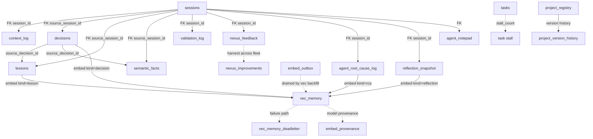
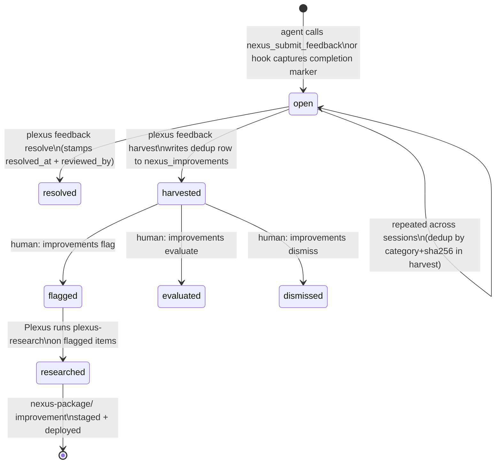

# Nexus Memory — Schema Reference

> Source of truth: `.memory/schema.sql` + `.memory/log.py`.
> This document describes every table in `project.db`, their relationships, and the DEC-019 feedback lifecycle.

---

## Table Overview

| Table | Kind | Written by | Purpose |
|---|---|---|---|
| `sessions` | Core | `log.py session start/end` | One row per Claude Code session; carries summary, branch, next_step |
| `tasks` | Core | `log.py task add/update` | Work items (TASK-NNN); synced from native TaskCreate via mirror hook |
| `decisions` | Logical-key | `log.py decision add` | Architecture decisions (DEC-NNN); bi-temporal versioning |
| `feature_specs` | Logical-key | `log.py feature add/update` | Feature tracking (FEAT-NNN) with spec_path and task list |
| `context_log` | Append-only | `log.py context snapshot` | Action-trail entries linked to a session; used for continuity |
| `lessons` | Logical-key | `log.py lesson add/validate` | Self-correction insights; unvalidated by default; injected at SessionStart when validated |
| `semantic_facts` | Logical-key | `log.py fact add` | Long-lived project knowledge (e.g. API shape constants); pinned facts never decay |
| `procedures` | Logical-key | `log.py procedure add` | Reusable multi-step workflows; trust-scored via success_count / fail_count |
| `agent_notepad` | Rolling window | `log.py notepad add` | Per-topic rolling 5-entry shared context between phased-task agents |
| `agent_root_cause_log` | Append-only | `log.py rca add` | RCA why-chains; also embedded into `vec_memory` (kind=rca) |
| `reflection_snapshot` | Append-only | `log.py reflection add` | Audit trail of spec/decision/constitution edits; also embedded into `vec_memory` (kind=reflection) |
| `validation_log` | Append-only | `log.py validation add` (lens-gate hook) | Lens review rows; `lens-gate.sh` queries this before allowing NEXUS:DONE |
| `nexus_feedback` | Append-only | `log.py feedback add` or MCP tool | Per-project friction log; harvested across the fleet by Plexus |
| `vec_memory` | Virtual (vec0) | `log.py` embed paths | HNSW semantic index; 1024-dim L2-normalized embeddings (mxbai-embed-large-v1) |
| `vec_memory_deadletter` | Append-only | `log.py` (embed failure) | Rows that could not be embedded; drained by `log.py vec backfill` |
| `embed_outbox` | Transactional | `log.py` (OPT-055) | Atomic intent-to-embed marker; prevents silent gaps between relational write and vec write |
| `embed_provenance` | Upsert | `log.py` (OPT-055) | Records which embed model + dim produced each vec row; auto-re-enqueues stale rows on model swap |
| `nexus_improvements` | Upsert | `log.py improvements populate` | Improvement backlog from distilled research notes; Plexus-side only |
| `project_registry` | Upsert | `log.py registry add/update` | Plexus fleet registry: one row per installed project |
| `project_version_history` | Append-only | `log.py registry add/update` | Immutable install/update history per project path |

---

## Table Details

### sessions

**Purpose:** bookends each Claude Code session. The SessionStart hook calls `session start`; SubagentStop calls `session end` (or `session reset` for handoffs). The `context_json` column is a free-form JSON snapshot of important state at session close.

Key columns:
- `id` — `S<YYYYMMDD>-<HHMMSS>` format
- `branch` — default `main`; set to the working branch at start
- `user_message_count` / `last_reset_at` — maintained by the context-reset-monitor hook
- `next_step` — carries intent forward to the next session's banner

### tasks

**Purpose:** work-item tracking. Auto-increments via TASK-NNN ids. Also receives native TaskCreate/TaskUpdate events via `task mirror-native` (task-db-mirror hook).

Key columns:
- `status`: `todo | in_progress | done | blocked | cancelled`
- `priority`: `critical | high | medium | low`
- `stall_count` / `last_persona` — added by migration; incremented by `task stall` when REVISE/BLOCKED markers repeat on the same persona

### decisions

**Purpose:** architecture decision records (ADRs). Bi-temporal: editing a DEC creates a new current row and suffixes the old id to `DEC-NNN@<ts>` (supersession; no deletes). History is lossless.

Key columns:
- `id` — `DEC-NNN` (bare = current; `DEC-NNN@<ts>` = historical)
- `status`: `proposed | accepted | superseded | deprecated`
- `valid_from` / `valid_to` / `superseded_by` / `supersedes` / `content_hash` / `is_tombstone` — bi-temporal columns added by migration

Embedded into `vec_memory` (kind=`decision`) at write time. Semantic recall via `log.py recall --kind decision`.

### lessons

**Purpose:** self-correction insights captured from revision loops, re-delegations, or reflections. Unvalidated by default (`validated=0`). The orchestrator promotes a lesson to `validated=1` via `lesson validate`. Only validated lessons are injected at SessionStart (top-K by recency).

Trigger values: `lens_fail | redelegation | session_drift | manual | reflection`

Embedded into `vec_memory` (kind=`lesson`) at write time.

### semantic_facts

**Purpose:** long-lived project knowledge unlikely to change often (e.g. API field name quirks, env var semantics). Pinned facts (`pinned=1`) never decay. Unpinned facts are soft-deleted by `memory retain --fact-ttl-days` (default 180 days). Uses `key` as the logical key (TEXT, not a sequential id). Bi-temporal: supersession creates a new row; old row gets `valid_to` set.

### procedures

**Purpose:** reusable orchestrator workflows (e.g. "ship-feature-phase"). Trust-scored via `success_count` / `fail_count`; updated with `procedure record-outcome`. Bi-temporal.

### agent_notepad

**Purpose:** rolling 5-entry shared context for multi-phase tasks. Agents write insight notes for the next agent on the same topic. The CLI auto-trims entries beyond 5 (oldest first) on each insert — this is enforced in Python, not a DB trigger.

Key columns:
- `topic` — scope key: TASK-NNN, FEAT-NNN, branch name, or freeform kebab
- `note_kind`: `fyi | nuance | reminder | gotcha | next-agent-action`
- `note` — CHECK: length ≤ 500 chars

### validation_log

**Purpose:** Lens review records. `lens-gate.sh` queries this table to confirm a PASS row exists before permitting NEXUS:DONE output from an implementer sub-agent.

Key columns:
- `agent_validated` — typically `"lens"`
- `verdict`: `PASS | PARTIAL | FAIL`
- `files_changed_json` — JSON array of implementer's declared files; used by `validation completeness-check`
- `revise_reason` — auto-filled when verdict is downgraded from the claimed value
- `dispatch_started_at` — ISO-8601 UTC; distinct from `validated_at`; used for wall-clock instrumentation

### nexus_feedback

**Purpose:** per-project friction capture. Agents call `nexus_submit_feedback` (MCP tool, source=`tool`) or the passive SubagentStop hook captures completion markers automatically (source=`hook`). Plexus reads across all registered projects via `feedback harvest` and deduplicates into `nexus_improvements`.

Key columns:
- `severity`: `critical | high | medium | low | info`
- `category`: `gate_deny | gate_needs_decision | gate_revise_stall | unclear_persona | unclear_skill | missing_context | roster_mismatch | workflow_friction | other`
- `nexus_version` — version of Nexus installed at capture time (read from `.memory/.nexus-version`); `'unknown'` if unavailable
- `resolved_at` — NULL while open; stamped by `feedback resolve`

### vec_memory (virtual table)

**Purpose:** HNSW semantic index over decisions, lessons, RCAs, and reflections. Requires the `sqlite-vec` C extension. When unavailable, `log.py` degrades gracefully: core tables still work; `recall` is unavailable without `--fallback keyword`.

- Embedding model: `text-embedding-mxbai-embed-large-v1` via LM Studio at `http://127.0.0.1:1234/v1/embeddings`
- Dimension: 1024 (L2-normalized float32). Enforced by `_assert_vec_dim` — dimension mismatch halts with exit 2.
- `kind` partition: `decision | lesson | rca | reflection`

### embed_outbox + embed_provenance (OPT-055)

**Purpose:** close the race between a relational INSERT and a vector INSERT. The source row and an `embed_outbox` marker are written in the SAME relational transaction (atomic intent). `vec backfill` drains the marker and the vec INSERT in a single vec transaction, so `vec-row-present == marker-absent` is atomic. A crash between writes leaves a marker that backfill will drain — no silent gap.

`embed_provenance` records which model + dims produced each `(kind, ref_id)` vec row. On model swap (same dim, different model name), stale rows are auto-re-enqueued into `embed_outbox` and a banner is emitted once.

### nexus_improvements (Plexus-side only)

**Purpose:** tracks distilled research notes for human review. Auto-populated by `improvements populate` (idempotent, no-downgrade on `evaluated/flagged/dismissed` rows). Human promotes via `improvements flag/evaluate/dismiss`.

- `review_state`: `unread | evaluated | flagged | dismissed`

---

## Table Relationship Overview



---

## nexus_feedback vs improvement_backlog (nexus_improvements)

These are two distinct tables with complementary roles:

| Aspect | `nexus_feedback` | `nexus_improvements` |
|---|---|---|
| **Location** | Every installed project's `project.db` | Plexus `project.db` only |
| **Who writes** | Project agents (MCP tool or hook) | `log.py improvements populate` (from distilled research notes) |
| **What it captures** | Runtime friction: gate denies, REVISE stalls, persona mismatches, missing context | Research-sourced improvement ideas from the inbox pipeline |
| **Retention** | Open until `feedback resolve` stamps `resolved_at` | State machine: `unread → flagged/evaluated/dismissed` |
| **Aggregation** | `feedback harvest` reads across all registered projects, deduplicates by `(category, sha256(message))`, and writes into Plexus `nexus_improvements` | Human-promoted via `improvements flag` → becomes a `plexus-research` topic |

The flow: project agent friction → `nexus_feedback` (per-project) → `feedback harvest` (Plexus) → `nexus_improvements` (Plexus backlog) → human flags → `plexus-research` investigation → `nexus-package/` improvement.

---

## DEC-019: Feedback / Lessons / Improvement Lifecycle

DEC-019 establishes the self-feedback MVP. Two parallel lifecycles run under it:

### Feedback capture and harvest



### Lessons capture and injection

```mermaid
stateDiagram-v2
    [*] --> unvalidated : log.py lesson add\n(trigger: lens_fail | redelegation |\nsession_drift | manual | reflection)
    unvalidated --> validated : log.py lesson validate\n(--as-decision DEC-NNN optional)
    unvalidated --> discarded : never promoted
    validated --> recalled : orchestrator calls\n`recall --kind lesson --top-k 5`\n(manual; no hook auto-injects)
    recalled --> superseded : lesson is re-recorded with\nupdated body (bi-temporal)
    superseded --> [*]
```

Key invariants:
- `validated=0` lessons are stored but NOT surfaced by recall unless explicitly requested.
- No hook auto-injects lessons at SessionStart. The orchestrator must call `recall --kind lesson --top-k 5` manually to surface validated lessons. Note: `recall` queries `vec_memory` by `kind='lesson'` without filtering on `validated=1` — callers who need only validated rows must cross-reference the `lessons` table (`lesson list --validated`).
- Lesson promotion requires explicit orchestrator action (`lesson validate`); it is never automatic.
- Both lessons and decisions are bi-temporal: edits create a new current row; old rows are suffixed `@<ts>` and marked `status='superseded'` — no deletes, history is lossless.

---

## Bi-temporal Versioning (OPT-054)

Applies to: `decisions`, `lessons`, `semantic_facts`, `procedures`, `feature_specs`.

Six additive columns (added by migration, safe to re-run):

| Column | Type | Meaning |
|---|---|---|
| `valid_from` | TEXT | ISO-8601; backfilled from row's own creation timestamp |
| `valid_to` | TEXT | NULL = current; ISO ts = closed/superseded |
| `superseded_by` | TEXT | id of the row that replaced this one |
| `supersedes` | TEXT | id of the row this one replaced |
| `content_hash` | TEXT | 16-char sha256 prefix of ALL user-facing columns |
| `is_tombstone` | INTEGER | 1 = retired; hidden from default recall |

Default recall shows only `valid_to IS NULL AND is_tombstone=0`. Pass `--history` to walk the full chain.

The `content_hash` covers ALL user-facing fields (not timestamps/audit ids) — an edit to `consequences` or `status` is detected and versioned, not silently dropped.

---

## Version Files

`.memory/.nexus-version` is written by `safe_update.py` (`_stamp_version`) after each install or update. It contains the semver string (e.g. `1.14.0`). `log.py` reads this file (`_installed_nexus_version`) when capturing `nexus_feedback` rows so every friction report is version-attributed. Returns `'unknown'` on any read error.

`.nexus-ledger.json` is also written by `safe_update.py` and `install.sh` to record the install manifest. Both files live in `.memory/` of the installed project.
