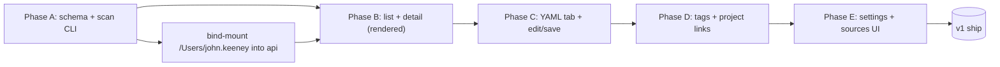

# Skill / Agent Library — Design Brainstorm

A Linear-flavored, Notion-tinted library for all the skills, agents, and orchestration configs scattered across the user's coding projects. Lives inside mimrai. Source of truth is on disk; mimrai is a curated read+edit surface on top.

---

## 1. What the user actually has on disk (inventory)

Quick survey of the user's project tree confirms the shape we're modeling:

| Project | Notable skill/agent surface |
|---|---|
| `mimrai/` | `.claude/skills/` (8 skills under nexus install), `.claude/agents/` (forge, scout, lens, quill, nexus-orchestrator…), `nexus-orchestrator/` (full orchestration template with its own agents + skills) |
| `ai-interaction-dash/` | `.claude/agents/`, `.claude/settings.json`, `nexus-orchestrator-template copy/` |
| `elevenlabs-eval-dash/` | `.claude/agents/` (6 personas), `agent-configs/`, `nexus-config.json` |
| `~/.claude/` (user-global) | `agent-browser/` skill, `codex/` skill, etc. |

All of it is markdown files with YAML frontmatter — same shape Claude Code already understands. We're not inventing a new format. We're indexing what exists.

---

## 2. Domain model

Four new tables, all in `public` (same Postgres mimrai already uses):

```
library_sources
  id              text primary key
  team_id         text not null fk -> teams
  label           text not null               -- "mimrai .claude", "eed agents", etc.
  root_path       text not null               -- absolute path on host
  kind_hint       text                        -- "skills" | "agents" | "orchestration" | null (auto-detect when null)
  glob_include    text default '**/*.md'      -- which files to scan
  glob_exclude    text default '**/node_modules/**'
  last_scanned_at timestamp
  created_at      timestamp default now()

library_entries
  id                text primary key
  source_id         text not null fk -> library_sources
  relative_path     text not null               -- e.g. "skills/nexus-install/SKILL.md"
  absolute_path     text not null               -- absolute for the host (denormalized for speed)
  kind              text not null               -- "skill" | "agent" | "orchestration"
  name              text not null               -- frontmatter.name OR filename
  description       text                        -- frontmatter.description
  frontmatter       jsonb not null              -- full parsed yaml
  body              text not null               -- markdown body (after frontmatter)
  file_sha          text not null               -- sha256 of full file, for change detection
  read_only         boolean default false       -- some library entries (e.g. shipped plugins) shouldn't be writable
  last_seen_at      timestamp                   -- updated on every scan
  last_edited_at    timestamp                   -- updated on every save from mimrai
  last_edited_by    text fk -> users
  created_at        timestamp default now()
  updated_at        timestamp default now()

  unique (source_id, relative_path)

library_entry_tags
  entry_id  text fk -> library_entries
  tag       text                                -- free-form, lowercased
  primary key (entry_id, tag)

library_entry_projects                          -- "used in project X" links
  entry_id    text fk -> library_entries
  project_id  text fk -> projects
  note        text                              -- optional per-link note
  primary key (entry_id, project_id)
```

Why four tables instead of stuffing tags + project links into JSON columns on `library_entries`: filters need indexed FK joins to be fast, and we'll have ~100–300 entries × N tags/projects each. Trivial scale either way, but the FK design lets us reuse mimrai's projects/labels patterns and add `where` clauses without parsing JSON.

**Disk is source of truth.** Mimrai's DB is a denormalized index over disk. When a scan runs, we reconcile by `(source_id, relative_path)` and update by sha. When the user saves from mimrai, we write disk first, then DB.

---

## 3. Auto-classification (skill / agent / orchestration)

Hierarchy of evidence, first match wins:

1. **Path-based**: contains `.claude/skills/` or `/skills/` → **skill**; contains `.claude/agents/` or `/agents/` → **agent**; contains `nexus-orchestrator`, `nexus-config`, or matches `orchestrator-*.md` → **orchestration**.
2. **Filename**: `SKILL.md` → **skill**; matches `*-agent.md` or `agents/*.md` → **agent**.
3. **Frontmatter shape**: has `model:` + `effort:` → **agent**; has `description:` but no model → **skill**; otherwise → **orchestration**.
4. **`kind_hint` on the source** overrides everything for that source.

Final classification is stored, but `kind` is editable in the UI in case the heuristic gets it wrong.

---

## 4. Three pages, one settings page

```
/team/[team]/library                         ← list + filter + search
/team/[team]/library/[entryId]               ← detail (rendered + yaml tabs)
/team/[team]/library/[entryId]?edit          ← detail in edit mode (same route, query flag)
/team/[team]/settings/library                ← sources + scan controls
```

Sidebar gets a top-level **Library** item with sub-nav: **Skills · Agents · Orchestration · All**.

---

## 5. List view (the main page)

```
┌───────────────────────────────────────────────────────────────────────┐
│  Library                                       [ + Add source ] [⟳]   │
├───────────────────────────────────────────────────────────────────────┤
│ [ Skill ▼ ] [ Source ▼ ] [ Project ▼ ] [ Tag ▼ ]  🔍 search   [≡ │ ▦] │
├───────────────────────────────────────────────────────────────────────┤
│ ▶ nexus-install                                       skill  ⚙ mimrai │
│   Configure the Nexus orchestrator for this project…              4d  │
│   #nexus  #setup  · used in: mimrai, eed                              │
├───────────────────────────────────────────────────────────────────────┤
│ ▶ scout                                                agent ⚙ mimrai │
│   Read-only investigator…                                          1w │
│   #reconnaissance  · used in: aid                                     │
├───────────────────────────────────────────────────────────────────────┤
│ ▶ contract-schema                                     skill  ⚙ mimrai │
│   Sub-agent I/O contract — required brief fields…                  2d │
│   #contract  · used in: mimrai, aid                                   │
└───────────────────────────────────────────────────────────────────────┘
```

Four filter chips (kind / source / project / tag), search box, sort, list/grid toggle. Linear-style: clicking any chip or tag filters the list — same chip used for both display and filter input.

---

## 6. Detail view

```
┌────────────────────────────────────────────────────────────────────┐
│  ◀ Library     nexus-install                       [Edit] [Open ↗]  │
│  skill · mimrai/.claude/skills/nexus-install/SKILL.md      1d edit  │
│  #nexus  #setup  · used in: mimrai, eed             [ + tag/project] │
├────────────────────────────────────────────────────────────────────┤
│ [ Rendered ]  [ YAML ]                                              │
├────────────────────────────────────────────────────────────────────┤
│  # Skill: nexus-install                                             │
│                                                                     │
│  Trigger: Invoke via `Skill nexus-install` after install.sh has…    │
│  …                                                                  │
└────────────────────────────────────────────────────────────────────┘
```

- **Rendered** tab: frontmatter as a small key/value table, body rendered through mimrai's TipTap (with our Mermaid extension already in place — Mermaid in skill docs renders inline).
- **YAML** tab: full file in a CodeMirror panel, YAML frontmatter + markdown body in one editable text buffer. No mode-split — that's how the file lives on disk and it's how editor people expect it.
- **Edit** flips both tabs to writable. Save writes disk first, then DB. Cancel discards.
- "Open ↗" copies the absolute path to the clipboard so the user can paste into `cursor /path` or `code /path`.

---

## 7. Tags + project links

- **Tags** are free-form, lowercased, autocomplete from existing tags. Inline edit on detail view + bulk-tag from list view multi-select.
- **Project links** point at mimrai's existing `projects` table — the same projects the kanban already knows about. Adding a link surfaces the skill on the project's detail page later (potential future: a "Skills used here" rail).
- Both editable inline. Both filterable from the list.

---

## 8. Settings page

```
/team/[team]/settings/library
┌──────────────────────────────────────────────────────────────────┐
│  Library Sources                                  [ + Add source ] │
├──────────────────────────────────────────────────────────────────┤
│  mimrai .claude          /Users/.../mimrai/.claude       55 · ⟳  ✕│
│  aid agents              /Users/.../ai-interaction-dash/.claude    7 · ⟳  ✕│
│  eed agents              /Users/.../elevenlabs-eval-dash/.claude   8 · ⟳  ✕│
│  user-global skills      /Users/.../.claude/skills              12 · ⟳  ✕│
└──────────────────────────────────────────────────────────────────┘
```

Per row: label, root path, entry count, **scan now**, remove. Scan is a button for v1 (a chokidar file watcher in v2). Adding a source kicks an initial scan automatically.

The "+ Add source" dialog asks for: label, path (text input with last-component autocomplete from common parents), kind hint (optional), include/exclude globs (collapsed advanced).

---

## 9. Ingestion / scan flow

Run on demand from the settings page **and** as a one-time job at startup.

```
for each source:
  walk root_path with include/exclude globs
  for each .md file:
    read bytes
    sha256 = hash(bytes)
    if (source_id, relative_path) exists with same sha → mark last_seen_at, skip
    else:
      parse frontmatter (gray-matter or js-yaml)
      classify kind (per §3)
      upsert library_entries row
  delete library_entries rows under this source where last_seen_at < scan_start
```

Library_entries.body is the post-frontmatter text. Mermaid in skill bodies renders for free because the TipTap editor already understands ```mermaid fences.

---

## 10. Edit + save flow

User clicks **Edit** → both tabs become writable. On Save:

1. Client posts `{ frontmatter, body }` to `/trpc/library.update`.
2. Server serializes back: `--- yaml --- \n body`. Validates frontmatter must contain `name` and `description`.
3. Server writes to `absolute_path` (atomic: write to `.tmp`, rename).
4. Server updates DB row, recomputes sha.
5. Returns updated entry. Client refetches.

If the disk file has changed since last scan (sha mismatch on read), surface a "this file changed externally" toast with a side-by-side diff. User picks **Use mine** or **Reload disk**.

---

## 11. Stack picks

- **Schema/queries**: keep going with Drizzle. Migration is one push.
- **tRPC router**: new `library` router with `get`, `getById`, `scan`, `update`, `addSource`, `removeSource`, `addTag`, `removeTag`, `linkProject`, `unlinkProject`.
- **Frontmatter parser**: `gray-matter` (small, robust, handles edge cases).
- **YAML editor**: `@uiw/react-codemirror` + `@codemirror/lang-yaml` + `@codemirror/lang-markdown` (already small, fits the Linear aesthetic).
- **Filesystem access from api**: read/write to host paths exposed via volume mount — see §13.
- **Sidebar/nav**: insert into the existing sidebar with a single component, no nav system rewrite.

---

## 12. Phasing — what we build first (and last)

Five thin slices, each shippable on its own:

| Phase | What | User can do after |
|---|---|---|
| **A** | Schema + scan CLI | See entries listed via `psql` or a `/library` debug endpoint |
| **B** | List page + filters + detail (Rendered tab read-only) | Browse the whole library in one place |
| **C** | YAML tab + Edit mode + save-to-disk | Edit any skill/agent from mimrai |
| **D** | Tags + project links (inline) | Tag skills, cross-link to projects |
| **E** | Settings: add/remove sources, scan button | Curate the library |

Stretch (v1.1+): file watcher, diff-on-conflict view, AI-assisted writing ("rewrite this skill's description in Linear's voice"), bulk-tag from list, dependency graph (which skills reference which agents).

---

## 13. The one thing I need a decision on

The api container needs to read + write to the user's project trees. Today the api only sees what's mounted into it. Two options:

**Option 1 — bind-mount host paths into the api container.** Add `volumes: - /Users/john.keeney:/host-home:ro` (read-write later) to the api service in `docker-compose.local.yaml`. Cleanest; works exactly the same way the import script already works.

**Option 2 — proxy through a tiny "library agent" that runs on the host.** A small HTTP server runs on the host (outside Docker), the dashboard container POSTs read/write requests to it. More moving parts; pays back if we ever want this to manage paths outside `/Users/john.keeney`.

Strong recommendation: **Option 1**. We can lock down with a `LIBRARY_ALLOWED_ROOT=/Users/john.keeney` env var so the api only reads/writes under that prefix, sanitized against `..` and symlinks.

---

## 14. Open questions before I build

1. **Default sources** — start with these four (`mimrai/.claude`, `ai-interaction-dash/.claude`, `elevenlabs-eval-dash/.claude`, `~/.claude`), or do you want a different initial set?
2. **Orchestration coverage** — beyond the nexus-orchestrator-template files, do you want me to index the `nexus-config.json` files too (parsed as orchestration entries)? I'd say yes.
3. **File watcher** — chokidar in the api container watching host bind-mounts works on macOS but with FS-poll latency (~2s). Acceptable, or stick with manual scan for v1?
4. **Tag taxonomy** — fully free-form (with autocomplete) is the default. Want to seed any (`nexus`, `setup`, `qa`, `eval`)?
5. **Linking to current task / project from a skill** — should the skill detail page show "currently being applied in task X" if you use mimrai's mentions? Cool but probably v1.1.

---

## 15. What this looks like as a tracking task graph



That diagram will render inline once this doc opens in the library page itself (recursive, satisfying).
