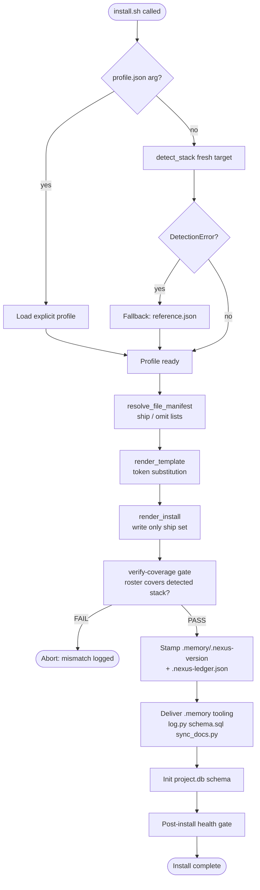
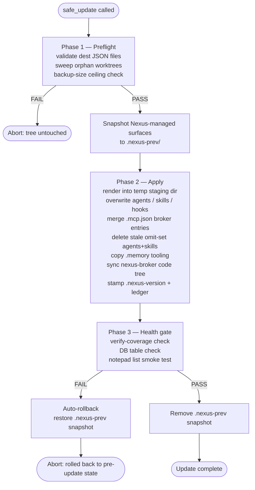

# Stack Profile — Design Contract

Version: 1.0  
Status: ACTIVE — the renderer and detector are implemented and covered by tests; additive changes only.

---

## Purpose

`nexus-stack.json` (a `.memory/nexus-stack.json` file in each installed project) is the single source of truth for what technology a project uses. The installer reads it to:

1. Render double-underscore token placeholders in persona, hook, and settings templates.
2. Resolve which agent `.md` files and skill directories ship vs. are omitted.

The profile never encodes Nexus orchestration details — only the project's own stack.

---

## Schema location

Canonical JSON Schema (draft 2020-12): `nexus-package/.memory/nexus-stack.schema.json`

Every profile file under `nexus-package/profiles/` MUST validate against it.

---

## Token Vocabulary

Each double-underscore token maps to exactly one profile field. Renderers substitute the field value verbatim (string) or via a simple transform (array → comma-joined, bool → "true"/"false"). In template files the token appears as `__NAME__` (bare name wrapped in double underscores); the table below lists the bare names.

| Token (bare name) | Source field | Notes |
|---|---|---|
| `FRONTEND_FRAMEWORK` | `frontend.framework` | e.g. `next`, `vite`, `none` |
| `FRONTEND_SRC_DIR` | `frontend.src_dir` | relative path |
| `FRONTEND_TEST_DIR` | `frontend.test_dir` | relative path |
| `TS_CHECK_DIR` | `frontend.ts_check_dir` | dir passed to `tsc --noEmit` |
| `TEST_RUNNER` | `frontend.test_runner` | `vitest`, `jest`, `none` |
| `BACKEND_LANG` | `backend.language` | `python`, `ts`, `none` |
| `BACKEND_SRC_DIR` | `backend.src_dir` | relative path |
| `PY_CHECK_DIR` | `backend.py_check_dir` | dir passed to `ruff`/`mypy`; empty string when null |
| `DB_KIND` | `data.db` | `duckdb`, `postgres`, `sqlite`, `none` |
| `VECTOR_KIND` | `data.vector` | `hnsw`, `pgvector`, `lmstudio`, `none` |
| `INGESTION_DIR` | `data.ingestion_dir` | empty string when null |
| `SEMANTIC_LAYER` | `data.semantic_layer` | `malloy`, `none` |
| `MODELS_DIR` | `data.models_dir` | empty string when null |
| `AI_LAYER` | `ai_layer` | full enum value |
| `AI_MODEL` | `ai_model` | e.g. `claude-sonnet-4-6` |
| `PACKAGE_MANAGER` | `package_manager` | `pnpm`, `npm`, `uv`, `mixed` |
| `WATCHED_PREFIXES` | `socraticode_watched_prefixes` | comma-joined, e.g. `/app/, /ingestion/` |
| `INTEGRATION_TARGETS` | `integration_targets` | comma-joined; empty string when `[]` |
| `MCP_SERVER_DIR` | `mcp_server_dir` | empty string when null |

---

## File-Inclusion Manifest

### Agnostic set — always ship

These files ship regardless of stack profile:

**Agents:**
- `nexus-orchestrator`
- `scout`
- `lens`
- `lens-fast`
- `palette`

**Skills (core protocol — 11 skills):**
- `nexus-protocol`
- `nexus-capabilities`
- `nexus-health`
- `nexus-loss-function`
- `nexus-dispatch-catalog`
- `nexus-orchestration`
- `parallel-first-check`
- `team-routing`
- `session-lifecycle`
- `contract-schema`
- `palette-design-patterns` (design companion to the always-shipped `palette` agent; ships unconditionally)

NATIVE-6 D4: `tdd-patterns` and `verification-protocols` are RETIRED. Their
successors ARE wired: `agent-protocol`/`verification`/`review-panel` sit in
`_AGNOSTIC_SKILLS` (`nexus-package/tools/stack_profile.py`) and flow through
`resolve_file_manifest` via `AGNOSTIC_SET`; `tdd-core` ships per-stack alongside
the quill agents. Asserted by `tests/test_stack_manifest.py`.

---

### Conditional rules

Rules are evaluated top-to-bottom; a file may match multiple rules (union, not exclusive).

#### Python presence (quill-py + pytest-idioms)

Condition: `backend.language == "python"` OR `data.has_ingestion == true`

Ship agents:
- `quill-py`

Ship skills:
- `pytest-idioms`

Note: This rule ships the Python test author and pytest patterns for any project that has a Python backend **or** an ingestion layer. It does **not** ship the pipeline-data or pipeline-async personas — those have their own stricter conditions below.

#### Backend present — server-side implementer (S2-17)

Condition: `backend.present == true` OR `backend.framework not in (null, "none")`

Ship agents:
- `forge-wire`

Ship skills:
- `forge-wire-conventions`

Note: `forge-wire` is the stack-agnostic server-side implementer that ships for **any** backend — FastAPI, Express, Fastify, or any other. Without this rule a backend-only stack would ship zero personas that may write application code. A TS backend also causes `quill-ts` and `vitest-rtl-idioms` to ship (TS test author).

#### Data-engineering pipeline personas

Condition: `data.has_ingestion == true` OR `data.db == "duckdb"`

Ship agents:
- `pipeline-data`

Ship skills:
- (none — `pipeline-data-conventions` retired 2026-07-13, native #4 owner sweep: a stack-conditional skill installed in zero fleet projects, dropped with no successor)

Note: A plain Python web backend does **not** satisfy this condition on its own. Only a real data pipeline (an ingestion layer present or DuckDB as the data store) ships these personas.

#### Async/worker personas

Condition: `workers.present == true`

Ship agents:
- `pipeline-async`

Ship skills:
- `pipeline-async-conventions`

Note: This condition is keyed **solely** on `workers.present`. Neither a Python backend nor an ingestion layer is sufficient — only an explicit worker layer (Dramatiq, or a detected worker entrypoint / `worker/` subdir) satisfies it.

#### DuckDB data layer

Condition: `data.db == "duckdb"`

Ship agents:
- `atlas`

Ship skills:
- `atlas-schema-patterns`

(`duckdb-read-patterns`/`duckdb-test-shims`/`polars-duckdb-mapping`/`polars-test-fixtures` retired 2026-07-13, native #4 owner sweep — zero fleet installs.)

#### Malloy semantic layer

Condition: `data.semantic_layer == "malloy"`

Ship skills:
- `atlas-schema-patterns` (also covers Malloy `.malloy` model conventions)

Note: `data.semantic_layer == "malloy"` implies `data.db == "duckdb"` in practice, so the atlas agent will already be included by the DuckDB rule.

#### Dramatiq workers — retired

`dramatiq-patterns` (the sole skill this rule shipped) was retired 2026-07-13
(native #4 owner sweep — zero fleet installs). `workers.framework ==
"dramatiq"` is still detected and reported truthfully in the profile (it feeds
no other ship rule today, but the field stays accurate rather than lying about
the stack) — it just no longer drives a ship decision.

#### Next.js or Vite frontend

Condition: `frontend.framework in ["next", "vite"]`

Ship agents:
- `forge-ui`
- `forge-wire`
- `quill-ts`

Ship skills:
- `forge-ui-conventions`
- `forge-wire-conventions`
- `vitest-rtl-idioms` (the Vitest-specific extension to the generic stub-authoring skill)

#### RSC boundary rules — Next.js only

Condition: `frontend.framework == "next"`

Ship skills:
- `rsc-boundary-rules`

Note: Server components do not exist in Vite; this skill ships for Next.js only.

#### Server-action contract — Next.js without a separate backend

Condition: `frontend.framework == "next"` AND `backend.present == false`

Ship skills:
- `server-action-contract`

Note: Server actions are the API layer only when no separate Express/FastAPI backend is present. When a dedicated backend exists, server-action-contract is inapplicable and is omitted.

#### Tremor UI library — retired

`tremor-patterns` (the sole skill this rule shipped) was retired 2026-07-13
(native #4 owner sweep — zero fleet installs). `frontend.ui_lib == "tremor"`
is still detected and reported truthfully in the profile — it drives the
`forge-ui-conventions` variant key (`_forge_ui_key` resolves it to the
`next-tremor` variant), so detection stays even though no skill ships for it
any more.

#### Tailwind / shadcn UI library

Condition: `frontend.ui_lib in ["tailwind", "shadcn"]`

Ship skills:
- `tailwind-design-tokens`

#### MUI UI library

Condition: `frontend.ui_lib == "mui"`

Ship skills:
- (no dedicated MUI skill in current package; omit tailwind skill)

#### MCP server present

Condition: `mcp_server_dir != null`

Ship agents:
- `hermes`

Ship skills:
- `hermes-auth-patterns`

#### Vercel AI SDK

Condition: `ai_layer in ["vercel-ai-sdk-v4", "vercel-ai-sdk-v6"]`

Ship skills:
- `ai-sdk-patterns`
- `embedding-patterns`

#### Anthropic direct

Condition: `ai_layer == "anthropic-direct"`

Ship skills:
- `embedding-patterns`

#### Tableau integration

Condition: `"tableau" in integration_targets`

Ship skills:
- `tableau`
- `tableau-client-patterns`

#### Postgres data layer

Condition: `data.db == "postgres"`

Ship agents:
- `atlas`

Ship skills:
- `atlas-schema-patterns`

---

## Omit logic

Any agent or skill NOT matched by the agnostic set or a conditional rule above is OMITTED. The `resolve_file_manifest` function returns both a `ship` list and an `omit` list for auditability.

---

## API Signatures (implemented + tested)

These functions are implemented and covered by tests. Signatures are fixed here as the contract.

### `detect_stack`

```python
def detect_stack(project_root: Path) -> dict:
    ...
```

**Input:** Absolute path to a project root directory.

**Output:** A `dict` conforming to `nexus-stack.schema.json`. The detector inspects the filesystem (presence of `package.json`, `pyproject.toml`, `next.config.*`, `vite.config.*`, etc.) and produces a best-guess profile. The caller is responsible for writing the result to `.memory/nexus-stack.json`.

**Errors:** Raises `ValueError` if `project_root` does not exist or is not a directory. Raises `DetectionError` (custom) if too few signals are found to produce a valid profile.

**Note:** Detection is a best-effort heuristic. The profile should always be reviewed by a human before a fresh install finalises it.

---

### `render_template`

```python
def render_template(text: str, profile: dict) -> str:
    ...
```

**Input:**
- `text`: raw template string containing zero or more double-underscore token placeholders (bare name wrapped in double underscores, e.g. the `BACKEND_SRC_DIR` token) from the vocabulary table above.
- `profile`: a validated stack profile dict (conforming to the schema).

**Output:** `text` with all double-underscore token placeholders replaced by their derived values. Unknown tokens (not in the vocabulary) are left unchanged.

**Errors:** Does not raise. Absent or null fields render as the empty string. A schema-invalid profile is not detected here; pass the profile through schema validation before calling `render_template` if enforcement is required.

---

### `resolve_file_manifest`

```python
def resolve_file_manifest(profile: dict) -> dict[str, list[str]]:
    ...
```

**Input:** A validated stack profile dict.

**Output:** A dict with exactly two keys:
- `"ship"`: list of file identifiers (agent names and skill directory names) that should be included.
- `"omit"`: list of file identifiers that are NOT included for this profile.

The union of `ship` and `omit` MUST equal the full set of files in the nexus-package. Callers use `ship` to copy files into the target project; `omit` is provided for audit/logging.

---

## Install and Update Flow

### Fresh install — `install.sh`



**Key fresh-install properties:**
- `detect_stack` runs **only on a fresh install** when no profile argument is supplied. If the target already has a `.memory/nexus-stack.json` from a prior install, use `safe_update.py` instead — it preserves the existing profile.
- Version files created at install time: `.memory/.nexus-version` (single line) and `.nexus-ledger.json` (`{version, installed_at, updated_at, source, phase_markers}`).
- A verify-coverage gate runs after render: it aborts the install if the rendered agent roster fails to cover the detected stack (e.g. a frontend was detected but only a Python-only roster was rendered).

---

### Update path — `safe_update.py` (3-phase)



**Key update-path properties:**

- **Never re-detects**: the update reads the existing `.memory/nexus-stack.json` and renders from it. `detect_stack` is not called unless `NEXUS_UPDATE_REPROFILE=1` is set (opt-in re-profile).
- **Never clobbers**: `CLAUDE.md`, `.memory/project.db`, `.claude/settings.local.json`, `.claude/agent-memory/` persona MEMORY.md, `nexus-stack.json` (the source of truth; overwritten from the profile, not from dest), and the router-capture logs (`router_decisions.jsonl`, `router_dispatches.jsonl`) are never touched by an update.
- **`.mcp.json` is merged, not replaced**: only the `nexus-broker` and `nexus-vault` server entries are upserted; all other MCP servers (e.g. project-added `prism`) are preserved.
- **Auto-rollback**: if the post-apply health gate fails, the `.nexus-prev` snapshot is restored byte-for-byte, leaving the install in its exact pre-update state.
- **Stale persona/skill cleanup**: agents and skills in the manifest `omit` set are deleted from the install so retired personas do not accumulate.

---

## Never-clobber rule for updates

An update run MUST follow this invariant:

> If `.memory/nexus-stack.json` already exists in the target project, it MUST be read and used as-is. An update MUST NOT regenerate or overwrite it.

Rationale: The profile may have been hand-tuned after initial install (e.g., `my-dashboard`'s reference profile). Auto-detection runs only during a fresh install when no profile exists yet.

The update flow is therefore:
1. Read existing `.memory/nexus-stack.json`.
2. Validate it against `nexus-stack.schema.json` (fail loudly if invalid).
3. Run `render_template` over all template files using the validated profile.
4. Run `resolve_file_manifest` to determine which agents/skills to sync.
5. Write `.memory/nexus-stack.json` from the rendered profile. The profile content is unchanged (read from the existing `nexus-stack.json` in step 1); only the file is refreshed to reflect any schema-level normalisation.

If the profile is schema-invalid (e.g., after a schema version bump), the update MUST halt with a clear migration error rather than silently overwriting.
