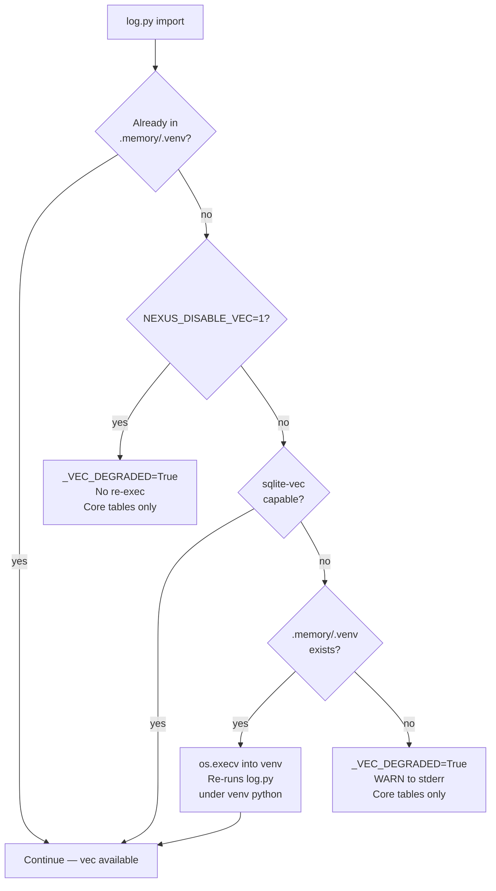

# Nexus Troubleshooting

Reference for diagnosing and recovering common Nexus failure modes. All behavior
described here is backed by code in `.claude/hooks/`, `.memory/log.py`, and
`nexus-broker/src/broker/`.

---

## 1. Memory bootstrap and sqlite-vec

### How bootstrap works

`log.py` runs a three-step probe at import time before any SQLite work:

1. **Already in venv?** — `os.path.realpath(sys.executable) == os.path.realpath(.memory/.venv/bin/python)`. If yes, skip re-exec (loop guard).
2. **Can this interpreter load sqlite-vec?** — `NEXUS_DISABLE_VEC` not set, `conn.enable_load_extension(True)` succeeds, and `import sqlite_vec` succeeds.
3. **Re-exec into `.memory/.venv`** — if the check fails and `.memory/.venv/bin/python` exists, `os.execv()` replaces the process with the venv interpreter. Idempotent.

If neither condition holds (no capable interpreter, no venv), the process sets
`_VEC_DEGRADED = True` and continues. Core tables (sessions, tasks, decisions,
…) are still created; only the `vec_memory` virtual table and semantic recall
are deferred. `log.py init` returns rc=0.



### Symptoms

| Symptom | Likely cause |
|---|---|
| `WARNING: sqlite-vec unavailable ... semantic recall deferred` on stderr | No venv and system python cannot load extensions |
| `vec_memory deferred (sqlite-vec unavailable: ...)` from `log.py init` | Same as above — non-fatal |
| `FATAL: vec_memory embedding dim is float[N] but this build expects float[1024]` then exit 2 | Model changed under an existing `vec_memory`; the dimension invariant fired |

### Recovery

**Build the venv** (one-time setup; re-run after a Python upgrade):
```bash
uv venv .memory/.venv --python 3.12
uv pip install --python .memory/.venv/bin/python sqlite-vec
```

After the venv exists, the next `log.py` call re-execs automatically. No
additional steps are needed.

**Rebuild vec_memory after a model/dim change:**
```bash
# Drop the old vec_memory table, then re-init. Data in other tables is unaffected.
python3 .memory/log.py init
python3 .memory/log.py vec backfill
```

### Force-degrade (tests / CI)

Set `NEXUS_DISABLE_VEC=1` to skip the re-exec and suppress all vec work. The
flag is honored at every call site (`_bootstrap_reexec`, `_vec_conn`) so init
and recall behave identically to a real no-extension host. Never set this in
production.

---

## 2. Broker unreachable / NEXUS_BROKER_ALLOW_DEGRADED

### What the broker-gate does

`broker-gate.py` is a PreToolUse hook that fires on every `Task` dispatch. It
reads `.memory/files/broker_state.json` and enforces:

- The file exists and parses as JSON.
- `approved` is `True`.
- `called_at` is within the last 120 seconds (per-turn freshness; relaxed for
  team-scoped teammate spawns whose `team_name` matches the approved brief).
- The dispatched persona matches `state["persona"]` (non-team dispatches).
- `notepad_logged_at` is present and within 300 seconds — the notepad read
  ritual must have been run this turn (Standard/Complex dispatches only;
  P2-07).
- A recent ACCEPTED planning-gate row must exist in `project.db` within the
  last 4 hours for Standard/Complex code-writing feature dispatches (P2-09;
  skipped for meta work and non-code-writing personas).

The gate **fails closed** (exit 2 / DENY) on any failure unless
`NEXUS_BROKER_ALLOW_DEGRADED=1` is set.

### Symptoms and what they mean

**`broker_state.json not found — broker unavailable`**
The nexus-broker MCP server has not been called this turn, or the state file
was never created. The broker server (`python -m broker.server`) may not be
running.

**`broker_state.json malformed`**
The file exists but is not valid JSON — a partial write or a corrupted file.
Delete it and re-call `nexus_validate_brief`.

**`broker rejected dispatch to '<persona>' — not allowed`**
`approved` is `False` in the state file. The brief was validated but rejected
by the broker. Fix the brief and re-validate.

**`broker_state.json is stale (Ns old, max 120s) — call nexus_validate_brief again for this turn.`**
The validation was done more than 120 seconds ago. Re-call `nexus_validate_brief`
in this turn.

**`broker approved persona 'X' but dispatch targets 'Y'`**
The orchestrator called `nexus_validate_brief` for persona X but dispatched to
persona Y. Re-validate with the correct persona.

**`notepad_logged_at is absent — run 'python3 .memory/log.py notepad list --topic <scope>' and call nexus_notepad_ping before dispatching.`**
The broker state has no record of the notepad read ritual being performed this
turn. Run the notepad list command for the current topic scope, then call
`nexus_notepad_ping`, before dispatching a Standard or Complex task.

**`notepad_logged_at is stale (Ns old, max 300s) — re-run the notepad ritual and nexus_notepad_ping for this turn.`**
The notepad was read more than 300 seconds ago. Re-run
`python3 .memory/log.py notepad list --topic <scope>` and call
`nexus_notepad_ping` again in this turn.

**`no ACCEPTED planning-gate row in the last 4h for this <tier> code-writing dispatch to '<persona>'`**
A Standard or Complex code-writing feature dispatch requires a prior planning
gate submission that was ACCEPTED. Run
`python3 .memory/log.py planning-gate submit --feat <id> --json ...` and have
the gate pass before dispatching (Constitution Art. I, spec-first).

### Recovery

**Normal path:** call `nexus_validate_brief` (the FastMCP tool on the
`nexus-broker` server) with a valid brief before each `Task` dispatch. The gate
opens for 120 seconds.

**Broker down:** set `NEXUS_BROKER_ALLOW_DEGRADED=1` in the environment to
allow unguarded dispatches. Every gate evaluation emits a loud stderr warning:
```
BROKER DEGRADED: broker_state.json not found.
NEXUS_BROKER_ALLOW_DEGRADED=1 is set — Task allowed WITHOUT broker validation.
```
Start nexus-broker and unset `NEXUS_BROKER_ALLOW_DEGRADED` to re-arm the gate.

**Start the broker:**
```bash
cd nexus-broker && uv run python -m broker.server
```

---

## 3. Gate-stuck diagnosis

Any hook that exits 2 with a JSON `deny` object blocks the tool call. The deny
object is written to stderr by `_gate_deny.py`. Read the deny message to
identify which gate fired and why.

### General pattern

1. The hook writes a JSON block to stderr containing `type: "deny"` and a
   human-readable `message`.
2. Claude Code surfaces the message in the response.
3. Find the gate name in the message prefix (e.g. `BROKER/OUTAGE`,
   `SOCRATICODE`, `SKILLS-REQUIRED`, `NO-DEFERRAL`, `LENS`, `ROOT-CAUSE`).
4. Satisfy the gate condition described in the message, then retry.

### Gate-by-gate diagnosis

**BROKER gate** — see §2 above.

**SOCRATICODE gate** (`socraticode-gate.sh`)
Fires when a code-writing persona runs grep/rg/find/ack/ag before a SocratiCode
discovery tool has returned indexed results. Fix: run `codebase_search` or
`codebase_symbols` first. Once a discovery call returns results the flag is
session-scoped; grep stays open for the rest of the session.

**SKILLS-REQUIRED gate** (`skills-required-guard.sh`)
The dispatched brief declares `skills_required` but the agent has not loaded
those skills. Fix: invoke the required skills via the `Skill` tool before the
first non-Read tool call.

**NO-DEFERRAL gate** (`no-deferral-gate.sh`)
The agent is trying to mark work complete while open items remain unresolved.
Fix: resolve every surfaced item inline or convert it to a tracked task before
emitting `## NEXUS:DONE`.

**LENS gate** (`lens-gate.sh`)
Code-touching work requires a Lens validation row in `validation_log` before
`## NEXUS:DONE`. Fix: dispatch a Lens sub-agent to validate, then let it write
the `agent_validated='lens'` row.

**ROOT-CAUSE gate** (`root-cause-gate.sh`)
An error fix was submitted without a root-cause statement. Fix: add a root-cause
analysis sentence naming the true underlying cause (not a symptom) in the
response.

**WORKTREE guard** (`worktree-guard.sh`)
An Agent dispatch attempted to create a new branch or worktree without meeting
the DEC-008 self-managed-merge-back guarantee. Fix: coordinate on the session
branch instead, or ensure the workflow owns the full lifecycle (auto-merge-back
+ worktree removal as a mandatory final phase).

### Reading a deny message

```
DENY [GATE-NAME]: <human-readable message explaining the missing condition>
Satisfy: <what to do>
```

The satisfy clause is the actionable fix. If it says "call nexus_validate_brief
first" the broker gate fired. If it says "run codebase_search or
codebase_symbols" the SocratiCode gate fired. Act on that clause and retry.

---

## 4. Dead-letter queue (vec_memory embedding failures)

When the embedding backend (LM Studio at `http://127.0.0.1:1234/v1/embeddings`)
is unavailable, `log.py` parks the un-embedded row in `vec_memory_deadletter`
and emits a one-time banner:
```
!! vec_memory DEAD-LETTER: embedding backend unavailable — relational
!! row was saved but NOT vector-indexed (reason: embed_unavailable). Parked in
!! vec_memory_deadletter. Recover with: log.py vec backfill
```

Recovery once the backend is back:
```bash
python3 .memory/log.py vec backfill
```

---

## 5. Dimension mismatch (exit 2)

`_assert_vec_dim` runs on every `_vec_conn()` call. If the `vec_memory` table
was built with a different embedding dimension than the current `_EMBED_DIM`
(1024), it exits 2 with:
```
FATAL: vec_memory embedding dim is float[N] but this build expects float[1024]
(model text-embedding-mxbai-embed-large-v1). Refusing to operate — rebuild
vec_memory or restore the matching model.
```

Fix: rebuild the vec_memory table and re-backfill:
```bash
# Drop and recreate vec_memory (other tables untouched)
python3 .memory/log.py init
python3 .memory/log.py vec backfill
```
