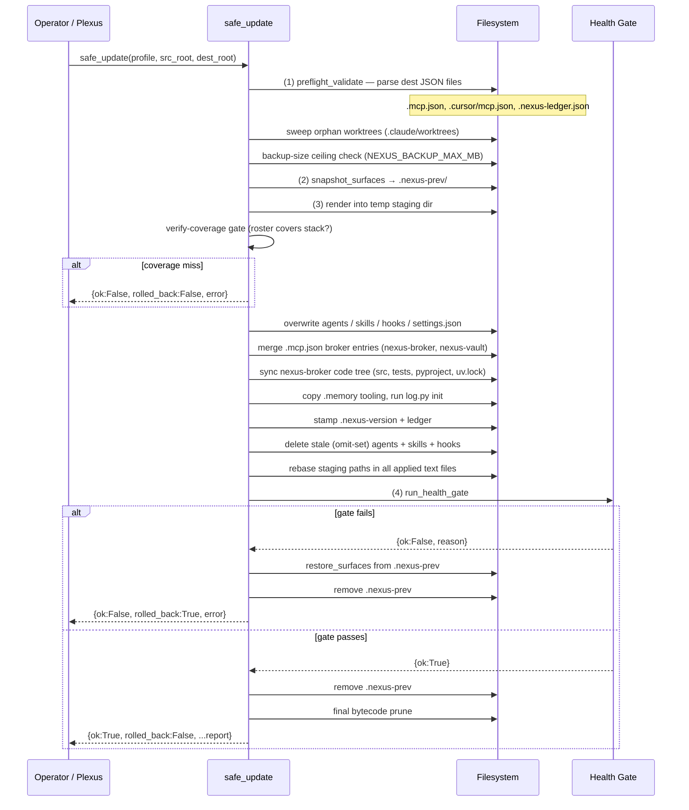

# Nexus Update Guide

Operator reference for updating an **existing** Nexus install via `tools/safe_update.py`.
For a fresh install see [INSTALL.md](INSTALL.md). For the stack-profile schema and the
full install/update flow diagrams see [STACK-PROFILE.md](STACK-PROFILE.md).

---

## Overview

`safe_update` wraps the file-by-file apply with an all-or-nothing envelope:

```
Phase 1 — Preflight (tree untouched on failure)
Phase 2 — Snapshot → Apply → Rebase
Phase 3 — Health gate → auto-rollback on failure, cleanup on success
```

---

## Update flow



---

## Three phases in detail

### Phase 1 — Preflight

All preflight checks run **before any byte is written**. A failure here returns
`{ok: False, rolled_back: False}` with the tree byte-for-byte untouched.

**a) JSON validity check**

Parses every JSON file that the apply will merge. A corrupt file would otherwise cause
a mid-apply exception that leaves the install half-written:

- `.mcp.json`
- `.cursor/mcp.json`
- `.nexus-ledger.json`

**b) Orphan-worktree sweep (DEC-008)**

Same logic as install: `git worktree prune` then `git worktree remove --force` for
each dir under `.claude/worktrees/`. An unremovable worktree is logged to `unreclaimed`
and reported in the return dict; it never blocks the update.

**c) Backup-surface size ceiling (NEXUS_BACKUP_MAX_MB)**

The rollback snapshot (`.nexus-prev/`) is the backup. The estimate sizes **only the
surfaces the snapshot actually archives** — the `_SNAPSHOT_SURFACES` allowlist (see
below) — not the entire project tree. Default ceiling: **200 MB**.

The exclude set strips: `.venv`, `node_modules`, `__pycache__`, `models`, `worktrees`,
`.pytest_cache`, `.ruff_cache`, `.mypy_cache`, `.git`, plus file suffixes `.pyc`,
`.duckdb-wal`, `.duckdb-shm`, `.gguf`, `.onnx`, `.safetensors`.

Override:

```bash
NEXUS_BACKUP_MAX_MB=500 python tools/safe_update.py ...
```

### Phase 2 — Snapshot → Apply → Rebase

**Snapshot: `.nexus-prev/`**

Before the first write, `_snapshot_surfaces` copies each entry in `_SNAPSHOT_SURFACES`
into `<dest>/.nexus-prev/`. A surface that does not exist in dest is recorded as a
`<rel>.__absent__` sentinel so rollback can delete a surface the apply newly created.
The snapshot lives inside the dest filesystem so the swap-back is a same-device move.

Snapshotted surfaces:

| Surface | Notes |
|---|---|
| `.claude/agents` | |
| `.claude/skills` | |
| `.claude/hooks` | |
| `.claude/settings.json` | |
| `AGENTS.md` | |
| `docs` | Only docs that exist in staging are overwritten; project docs are never deleted |
| `.cursor` | |
| `.mcp.json` | |
| `.memory/nexus-stack.json` | |
| `.memory/log.py` | |
| `.memory/schema.sql` | |
| `.memory/.nexus-version` | |
| `nexus-broker/src` | Atomic rename-swap: copy to `.nexus-new`, rename live to `.nexus-prev`, rename new into place |
| `nexus-broker/tests` | Same atomic swap |
| `nexus-broker/pyproject.toml` | |
| `nexus-broker/uv.lock` | |
| `nexus-broker/launchd` | (when present) |

`.nexus-ledger.json` is **excluded from the snapshot** intentionally: it is
append-only metadata and must never be reverted. Rolling it back would restore a stale
`installed_at` / `phase_markers` that makes a retry re-stamp look like the original
install.

**Apply**

The apply renders the package into a temp UUID-named staging directory, then applies
selectively onto dest:

1. Overwrite `.claude/agents/`, `.claude/skills/`, `.claude/hooks/`, `.claude/settings.json`.
2. Deliver root `AGENTS.md` (Nexus-owned identity, always overwritten; contrast `CLAUDE.md`).
3. Overwrite docs that also exist in staging (project-only docs are untouched).
4. Overwrite `.memory/nexus-stack.json` (rewritten from the profile).
5. Merge `.mcp.json` — upsert only `nexus-broker` and `nexus-vault` entries; all other
   MCP servers are preserved.
6. Overwrite Nexus-managed `.cursor` surfaces (fixed files, rules, agents); merge
   `.cursor/mcp.json` (same broker-only upsert strategy).
7. Copy `.memory` tooling: `log.py`, `schema.sql`, `sync_docs.py`, `health.py`.
8. Build `.memory/.venv` (best-effort; same Python ≥ 3.11 resolver as install).
9. Run `log.py init` to migrate the schema (idempotent).
10. Sync `nexus-broker` code tree using atomic rename-swap for directories.
11. Stamp `.memory/.nexus-version` and `.nexus-ledger.json`.
12. Delete stale personas and skills whose names are in the manifest `omit` set.
13. Delete orphaned hook scripts no longer shipped by the package.

**Rebase**

`render_install` bakes the temp staging path and its Arize slug into every rendered
file. After the staging tempdir closes, a text-replacement pass rebases those
artefacts in-place across all applied files (`.claude/`, `.memory/nexus-stack.json`,
`docs/`, `.mcp.json`, `.cursor/`).

### Phase 3 — Health gate

Four checks, each tolerant of a minimal environment:

| Check | Always runs? | Triggers rollback? |
|---|---|---|
| Version coherence: `.memory/.nexus-version` == package `VERSION` | Yes | Yes |
| Schema completeness: all 8 core tables in `project.db` (when present) | When `project.db` exists | Yes |
| Broker import: `uv run python -c 'import broker.server, broker.vault.stdio'` | When `nexus-broker/.venv/bin/python3` + `uv` are available | Yes |
| Hook: `health-banner.sh` exits 0 | When the file exists | Yes |

On gate failure: `_restore_surfaces` copies each `.nexus-prev/<surface>` back to the
live path, then removes `.nexus-prev`. The install is left in its exact pre-update
state.

On success: `.nexus-prev` is removed, then a final bytecode prune sweeps
`__pycache__/` and `*.pyc` outside `.venv` (the health-gate broker-import probe
regenerates bytecode; this clears it).

---

## Return contract

`safe_update` always returns a dict. The `ok`, `error`, and `rolled_back` fields are
always present:

```python
# Success
{
  "ok": True,
  "error": None,
  "rolled_back": False,
  "updated_agents": [...],          # agent stems written from staging
  "deleted_agents": [...],          # stale agents removed
  "deleted_skills": [...],          # stale skill dirs removed
  "deleted_hooks": [...],           # orphaned hook scripts removed
  "deleted_cursor_rules": [...],    # orphaned nexus-*.mdc rules removed
  "deleted_cursor_agents": [...],   # de-rostered .cursor/agents removed
  "mcp_servers_preserved": [...],   # server names kept in dest .mcp.json
  "cursor_mcp_servers_preserved": [...],
  "claude_md_preserved": True,      # CLAUDE.md never touched
  "agents_md_shipped": True,        # root AGENTS.md delivered+overwritten
  "broker_synced": True,
  "broker_entries": [...],          # broker top-level entries delivered
  "broker_files_copied": <int>,
  "broker_venv_preserved": True,    # install's .venv left untouched
  "memory_venv_ok": <bool>,
  "memory_venv_skipped": <bool>,
  "memory_venv_warnings": [...],
  "version_stamped": "<v>",
  "files_copied_count": <int>,
  "drift_warning": "<str>",         # non-empty when profile drift detected
  "drift_missing_personas": [...],
  "reprofiled": <bool>,
  "worktree_sweep": {...},
  "pycache_dirs_removed": <int>,
  "pyc_files_removed": <int>,
}

# Preflight failure (tree untouched)
{
  "ok": False,
  "error": "<description>",
  "rolled_back": False,
  # worktree_sweep may be present (sweep ran before size abort)
}

# Apply or health-gate failure (rolled back)
{
  "ok": False,
  "error": "<description>",
  "rolled_back": True,
  "rollback_unrestored": [...],   # surfaces that could not be restored (empty = full rollback)
  # ...plus the partial _apply_update report fields if the health gate ran
}
```

---

## Never-clobber set

An update NEVER touches the following, regardless of what the package ships:

| Path | Why |
|---|---|
| `CLAUDE.md` | Project-customised; never shipped or rendered by the package |
| `.memory/project.db` | Accumulated runtime state (sessions, tasks, decisions, lessons) |
| `.claude/settings.local.json` | Project-local settings overrides |
| `.claude/agent-memory/` | Each persona's accumulated `MEMORY.md`, grown across sessions |
| `.memory/files/router_decisions.jsonl` | Accumulated training-data capture |
| `.memory/files/router_dispatches.jsonl` | Accumulated training-data capture |
| `.mcp.json` non-broker entries | Project-added MCP servers (e.g. `prism`) are preserved by merge |

`nexus-stack.json` is rewritten from the current profile on every update, but the
stored profile is preserved by default (never-clobber). See Profile drift below.

---

## Profile drift (NEXUS_UPDATE_REPROFILE)

By default, the update reads the existing `.memory/nexus-stack.json` and renders from
it without re-detecting the stack. This preserves a hand-tuned profile across updates.

If the live stack has drifted (e.g. a frontend was added after the initial install), a
LOUD `drift_warning` is printed naming the uncovered surfaces and missing personas, but
the install stays on the stored profile and the update still succeeds.

To close the drift in one update:

```bash
NEXUS_UPDATE_REPROFILE=1 python tools/safe_update.py ...
```

This re-detects the stack and renders from the fresh profile, adding newly required
personas. The `reprofiled: True` field in the return dict confirms the re-profile ran.

---

## Troubleshooting `rolled_back: True`

When `safe_update` returns `rolled_back: True` the install is back in its exact
pre-update state. The `error` field names the failing check.

**Common causes and fixes:**

| Symptom (`error` contains) | Likely cause | Fix |
|---|---|---|
| `version mismatch` | `.memory/.nexus-version` did not get stamped | Check that `.memory/` is writable; re-run the update |
| `schema incomplete — core tables missing` | `log.py init` failed or returned non-zero | Check `python3 <install>/.memory/log.py init` manually; look for DB permission issues |
| `broker import returned rc=` | `nexus-broker` source is incomplete or `uv.lock` is stale | `uv sync --directory <install>/nexus-broker` then re-run |
| `health-banner hook rc=` | A hook script is malformed or its dependency is missing | Run `bash <install>/.claude/hooks/health-banner.sh` manually to see the error |
| `preflight: dest .mcp.json is not valid JSON` | The project's `.mcp.json` is corrupt | Fix the JSON, then re-run |
| `backup aborted: the Nexus-managed backup surface is … MB` | Leaked `.claude/worktrees` or large `docs/` | Run `git worktree remove --force .claude/worktrees/<name>` for each orphan, or raise `NEXUS_BACKUP_MAX_MB` |

If `rollback_unrestored` is non-empty, one or more surfaces could not be fully restored.
Each entry is the `_SNAPSHOT_SURFACES` rel-path that failed. Those surfaces may be in
a partial state; restore them manually from `.nexus-prev/` before retrying:

```bash
# Example: manually restore .claude/agents from the snapshot
cp -r <install>/.nexus-prev/.claude/agents <install>/.claude/agents
```

`.nexus-prev/` is removed on success and preserved on failure to enable manual
recovery.

---

## Version files

Both files are written by `_stamp_version` at the end of phase 2:

| File | Content |
|---|---|
| `.memory/.nexus-version` | Single-line version string (e.g. `1.14.0\n`) |
| `.nexus-ledger.json` | `{version, installed_at, updated_at, source, phase_markers}` |

`installed_at` is preserved (never overwritten on update). `updated_at` refreshes.
`phase_markers` is append-only; the version entry is updated in-place if it already
exists (idempotent retry-safe).

`.nexus-ledger.json` is excluded from the rollback snapshot intentionally. If a
health-gate rollback occurs after the stamp, the ledger retains the attempted version —
the health-gate version-coherence check detects the partial state without touching the
ledger.

---

## Environment variables

| Variable | Default | Effect |
|---|---|---|
| `NEXUS_BACKUP_MAX_MB` | `200` | Snapshot-surface size ceiling in MB |
| `NEXUS_UPDATE_REPROFILE` | _(unset)_ | Set to `1` to re-detect the stack and render from the fresh profile |
| `_NEXUS_SKIP_VENV_BUILD` | _(unset)_ | Test-only: skip the `.memory/.venv` build subprocess |
| `NEXUS_FORCE_PERSONA_SET` | _(unset)_ | **Test-only seam** — never set in production |
