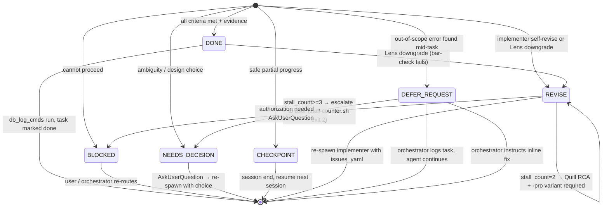

# Agent Contract — Required for All Agent Delegations

Every task delegated to a sub-agent MUST include all required input fields and the agent MUST return all required output fields. The orchestrator (main Claude session) validates both.

---

## Required Input (pass to every agent)

```json
{
  "agent_persona": "<scout|forge-ui|forge-ui-pro|forge-wire|forge-wire-pro|pipeline-data|pipeline-data-pro|pipeline-async|pipeline-async-pro|hermes|atlas|palette|lens-fast|lens|quill-ts|quill-py>",
  "goal": "<precise, single-sentence statement of what to accomplish>",
  "context_files": ["<path/to/file1>", "<path/to/file2>"],
  "acceptance_criteria": [
    "<verifiable criterion — pass/fail, not subjective>",
    "<criterion 2>"
  ],
  "verification_required": [
    "rtk tsc",
    "rtk lint",
    "uv run ruff check"
  ],
  "do_not_touch": [
    "<path/to/file>",
    "<file owned by another persona this session>"
  ],
  "constraints": [
    "<must NOT do X>",
    "<must use Y library, not Z>"
  ],
  "db_log_cmds": [
    "<commands the agent expects orchestrator to run on completion>"
  ],
  "db_context": "<paste output of: python3 .memory/log.py context dump>",
  "notepad_topic": "<TASK-NNN | FEAT-NNN | branch-name | freeform-kebab — scope key for the notepad>",
  "skills_required": ["<skill-name-1>", "<skill-name-2>"],
  "parallel_group_id": "<optional string or null — homogeneous-fan-out group key>",
  "verification_tier": "targeted | release"
}
```

**Required fields** (all must be present in every brief): `agent_persona`, `goal`, `context_files`, `acceptance_criteria`, `verification_required`, `do_not_touch`. Note: `parallel_group_id` is **OPTIONAL** (back-compat with 1.1.1 briefs); it is NOT in the required list.

**`parallel_group_id`** — Optional string (or `null`). Orchestrator-side hint for Article XIII.b (Homogeneous Persona Fan-Out): when copies of the same persona are dispatched against disjoint slices of one problem, every brief in the fan-out MUST share the same `parallel_group_id` AND all briefs MUST be dispatched in a single tool block (one message, all Agent invocations). Fan out as wide as the work warrants — fan-out width is driven by the number of independent units, not a numeric cap. The only hard limits are the harness's (~16 concurrent, 1000 per run, 4096 per call; the rest queue automatically). Prefer heterogeneous decomposition (different personas) over wide homogeneous fan-out. The orchestrator deterministically merges the returns by slice key. Absence of the field is fine — it means the brief is not part of a homogeneous fan-out. This field is INPUT-only; agents do not echo it in the return schema.

**`skills_required`** — Required for any code-writing persona (`forge-ui`, `forge-wire`, `pipeline-data`, `pipeline-async`, `atlas`, `hermes`, `quill-ts`, `quill-py`, and their `-pro` variants). List the skill names the agent must load before their first non-Read tool call. See `docs/agents/SKILL_MAP.md` for the minimum set per `(persona, work_type)`. The code-writing persona set is derived at gate runtime from `deliverables.json`: any persona without `must_not_modify: ["**/*"]` is included. Optional for read-only personas (`scout`, `lens`, `lens-fast`) — the only three that carry `must_not_modify: ["**/*"]` in `deliverables.json` and are therefore excluded from gate enforcement. Note: `palette` is a code-writing persona (no `must_not_modify` restriction) and MUST include `skills_required`.

**`verification_tier`** — OPTIONAL. Controls which verification commands the agent runs. Two values:

- **`targeted`** (DEFAULT for `task_tier=simple` or `task_tier=trivial` AND a single changed file or docs-only change): the agent runs ONLY the targeted/changed test file(s) plus `uv run ruff check` on the changed files (e.g. `uv run pytest tests/test_hooks_py39_import.py`). For structural propagation without heavy test runs, use `tools/build_snapshot.sh --sync` (fast mode: rsync live→package + cheap structural gates only; the 3 heavy pytest phases are skipped, ~20-30 s). Do NOT run `tools/build_snapshot.sh --check` for a trivial or single-file change — that is the **over-verification anti-pattern** this field prevents.

- **`release`** (REQUIRED for multi-file changes, gated paths, or an actual release/rollout): the agent runs the full `tools/build_snapshot.sh --check` — all 3 pytest phases, the complete structural gate set. Reserve this for the single final release gate, not per-item verification.

When absent, the orchestrator infers the tier from `task_tier` and file count: single-file or docs-only → `targeted`; otherwise → `release`. Orchestrators MUST set this field explicitly for any non-trivial brief to prevent agents from defaulting to the heavier path unnecessarily.

**Strongly recommended:** `constraints`, `db_log_cmds`, `db_context`.

The orchestrator REJECTS any brief missing a required field. Personas that receive an incomplete brief must return `## NEXUS:BLOCKED` with the missing field listed.

---

## Required Output (agent must return)

```json
{
  "status": "complete | partial | blocked | needs-decision | revise-requested",
  "completion_marker": "## NEXUS:DONE | ## NEXUS:BLOCKED | ## NEXUS:NEEDS-DECISION | ## NEXUS:CHECKPOINT | ## NEXUS:REVISE | ## NEXUS:DEFER-REQUEST",
  "files_changed": ["<path>"],
  "verification_result": "<verbatim output of each verification_required command>",
  "acceptance_met": [
    {"criterion": "<text from input>", "met": true, "evidence": "<line numbers or output>"}
  ],
  "blockers": ["<description if status=blocked>"],
  "decisions_needed": [
    {"question": "<…>", "options": ["A", "B"], "recommendation": "A"}
  ],
  "db_log_cmds": [
    "python3 .memory/log.py task update --id TASK-001 --status done",
    "python3 .memory/log.py decision add ..."
  ],
  "notepad_written": {
    "topic": "<notepad_topic from brief>",
    "agent": "<persona>",
    "kind": "fyi | nuance | reminder | gotcha | next-agent-action",
    "note": "<the insight written>"
  },
  "notes": "<anything the orchestrator must know>",
  "root_cause_analysis": {
    "symptom": "<one line describing what the user observed>",
    "why_chain": [
      "<Why 1: immediate cause>",
      "<Why 2: cause of Why 1>",
      "<Why 3: cause of Why 2>",
      "<Why 4: cause of Why 3>",
      "<Why 5 (root): architectural / contract / design defect that allowed this bug class>"
    ],
    "pattern_fix": "<how the codebase/process changes so this class cannot recur>"
  },
  "deploy_step": {
    "restart_action": "<none | HMR | restart <svc> | build+up <svc>>",
    "verification": "<command that confirms the new code is running>"
  }
}
```

**Field notes:**
- `root_cause_analysis` — REQUIRED for any error-fix or bug-investigation task. The `why_chain` must contain ≥ 5 entries tracing from symptom to architectural root.
- `deploy_step` — REQUIRED for any delivery touching `app/`, `ingestion/`, `design/`, or `docker-compose*.yml`. Omitting this field is a CONTRACT VIOLATION. It always DOCUMENTS the restart/rebuild action, but documenting it does NOT mean a human handoff is required: running a LOCAL container rebuild/restart (`docker compose up --build` / `restart` / `down && up`) to verify already-committed code is part of verification and the agent MAY run it directly under the user's standing local-dev authorization. The deploy-step human handoff is reserved for REMOTE/PRODUCTION releases (Constitution Articles XII/XIV).
- `notepad_written` — REQUIRED in every agent response. Either `{topic, agent, kind, note}` (insight written) or `{skipped: "no useful context to add"}` (explicitly opted out). Omitting this field entirely is a CONTRACT VIOLATION (Rule 17).

The `completion_marker` is the **authoritative routing signal**. The orchestrator regex-matches the marker to route the response (proceed / revise / escalate). It MUST appear as an H2 heading at the start of a line in the agent's final output. See Completion Markers below for vocabulary and the `status` ↔ `completion_marker` mapping.

---

## `status` ↔ `completion_marker` mapping

| `status` value | Expected `completion_marker` | Notes |
|---|---|---|
| `complete` | `## NEXUS:DONE` | All acceptance criteria met, all verifications passing |
| `partial` | `## NEXUS:CHECKPOINT` | Safe resume point reached; remaining work in `notes` |
| `blocked` | `## NEXUS:BLOCKED` | Blocker described in `blockers`; requires user or re-route |
| `needs-decision` | `## NEXUS:NEEDS-DECISION` | `decisions_needed` populated; orchestrator asks user |
| `revise-requested` | `## NEXUS:REVISE` | Actionable issue list required immediately after marker |
| `partial` | `## NEXUS:DEFER-REQUEST` | Out-of-scope error found; orchestrator resolves before continuing |

The `completion_marker` is the **routing field** — the orchestrator routes on `completion_marker`, not `status`. A mismatch between the two fields is a CONTRACT VIOLATION; `completion_marker` wins.

---

## Completion Markers (canonical vocabulary)

All personas MUST emit exactly one of these as an H2 heading in their final response:

| Marker | When | Triggers |
|---|---|---|
| `## NEXUS:DONE` | Work complete; all `acceptance_met` true; all `verification_result` passing | Orchestrator runs `db_log_cmds`, marks task `done` |
| `## NEXUS:BLOCKED` | Cannot proceed; blocker requires user input or another persona | Orchestrator surfaces blockers to user or re-routes |
| `## NEXUS:NEEDS-DECISION` | Design choice surfaced mid-task; options must be in `decisions_needed` | Orchestrator asks user (AskUserQuestion) or invokes `decision add` |
| `## NEXUS:CHECKPOINT` | Partial progress; safe resume point reached; remaining work in `notes` | Orchestrator pauses and resumes in next session |
| `## NEXUS:REVISE` | Lens / lens-fast / implementer returns work for revision — MUST enumerate specific, actionable issues (each with `file:line` + what is wrong + what to change) on the line(s) immediately after the marker | Orchestrator re-spawns implementer with the actionable issue list (+ issues YAML) in `context_files` |
| `## NEXUS:DEFER-REQUEST` | Agent discovered an out-of-scope error mid-task and is requesting permission to defer it | Orchestrator approves defer (logs task), instructs inline fix, or escalates to user |

The orchestrator routes based on the marker:

```
DONE          → run db_log_cmds → mark task done → next task
BLOCKED       → read blockers → re-delegate or escalate to user
NEEDS-DECISION → AskUserQuestion or decision_add → re-spawn with chosen option
CHECKPOINT    → session end with checkpoint note → resume next session
REVISE        → re-spawn implementer with issues_yaml → 3-iteration cap with stall detection
DEFER-REQUEST → orchestrator approves/rejects defer → fix inline or log new task
```

### Completion-marker routing state machine



**State notes:**
- `DONE → REVISE`: Lens can downgrade a DONE to REVISE when the bar-check fails. The original implementer is re-spawned with the Lens issue list.
- `REVISE → REVISE stall cap`: `stall-counter.sh` tracks consecutive REVISE/BLOCKED markers per persona per task. At `stall_count=2` it emits an advisory requiring a Quill root-cause analysis before retry and mandating the `-pro` variant. At `stall_count≥3` it hard-blocks (exit 2) and escalates to the user via AskUserQuestion.
- `DEFER-REQUEST` is **orchestrator-routed only** — it is intentionally absent from the `return-validator.py` `ANY_MARKER_RE` regex (which checks DONE/REVISE/BLOCKED/CHECKPOINT/NEEDS-DECISION). The orchestrator handles the routing logic for DEFER-REQUEST via its own parsing; the return-validator does not validate it structurally. See NEXUS:DEFER-REQUEST section below for body requirements.

---

## NEXUS:REVISE — actionable-detail mandate (anti-stall)

A bare or vague `## NEXUS:REVISE` is a CONTRACT VIOLATION. Every `## NEXUS:REVISE` (from Lens, lens-fast, or an implementer) MUST be immediately followed — on the next line(s), in the prose response body, NOT only buried in the JSON — by a list of specific, actionable issues.

### REVISE issue schema

Each issue in the list MUST be expressible as this structure (prose or YAML both accepted):

```yaml
- file: "<path/to/file>"
  line: <line number or range, e.g. 42 or "38-45">
  issue: "<what is wrong — verbatim error message or failing assertion>"
  fix: "<what to change — concrete, not a bare verb>"
```

Each issue MUST carry:

- **WHERE** — `file:line` (or the exact gate name + command, e.g. `tsc exit 1`) so the implementer can navigate directly.
- **WHAT** — what is wrong, with the verbatim error message / failing assertion / expected-vs-actual (e.g. `TypeError: X not assignable to Y`; `test_search_ranking: expected 3 results, got 1`).
- **FIX** — what to change. A bare verb (`tsc failed`, `tests broke`, `clean it up`) does NOT meet the bar.

Why this is HARD: a detail-less REVISE forces the orchestrator to re-dispatch the implementer blind, which produces a guess, which REVISEs again — the `gate_revise_stall` churn loop. The actionable list is what the orchestrator re-injects as the re-dispatch context, so the next attempt is targeted, not a guess. `## NEXUS:DONE` is NEVER an acceptable substitute for a REVISE that has issues — but a REVISE that has issues is NEVER acceptable without the actionable list.

---

## NEXUS:DEFER-REQUEST

`## NEXUS:DEFER-REQUEST` is a **canonical governance completion-marker** — it is orchestrator-routed (not hook-validated by `return-validator.py`). When an agent discovers an out-of-scope error mid-task and wants to defer fixing it, they MUST surface that explicitly with this marker. The response body MUST include:

- The error description (what was found)
- Why it is out of the current task's scope
- Estimated effort to fix in-line vs. defer

The orchestrator then either:
1. **Approves the defer** — logs a task, agent continues with original goal.
2. **Instructs inline fix** — agent amends delivery to include the fix.
3. **Escalates to user** — via AskUserQuestion if authorization is needed.

**Default behavior:** If an agent does NOT use this marker but ALSO does not fix a discovered issue, that is a **CONTRACT VIOLATION** and triggers automatic re-delegation.

**Routing note:** `DEFER-REQUEST` is intentionally absent from the `return-validator.py` validation regex (`ANY_MARKER_RE` covers DONE/REVISE/BLOCKED/CHECKPOINT/NEEDS-DECISION). This is by design: the DEFER-REQUEST body structure is parsed and resolved by orchestrator logic, not by the structural return-validator. Future work may add structural validation for DEFER-REQUEST bodies (tracked follow-up).

---

## Rules All Agents Must Follow

1. **Read before edit.** Always read a file before editing it. Re-read after any other tool changes the file (per user-global CLAUDE.md R41).
2. **SocratiCode first — grep is hooked.** The `.claude/hooks/socraticode-gate.sh` PreToolUse hook **programmatically blocks** grep/rg/find/ack/ag/fgrep/egrep at command position unless a SocratiCode discovery tool (`codebase_search`, `codebase_symbol`, `codebase_graph_query`, `codebase_impact`, etc.) has fired earlier in the session. The flag is session-scoped. Trying grep first is a permission-denied event, not just a contract violation.
3. **Verify before done — substantive evidence required.** Run every `verification_required` command and capture the verbatim output in `verification_result`. Claims without output → rejected.

   **Two legal exits when a verify command does not return a clean pass:**

   | Situation | Legal action |
   |---|---|
   | Command ran, reported a real failure (type error, lint error, test fail) | **FIX** the code, re-run until genuinely green |
   | Command absent / not installed / `command not found` / rc=127 | **emit `## NEXUS:BLOCKED`** — verification could not be performed |

   **Green is something a tool prints, never something you assert. No run, no green — BLOCK.** Fabricating a third path is a hard violation.

   Do NOT assert that a specific named command passed when that command is the one known to be unavailable. The evidence for an absent command is its captured `command not found` / rc=127 stderr, never a fabricated pass. Do not relocate the BLOCK rationale onto a different invented error.

   **What counts as evidence** (three-rung ladder, descending strength):
   1. A `````json` fenced block containing a non-empty, non-placeholder `verification_result` key whose value is the *verbatim* terminal output of every verification command. This is the strongest form.
   2. A fenced shell/output block (no JSON wrapper) carrying a recognisable PASS signal — but the PASS signal must **co-occur** with either a command echo naming the tool that produced it (e.g., `$ pytest -q`) or a structured result summary (`12 passed`, `exit 0`, `rc=0`). A bare "ok" or "pass" in prose is NOT evidence.
   3. A plain `## NEXUS:DONE` with neither of the above — `return-validator.py` fires an `UNVERIFIED COMPLETION` advisory. The orchestrator MUST NOT accept this without re-checking.

   **Banned phrases** in `verification_result` without a real rc=0 capture (matched by `_PLACEHOLDER_RE`): `todo`, `tbd`, `n/a`, `none`, `pending`, `<any angle-bracket token>`, `...`, `-`, `deferred`, `structure verified`, `Ready for <tool>`, `verified complete`, any checkmark not backed by captured command output.

4. **No silent failures.** If a tool call fails, report it in `blockers`, not in `notes`.
5. **Commit on the session branch — commit-only, never push.** All work lands on the session branch (the branch active at session start, detected at runtime via `git branch --show-current` — may be `main` or any other branch; never hardcode it). One focused commit per task IS the checkpoint. Do NOT create a new feature branch and do NOT use `git worktree`. A sub-agent COMMITS on the session branch but does NOT push it — only the orchestrator or the user pushes (an explicitly user-authorized sub-agent push uses the bypass token).
6. **Return `db_log_cmds`.** The orchestrator runs these to update the memory DB. Agent does not run them — orchestrator does.
7. **No invented features.** If the spec is ambiguous, return `## NEXUS:NEEDS-DECISION` with `decisions_needed` populated. Do not design around an ambiguity.
8. **Leaf executor — no recursion.** Sub-agents may NOT spawn their own sub-agents (no Task tool usage). All delegation flows through Nexus. Personas that need help must return `## NEXUS:NEEDS-DECISION` requesting a pairing.
9. **Respect `do_not_touch`.** Files in that list must not be modified, even if the agent thinks they should be. If a needed change is in a forbidden file, return `## NEXUS:NEEDS-DECISION` requesting permission.
10. **Deploy-step disclosure — LOCAL actions pre-authorized, REMOTE requires handoff.** Every implementation response that touches `app/`, `ingestion/`, `design/`, or `docker-compose*.yml` MUST end with a `## Deploy step` block naming the restart command (none / HMR / restart / rebuild). The block documents what to run — not whether to hand off.

    **PRE-AUTHORIZED LOCAL actions** (agent MAY run these directly as part of verification, no human handoff needed):
    - `docker compose up --build <svc>`
    - `docker compose restart <svc>`
    - `docker compose down && docker compose up -d <svc>`
    - Local test re-runs (`uv run pytest`, `rtk tsc`, `rtk lint`, etc.)

    **BLOCKED — REMOTE/PRODUCTION actions that require human handoff** (Constitution Articles XII/XIV):
    - `git push` to any remote (including the session branch)
    - Publishing to a package registry (`npm publish`, `pip publish`, `docker push`, etc.)
    - Production database migrations (`alembic upgrade head` against prod, etc.)
    - Any action touching a live/hosted environment

    When in doubt: if it touches a remote host, registry, or production DB → `## NEXUS:NEEDS-DECISION` with the action described.

11. **Root cause in every fix response.** When the task is "fix a bug" or "investigate an error", the response MUST include a `## Root Cause Analysis` block in this exact format:

    ```
    ## Root Cause Analysis
    Symptom: <one line describing what the user observed>
    Why 1: <immediate cause>
    Why 2: <cause of Why 1>
    Why 3: <cause of Why 2>
    Why 4: <cause of Why 3>
    Why 5 (root): <architectural / contract / design defect that allowed this bug class>
    Pattern fix: <how the codebase/process is changing so this class can't recur>
    ```

    A response that resolves the symptom but cannot articulate the root cause is INCOMPLETE. The `root_cause_analysis` JSON field (see Required Output) must also be populated with the same content.

12. **No deferral of discovered issues.** Errors, anomalies, or contract violations discovered while doing assigned work MUST be fixed in the same delivery. Filing as a follow-up task is FORBIDDEN unless the user explicitly authorized the defer (via AskUserQuestion or the `## NEXUS:DEFER-REQUEST` flow). The default is FIX, not FILE.

13. **Visual and end-to-end verification.** Verification must cross the real boundary — tests that mock the boundary they are validating do NOT satisfy this rule:
    - UI changes: `aside repl` before+after screenshots in the response. Load `Skill aside-browser`; open a tab and capture with:
      ```js
      const p = await openTab(url);
      await p.screenshot({ path: '/absolute/before.png' });
      // apply change / reload
      await p.screenshot({ path: '/absolute/after.png' });
      ```
      Set `verification_result.screenshot_before` and `screenshot_after` to those absolute paths. The `visual-evidence-gate.sh` hook (SubagentStop, deny-capable) enforces this; provide `verification_result.visual_skip_reason` (non-empty string) for an accountable skip.
    - API/route changes: real-boundary invocation result (curl, `aside exec`, or docker exec) in the response.
    - Container/Dockerfile changes: docker build + container start + smoke test result in the response.

    *DEC-037 (2026-06-26):* `aside` (CLI exec/repl + MCP) is the canonical browser/screenshot tool, replacing the former `agent-browser` pattern. The Article XII visual gate is enforced by `visual-evidence-gate.sh`.

14. **Deploy-step block with action + verification.** Every implementation response touching `app/`, `ingestion/`, `design/`, or `docker-compose*.yml` MUST end with a `## Deploy step` block structured as:

    ```
    ## Deploy step
    Restart action: <none | HMR | restart <svc> | build+up <svc>>
    Verification: <command that confirms the new code is running>
    ```

    The block targets the current session-branch HEAD (the change is already committed there) — there is no branch/checkout line. A response without this block is INCOMPLETE. The `deploy_step` JSON field (see Required Output) must also be populated. See Rule 10 for the LOCAL vs REMOTE authorization boundary.

15. **Architectural-pattern review when crossing service boundaries.** If the fix changes a cross-service mechanism (process exec, IPC, queue, RPC, etc.), the response MUST cite which alternative patterns were considered and why the chosen one fits the deployment topology. A Scout-led alternatives map is recommended before coding.

16. **Lens validates before any coding-agent NEXUS:DONE is accepted.** Code-writing persona (forge-ui / forge-wire / pipeline-data / pipeline-async / hermes / atlas) responses claiming `## NEXUS:DONE` on source-code work are CONDITIONAL until Lens has validated. The orchestrator MUST dispatch Lens before logging task-done or merging the change. Lens can downgrade to `## NEXUS:REVISE`; in that case the orchestrator re-dispatches with the failure context (Five Whys investigation Scout, then implementer). Skipping Lens is a CONTRACT VIOLATION.

17. **Notepad read-write loop.** Every dispatched agent MUST:
    1. As their FIRST action, run `python3 .memory/log.py notepad list --topic <topic>` — the topic is provided in the brief's `notepad_topic` field. Read the 5 entries before any other work.
    2. As their LAST action before returning `## NEXUS:DONE` (or any completion marker), run `python3 .memory/log.py notepad add --topic <topic> --agent <persona> --note "..."` with a concise insight (≤500 chars) that future agents on this topic would NOT otherwise discover. Pick the kind that fits: `gotcha` (something tricky), `nuance` (subtle behavior), `reminder` (don't forget X), `fyi` (status-adjacent context), `next-agent-action` (what the next agent should do or check).
    3. The notepad is for INSIGHTS, not tasks. "I completed step 3" is FORBIDDEN. "The DuckDB writer lock is held by the ingestion service at startup — open read-only" is correct.
    4. The `notepad_written` output field MUST be populated in the return JSON — either with the insight written or `{skipped: "no useful context to add"}`. Omitting it is a CONTRACT VIOLATION.

18. **Skill triggers — JIT load-order rule.** Each persona has a `## Skill triggers` section in its `.claude/agents/<persona>.md` file listing JIT-load conditions. Agents MUST check their skill-trigger table at the start of each dispatch and load relevant skills via `Skill <name>` before beginning work. Skills are NOT auto-loaded (that would bloat context); the trigger table is the contract for when to reach for them.

    **Load order when multiple skills are triggered:**
    1. Load all skills listed in `skills_required` (brief-driven, see Rule 19) first, in the order given.
    2. Then load any additional skills from the persona's skill-trigger table that the current task activates.
    3. Never load a skill mid-task after the first non-Read tool call — the load window closes there.

    A persona that skips a triggered skill and produces a deliverable inconsistent with that skill's canonical patterns has committed a CONTRACT VIOLATION — Lens will flag and return `## NEXUS:REVISE`.

19. **Brief-driven skill loading.** When `skills_required` is non-empty in the brief, you MUST call `Skill <name>` for each entry BEFORE your first non-Read tool call. The order matters: skills are applied in the order listed. The orchestrator rejects responses that used skill content without an explicit `Skill <name>` call appearing in your tool-use transcript. Auto-discovery is not relied upon; explicit invocation is the contract. The `skills-required-guard.sh` hook enforces this mechanically: absent `skills_required` for a code-writing persona is blocked at dispatch time. See `docs/agents/SKILL_MAP.md` for the minimum required skills per `(persona, work_type)`.

> *DEC-037 (2026-06-26):* The "agent-browser for web tasks" rule is REPLACED by `aside` (CLI exec/repl + mcp) as the canonical browser/screenshot tool. The Article XII visual gate is now ENFORCED by `visual-evidence-gate.sh` (SubagentStop, deny-capable, accountable-skip via `visual_skip_reason`). DEC-036 (Phase 4 reverse-audit) had dropped the unguarded rule; DEC-037 reinstates it with enforcement.
