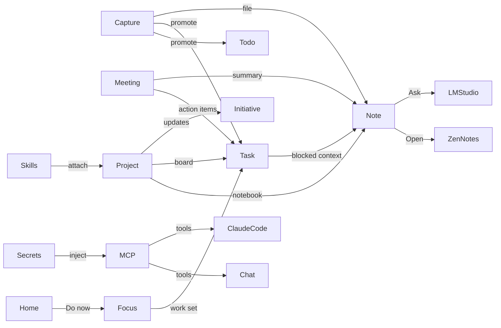

# FEAT-004 — Dashboard OS (Personal command center)

**Status:** design / IA + UX overhaul (REV 2 — locks + connected UX + final mockup)  
**Goal:** One app that replaces and integrates Linear · Notion · WorkFlowy/Dotflowy · ZenNotes · Infisical · MCP catalog · Claude/Codex ops — without feeling like six half-apps bolted together.  
**North-star feeling:** OpenShip’s quiet polish + Linear’s professional density + ADHD-friendly capture/find/close loops.  
**Reference shots:** `docs/design/dashboard-os/ref/shot-*.png`  
**Mockups:** `docs/design/dashboard-os/mockups.html` (options) · **`final.html`** (locked system)

---

## 0. What you said (requirements distilled)

| Need | Source apps | Pain today |
|---|---|---|
| All-in-one daily driver | everything below | Features feel thrown together; navigation doesn’t flow |
| Knowledge = Notion-like, project top-level → notes under | Notion, ZenNotes | Knowledge / Library / Documents / Prompts overlap and confuse |
| Skills collection | Claude/Codex skill dirs | Buried in Library; agent-oriented, not human browse |
| Switch Obsidian → **ZenNotes** | ZenNotes (+ MCP) | Vault still Obsidian-framed; no “Open in ZenNotes” |
| Human-first vault organization | — | Current tree is agent-friendly, not yours |
| MCP for Claude/Chat to ask the vault | nexus-mcp, ZenNotes MCP | Partial knowledge tools; no semantic “ask my brain” |
| LM Studio for AI + embeddings | LM Studio | Embeddings still OpenAI-shaped; chat via cloud AI SDK |
| Quick notes + longer projects (outline) | WorkFlowy / Dotflowy | Todos ≠ outlines; no nested bullet brain |
| Tasks / To-do UX upgrade | Linear | My Tasks hard to scan; Home sparse; feels cheap vs Linear |
| Meeting transcripts section | — | Missing |
| Lens + vault together | Things + notes | Lens is pure tasks; no knowledge adjacency |
| Secrets from **Infisical** local Docker | Infisical | Only API-keys settings; no vault import/manage |
| MCP inventory dashboard | many MCP configs | Settings list only; not a living catalog |
| Soft colored icons with light glow | OpenShip | Flat lucide icons; Library has kind chips only |
| Linear-style initiative updates (drop comments) | Linear Initiatives | Project health updates exist but feel thin/cheap |
| ADHD: reduce fragmentation | — | Too many places for the same thought |


---

## 0b. Locks (user decisions — 2026-07-19)

| Surface | Lock | Notes |
|---|---|---|
| **Soft icons** | **Yes, but NOT in sidebar** | Soft tinted tiles on Home tiles, Skills cards, empty states, project overview, MCP/Secrets cards. **Sidebar = plain stroke icons only** (Linear-like), active row still soft-fills. |
| **Home** | **Option B — Do now + project pulse** | Capture bar + greeting + Do now + Project pulse + right rail (Inbox / Starter / Ops). |
| **Sidebar IA** | **Option B — Brain / Ops** | Home · Focus · Capture · Projects · Favorites · Brain (Notes, Skills, Meetings, Prompts) · Ops (MCPs, Secrets, Settings). |
| **Notes** | **Option A — Project notebooks** | Project top-level → notes under; Open in ZenNotes; Ask vault. |
| **MCPs** | **Catalog cards** | Living ops surface, not settings-only. |
| **Secrets** | **Infisical bridge** | Masked list, import, inject into MCP/project. |
| **Focus** | **Option A — Things segments** (Today/Upcoming/…) | Keep N/N/L as optional layout toggle later if needed. |
| **Project updates** | **Initiative composer** | Linear-style drop-in updates. |
| **Meetings** | **Rework required** | See §3.7 REV 2 — not the thin list+detail only. |
| **Filters** | **Required on every major screen** | Sticky filter chip row + saved views where lists/boards exist. |
| **Project Starter** | **Included** | Thin entry now; full workshop after core graph. FEAT-003. |
| **Inbox** | **Attention only** | Not a brain dump. Dumps go to Capture. Inbox → Focus “Needs you” (preferred) or badge on Focus. |
| **Capture default** | **Dump** | Not Task, not Inbox. |
| **Vault folders** | **`projects/{projectId}/`** | Stable id. |
| **Cloud AI fallback** | **Gemini** | When LM Studio down; always labeled. |
| **Promote MVP** | Capture + Todos + Meeting actions | Shared menu; safe promote. |

**Explicit reject:** soft icon squares in the sidebar; using Inbox as a scratch pad.

---

## 1. Visual language — steal with intent

### 1.1 From OpenShip (shot-05 / shot-00)

| Pattern | Spec for Nexus |
|---|---|
| **Soft icon tiles** | 36×36 rounded-xl on **content surfaces only** (Home tiles, cards, empty states, Skills/MCP/Secrets). **Sidebar icons stay plain strokes** (no tint square) — Linear density. Active sidebar row uses soft fill, not icon chrome. |
| **Quiet empty states** | Centered illustration + one sentence + two CTAs (primary filled white/light, secondary ghost). Tip line with `⌘K`. |
| **Home as dashboard** | Greeting + one hero panel + right rail (Activity / Tips / Recent) + bottom quick-action tiles. Not a sparse card graveyard. |
| **Sidebar restraint** | ≤6 top-level items in MAIN. Nested stuff under Projects / Knowledge / System. Account footer. Gradient primary CTA at bottom of nav. |
| **Active row** | Soft fill + subtle border, not harsh invert. |

### 1.2 From Linear (shot-04)

| Pattern | Spec for Nexus |
|---|---|
| **Kanban density** | Cards with ID, title, date, colored project/label chips, priority glyph. Columns with count. |
| **Issue professionalism** | Hairline borders, consistent 13px body, muted metadata, no oversized empty chrome. |
| **Initiatives / updates** | Timeline of short posts with health, author, relative time — feels like a conversation, not a form dump. |
| **Sidebar clusters** | Workspace / Favorites / Teams — collapsible, scannable. |

### 1.3 Why Nexus “looks cheaper” today (shot-03)

- Sidebar is a **long flat list** of peer items (My Tasks, Lens, Chat, projects, My work×4, Knowledge×4, System×2) → no hierarchy of importance.
- Home is **three lonely cards** on a black void; OpenShip fills the canvas with a composed hero + rail + action strip.
- Icons are plain strokes; OpenShip’s soft tinted squares carry brand and scanability.
- Empty “Up next” is apologetic; OpenShip empty states are inviting.
- Project chips on Home are tiny progress bars without status narrative or last update.
- No right rail, no activity pulse, no “what should I do in the next 5 minutes?”

**Design rule going forward:** every surface gets (1) clear primary action, (2) scannable density, (3) soft identity color, (4) one obvious next step when empty.

---

## 2. Information architecture (rebuild)

### 2.1 Proposed sidebar (max depth 2)

```
┌ WORKSPACE ─────────────────────┐
│ ◎ Home                         │  command center
│ ☉ Focus                        │  Lens + Today (merged)
│ ☐ Capture                      │  quick notes + todos + inbox zero
│ ▤ Projects                     │  list / board entry
│                                 │
│ FAVORITES (user-pinned)         │
│   · Voice Agent Studio          │
│   · AI Interaction Dashboard    │
│                                 │
│ BRAIN                           │
│   ◆ Notes                      │  ZenNotes vault (was Knowledge)
│   ▦ Skills                     │  elevated from Library
│   ◇ Meetings                   │  NEW transcripts
│   ✦ Prompts                    │  keep
│   ▤ Documents                  │  long-form / team docs (narrowed)
│                                 │
│ OPS                             │
│   ⬡ MCPs                       │  NEW living catalog
│   ⚿ Secrets                    │  NEW Infisical bridge
│   ⚙ Settings                   │
│                                 │
│ [ + New ]  gradient CTA         │  task | note | project | idea
│ account footer                  │
└─────────────────────────────────┘
```

**What collapses / moves**

| Today | Tomorrow |
|---|---|
| My Tasks + Lens + Now/Next/Later | **Focus** (one place; segments inside) |
| To-do + Inbox | **Capture** (inbox + quick todos + outline scratch) |
| Knowledge + part of Documents | **Notes** (vault) |
| Library (skills/agents/orch) | **Skills** (human catalog; agents as filter) |
| Settings → MCP servers | **MCPs** top-level ops |
| Settings → API keys only | **Secrets** (Infisical + local) |
| Chat | Stays accessible via `⌘J` / header; not competing with Home |
| Recurring | Under Focus → Scheduled, or Settings → Automation |

### 2.2 Entity model (how things relate)

```text
                    ┌────────────┐
                    │  Project   │◄──── Linear-like container
                    └─────┬──────┘
           ┌──────────────┼──────────────┬─────────────┐
           ▼              ▼              ▼             ▼
        Tasks          Notes         Skills        Secrets
      (board)      (vault tree)    (linked)      (scoped)
           │              │
           ▼              ▼
        Todos          Meetings
     (quick check)   (transcripts → notes/tasks)
           │
           ▼
        Capture inbox ──► promote to Task | Note | Project update
```

**Promotion rules (ADHD gold)**  
Anything captured can stay tiny OR one-click promote:

- Capture line → Todo  
- Todo → Task (project + status)  
- Bullet outline node → Note under project  
- Meeting action item → Task  
- Project update comment → stays on initiative timeline  

Never force structure at capture time.

---

## 3. Feature-by-feature audit

### 3.1 Home

| Today | Opportunity |
|---|---|
| Greeting + quick capture + agenda + up next + active projects | Compose like OpenShip: hero “Today” panel, right rail Activity/Tips/Recent, bottom quick tiles |
| Sparse when little data | Show **Focus queue** (top 3), **Stale projects**, **Unread inbox**, **Last note**, **MCP health** even if counts are low |
| No initiative pulse | “Project pulse” strip: last update per active project (Linear initiative style) |
| Capture bar good seed | Keep; add mode switch: Task · Todo · Note · Update |

**Home modules (v2)**  
1. Greeting + day brief  
2. Universal capture  
3. **Do now** (max 5: overdue + Focus Today + blocked-needing-you)  
4. **Project pulse** (avatar/color, last update snippet, health)  
5. Right rail: Inbox count, MCP/Secrets status, Recent notes, Starter continue  
6. Bottom tiles: New note · Open Focus · Skills · Meetings · Secrets  

### 3.2 Focus (My Tasks + Lens + Triage)

| Today | Pain | Fix |
|---|---|---|
| My Tasks = filtered TasksView | Feels like a dump | Default **Focus** view: Today / Upcoming / Anytime / Someday / Logbook (Lens) with list density |
| Lens separate | Extra hop | Merge into Focus segments |
| Now/Next/Later separate | Third prioritization model | Map Now→Today, Next→Upcoming, Later→Someday; retire separate route or make it a Focus layout toggle |
| Hard to find stuff | Weak search/filter chrome | Sticky filter chip row (project, priority, label, has-note); `⌘F` in-view filter; saved Focus views |

**Linear parity:** issue id, project chip, priority, date on every row; keyboard j/k; bulk select.

### 3.3 Capture (To-do + Inbox + outline)

| Today | Pain | Fix |
|---|---|---|
| Todos = flat checklist | Not WorkFlowy | Add **Outline mode**: nested bullets, collapse, zoom into node (WorkFlowy), each node can link project |
| Inbox separate | Fragmentation | Capture page tabs: Inbox · Todos · Outline · Quick notes |
| No “brain dump” | ADHD needs frictionless | `⌘⇧N` global quick capture → Capture inbox |

**Todo vs Task (clear rule)**  
- **Todo** = personal, disposable, minutes–hours, no board ceremony  
- **Task** = project work, status, assignee, verification  
UI always offers “Promote to task…”

### 3.4 Projects

| Today | Pain | Fix |
|---|---|---|
| Grid + tabs (board, docs, todos, library…) | Good bones, cheap chrome | OpenShip-style list/grid toggle; soft project icon tiles; status + last update + open count |
| Updates exist | Looks thin vs Linear initiatives | **Initiative timeline**: composer always on top (“Drop an update…”), health emoji, comments thread, attach note/task |
| Project knowledge soft-link | Confusing | Project **Notes** tab = vault folder `notes/projects/{slug}/` only; one button Open in ZenNotes |
| No secrets/MCP scope | Missing | Project overview chips: linked skills, MCPs, secrets count |

### 3.5 Notes (was Knowledge) — biggest rework

**Problems**  
- Named “Knowledge” while Documents/Library/Prompts also store “knowledge”  
- Folder taxonomy (`daily/ projects/ ideas/ drafts/ references/ iter12/`) is agent/Zettel-ish, not how you navigate life  
- Obsidian coupling in copy and mental model  
- No first-class project notebook tree (Notion pages)  
- No Open in ZenNotes  
- No “ask this vault” chat with local embeddings  

**Target model — Notion × ZenNotes**

```text
Vault root (ZenNotes-compatible on disk)
├── _inbox/                 # unfiled captures
├── projects/
│   └── {project-slug}/     # ONE notebook per Nexus project
│       ├── _index.md       # project home note (cover, goals)
│       ├── decisions/
│       ├── meetings/       # or symlink from Meetings
│       └── notes/
├── areas/                  # ongoing life areas (ADHD, career, health)
├── resources/              # evergreen reference (was references)
├── archive/
└── daily/                  # optional; ZenNotes calendar can own these
```

**UI**

```
┌ Notes ────────────────────────────────────────────────────────────┐
│ [Search]  Projects ▾  Areas ▾   [Open ZenNotes] [Ask vault] [New] │
├─ Tree ──────────────┬─ Editor / Preview ────────┬─ Context ───────┤
│ ▼ Projects          │ title + breadcrumb         │ Backlinks       │
│   ▼ Voice Agent     │                            │ Linked tasks    │
│     _index          │ markdown body              │ Skills used     │
│     decisions/…     │                            │ Open in ZenNotes│
│   ▶ AI Interaction  │                            │                 │
│ ▼ Areas             │                            │                 │
│ ▼ Inbox (3)         │                            │                 │
└─────────────────────┴────────────────────────────┴─────────────────┘
```

**Open in ZenNotes**  
- `zennotes://open?path=…` or CLI if published; fallback `open -a ZenNotes {vaultRoot}`  
- Settings: vault root path (default migrate from `nexus-knowledge` → user ZenNotes vault or keep path and retarget ZenNotes `localVaults`)

**Ask vault (LM Studio)**  
- Index notes with local embeddings (LM Studio OpenAI-compatible endpoint) into pgvector/DuckDB  
- UI: slide-over chat “Ask Notes” scoped to selection / project / whole vault  
- MCP tools: `notes_search`, `notes_ask`, `notes_read`, `notes_write` for Claude Code / Chat  

### 3.6 Skills (elevated Library)

| Today | Fix |
|---|---|
| Library mixes skills/agents/orchestration | **Skills** home: grid of soft-icon cards by source (global Claude, Codex, project) |
| Scan-only mental model | “Install / pin / try” actions; pin to project; copy path; open file |
| Not human-browsable | Filters: kind, source, used-in-project, recently used; README preview |

Agents & orchestration = filters/tabs inside Skills, not separate top-level mystery.

### 3.7 Meetings (NEW — REV 2 rework)

Meetings is not a thin transcript dump. It is a **pipeline**: capture → understand → act → file.

```
┌ Meetings ──────────────────────────────────────────────────────────────┐
│ Filters: Project · Source · Has actions · Date range · Saved views      │
├─ Left: sessions ──────┬─ Center: workspace ──────────┬─ Right: actions ─┤
│ grouped by week       │ tabs: Summary | Transcript   │ unchecked items  │
│ status chips:         │         | Notes | People     │ [→ Task] each    │
│  new / summarized /   │ player-style jump-to-ts      │ [→ Todo]         │
│  actions-open / filed │ highlight speakers           │ [→ Note bullet]  │
│                       │ LM Studio re-summarize       │ Link project     │
│ [Drop / Paste / Import]│                             │ File to notebook │
└───────────────────────┴──────────────────────────────┴──────────────────┘
```

**Why rework:** ADHD brains need the *output* (actions + filed note), not the raw wall of text. Default landing after import = **Summary + open actions**, transcript is secondary tab.

**Sources:** paste · file drop (.txt/.vtt/.srt/.md) · folder watch later · manual “live notes” without transcript.

**Storage**
- Raw: `meetings/raw/YYYY-MM-DD-slug.{vtt,txt}`
- Filed note: `notes/projects/{slug}/meetings/YYYY-MM-DD-title.md` (summary + links + action refs)
- Actions become Tasks/Todos with `sourceMeetingId`

**Filters (required):** project, source, date, “has open actions”, “unfiled”, saved view “Needs filing”.

### 3.8 Prompts & Documents

- **Prompts:** keep; cross-link from Skills and Chat.  
- **Documents:** narrow to long-form / shareable / non-vault docs so Notes isn’t duplicated. Hub stays; stop dual-storing project notes here.

### 3.9 MCPs (NEW top-level)

Living catalog (not buried in Settings):

| Column | Meaning |
|---|---|
| Name / soft icon | identity |
| Status | up / down / unknown (probe) |
| Used by | Claude / Codex / Chat / ZenNotes |
| Scope | global / project |
| Tools count | from list_tools |
| Actions | enable, edit env (via Secrets), test, open docs |

Seed known servers: nexus-mcp, ZenNotes MCP, Infisical if any, browser, etc.

### 3.10 Secrets (NEW — Infisical)

- Connect Infisical local Docker (URL + token/service identity)  
- Browse projects/envs/secrets (masked)  
- **Import selected →** Nexus project env map or MCP server env  
- Never show full secret by default; copy-once; audit log local  
- Replace thin API-keys page as the human front door; API-keys become one source type  

### 3.11 Chat / Claude / Codex

- Chat stays; model routing adds **LM Studio** local endpoint  
- System tools always include Notes + Tasks + MCPs when enabled  
- Header indicator: Local (LM Studio) vs Cloud  
- Project Starter (FEAT-003) launches from Projects CTA — already designed  

### 3.12 Lens + vault

Focus Today segment shows optional **linked notes** under each task (if task has `notePath` or backlink).  
“Open related note” on task card. Lens is not only tasks — it’s **attention**.

---

## 4. Relationship map (flows that must feel native)



**Cross-links in UI (always)**  
- Task → Notes / Project / Skills  
- Note → Tasks / Project / Open ZenNotes  
- Project → Board · Notes · Updates · Skills · Secrets · MCPs  
- Home modules deep-link with filters pre-applied  

---

## 5. Navigation & findability (ADHD)

1. **One capture** (`⌘N` / `⌘⇧N`) — never wonder where to put a thought.  
2. **One focus** — where work happens today.  
3. **One brain** — Notes (+ Ask).  
4. **⌘K** knows entities: go to project, note, skill, mcp, secret, meeting.  
5. **Pinned favorites** in sidebar.  
6. **Recent** everywhere (Home rail, ⌘K, Notes).  
7. **Promote, don’t pre-sort** — structure is optional until you need it.  
8. **Soft color identity** per project/area so spatial memory works.  

---

## 6. Vault migration plan (Obsidian → ZenNotes)

1. Pick canonical disk root (recommend keep `/Users/john.keeney/nexus-knowledge` OR point both Nexus + ZenNotes at your preferred ZenNotes vault).  
2. Reshape folders to §3.5 tree (scripted move + redirect stubs).  
3. Add ZenNotes to `localVaults` (already supports multi-vault).  
4. Nexus settings: `notes.vaultRoot`, `notes.openCommand` (`zennotes` URL scheme).  
5. Reindex embeddings via LM Studio.  
6. Update nexus-mcp knowledge tools paths.  
7. Deprecate Obsidian copy in UI strings.

---

## 7. LM Studio integration

| Use | How |
|---|---|
| Chat local models | AI SDK `createOpenAICompatible({ baseURL: http://localhost:1234/v1 })` |
| Embeddings | LM Studio embedding model → existing pgvector / embedding package swap provider |
| Meetings summary | Local model, offline-friendly |
| Ask vault | RAG: embed chunks, retrieve top-k, answer with citations to note paths |

Settings → Models: Cloud | LM Studio URL | default chat model | embedding model | probe status.

---


---

## 7b. Connected experience (how surfaces flow)

The product wins only if tabs **hand off** work. Canonical loops:

### Loop 1 — Morning (ADHD start)
Home **Do now** → open item in **Focus** → if blocked, open **linked Note** or drop **Project update** → done item returns Home count to zero.

### Loop 2 — Brain dump
`⌘⇧N` **Capture** → later Process: promote lines to Todo / Task / Note under project notebook → Inbox zero.

### Loop 3 — Project workday
**Projects** → Board (Focus filter pre-applied to project) ↔ **Notes** notebook ↔ **Updates** composer ↔ **Skills** pinned to project ↔ **Secrets/MCPs** scoped chips on overview.

### Loop 4 — Meeting aftermath
**Meetings** import → Summary tab → check actions → bulk “Create tasks in project” → **File to notebook** → appears in project Notes + Home pulse if update posted.

### Loop 5 — Agent work
**Skills** pin to project → **Project Starter** (FEAT-003) or Chat/Claude uses **nexus-mcp** + **ZenNotes MCP** + secrets-injected env → board moves on **Focus/Projects**.

### Loop 6 — New idea → build
Home/Projects **Start from idea** → Starter workshop (concept→handoff→board) → continues on Home “Continue starter” → sealed project lands in Projects with notebook scaffolded under Notes.

### Universal chrome on every major list/board
1. **Sticky filter bar:** search · project · status/segment · label/tag · date · “has link”  
2. **View switch:** list | board | timeline (where relevant)  
3. **Saved views:** personal, pinable to Favorites  
4. **Empty state:** one primary + one secondary CTA  
5. **Deep link out:** Open in ZenNotes / Open board / Open Focus with filters  

### Cross-link chips (always visible on entities)
| Entity | Shows chips to |
|---|---|
| Task | Project, Note, Meeting, Skill |
| Note | Project, Tasks, Open ZenNotes, Ask |
| Project | Board, Notes, Updates, Skills, MCPs, Secrets, Starter |
| Meeting | Project, Actions→Tasks, Filed note |
| MCP | Secrets used, Projects |
| Starter | Phase, Resume, Target project |

---

## 8. Phased delivery (recommended)

### Phase A — Navigation & visual system (feels new immediately)
- Soft icon component (`SoftIcon`) roll out sidebar + Home + empty states  
- Sidebar IA collapse (Focus, Capture, Brain, Ops)  
- Home redesign (Do now, Project pulse, right rail, quick tiles)  
- Empty states OpenShip-quality  

### Phase B — Notes + ZenNotes
- Rename Knowledge → Notes; project notebook tree  
- Open in ZenNotes button  
- Vault reshape script  
- Project Notes tab = vault folder  

### Phase C — Capture / Tasks / Focus
- Merge Lens into Focus  
- Outline mode (WorkFlowy-lite)  
- My Tasks density + filters  
- Capture promotion flows  

### Phase D — Projects polish
- Initiative updates composer (Linear-like)  
- Project overview makeover (soft icons, pulse, linked resources)  

### Phase E — Skills / MCPs / Secrets / Meetings
- Skills home  
- MCP catalog  
- Infisical bridge  
- Meetings module  

### Phase F — Local AI
- LM Studio provider  
- Embeddings + Ask vault  
- MCP `notes_ask`  

**Parallel:** FEAT-003 Project Starter plugs into Projects CTA without blocking A–D.

---

## 9. Detailed opportunities catalog (high-value, small + large)

### Visual / craft
1. `SoftIcon` primitive (color, bg opacity, size sm/md/lg)  
2. Gradient `+ New` CTA in sidebar (OpenShip)  
3. Project color on every chip/row consistently  
4. Card elevation: 1px border + inner highlight, not heavy shadow  
5. Typography scale lock: 20/13/12/11 like Linear  
6. Skeleton loaders matching final layout (not generic bars only)  

### Home
7. Do now (max 5)  
8. Project pulse with last initiative update  
9. Right rail Activity  
10. Quick tiles  
11. Capture mode switcher  
12. Stale project nudge  

### Focus / Tasks
13. Unified Focus route  
14. Saved views  
15. Row density toggle (comfy/compact)  
16. “Waiting on” filter  
17. Task ↔ note link control  
18. Keyboard cheatsheet on `?`  

### Capture / Outline
19. Nested todos  
20. Zoom into bullet  
21. Inbox zero ritual (process 10)  
22. Natural language due dates in capture  

### Notes
23. Project notebook hierarchy  
24. Open ZenNotes  
25. Ask vault  
26. Unresolved wiki-link queue  
27. Daily note optional via ZenNotes calendar  
28. Drag note → project folder  

### Projects
29. Initiative composer always visible  
30. Update reactions / comments  
31. Overview resource strip (notes/skills/mcps/secrets)  
32. Board default professional density  

### Skills
33. Card grid with soft icons  
34. Pin to project  
35. “Used by starters / agents” badge  

### MCPs / Secrets / Meetings
36. MCP health probe  
37. Secret inject into MCP env  
38. Meeting → tasks extraction  
39. Transcript search  

### Global
40. ⌘K entity search expansion  
41. Global quick capture  
42. Favorites  
43. “Where is this?” command (explain IA)  
44. ADHD mode: larger hit targets, fewer simultaneous modules (Home config)  

---

## 10. Anti-goals

- Don’t build a second Obsidian. ZenNotes owns deep editing; Nexus owns organization + links + ask.  
- Don’t show every Linear feature — show the ones you use (board, issues density, initiative updates).  
- Don’t nest more than 2 levels in the app sidebar.  
- Don’t require filing before capture.  
- Don’t store secrets in Postgres plaintext.  

---

## 11. Success criteria (you feel it when…)

1. You open the app and know **the next 3 things** within 5 seconds.  
2. You never wonder Notes vs Documents vs Library.  
3. A thought goes Capture → later becomes Task/Note without guilt.  
4. Project page feels like Linear initiative + Notion notebook + board.  
5. Soft icons make the sidebar scannable by color.  
6. “Open in ZenNotes” and “Ask vault” are one click.  
7. MCPs and secrets are visible ops, not buried settings.  
8. The app feels **one product**, not a folder of demos.  

---

## 12. Open decisions

1. Canonical vault path: keep `nexus-knowledge` or switch to OneDrive/ZenNotes root?  
2. Focus: keep “Now/Next/Later” language as a layout or fully adopt Today/Upcoming/Someday?  
3. Chat: default to LM Studio when available?  
4. Infisical: self-hosted URL and auth method you already use?  
5. Meetings: primary source (paste / file drop / specific app)?  
6. Sidebar: show Chat or header-only?  

---

## 13. Mockups

Interactive: [`dashboard-os/mockups.html`](./dashboard-os/mockups.html)

Screens:  
IA sidebar · Home v2 · Focus · Capture/Outline · Notes+ZenNotes · Skills · Project initiative · MCP catalog · Secrets · Meetings · SoftIcon system  

---

## 14. References

- OpenShip UI (user shots) — soft icons, home composition, empty states  
- Linear TODO board + initiatives (user shots) — density, updates  
- Current Nexus Home (shot-03) — baseline pain  
- `docs/design/TASK-012-knowledge-vault-spec.md` — prior knowledge work  
- `docs/SKILL_LIBRARY_DESIGN.md` — library model  
- `docs/design/PROJECT-STARTER-FEATURE.md` — project creation factory  
- ZenNotes config + multi-vault  
- `mcp-server/server.ts` — existing agent bridge  
