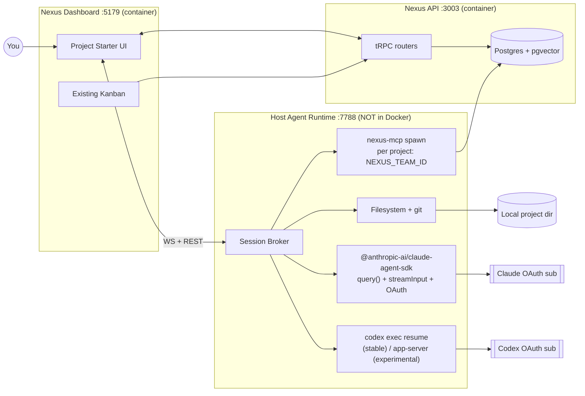
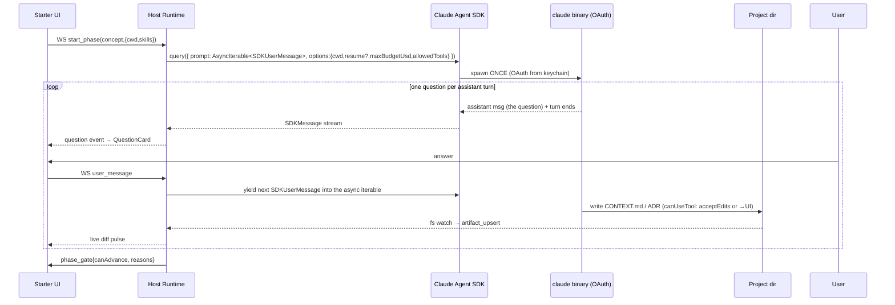
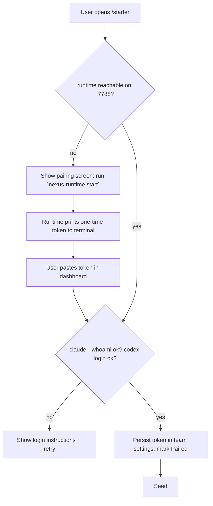
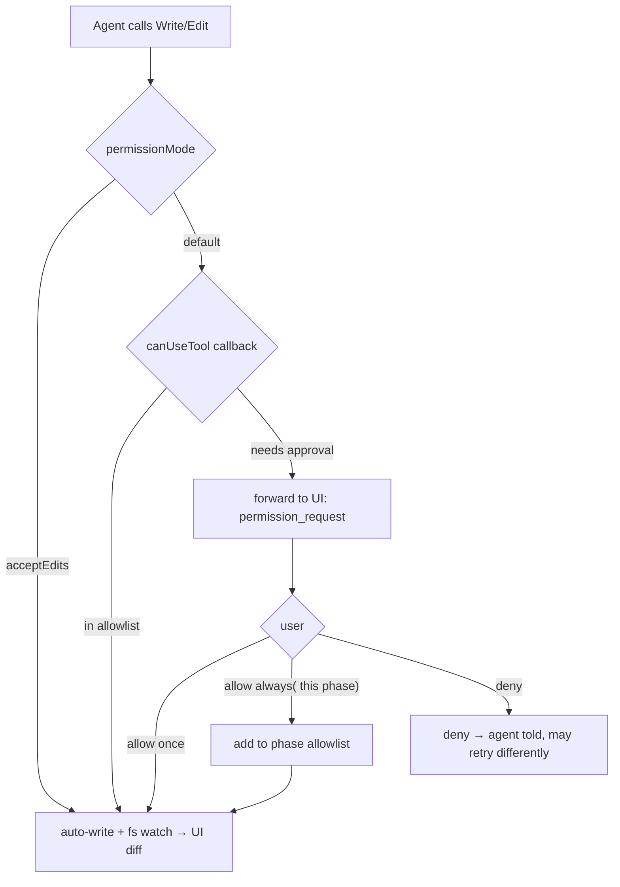
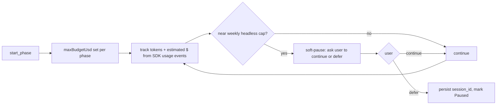

# FEAT-003 — Project Starter (Idea → Wayfind → Grill → Handoff → Kanban → Code)

**Status:** design (REV 2 — reviewed; gaps from v1 addressed, UI deepened)  
**Owner surface:** Nexus dashboard (`apps/dashboard`) + host-side Agent Runtime  
**Drivers:** Claude Code (OAuth sub) + Codex CLI (OAuth sub) — **no API keys**  
**Skill spine:** Matt Pocock [`wayfinder`](https://github.com/mattpocock/skills/blob/main/skills/engineering/wayfinder/SKILL.md) + [`grill-with-docs`](https://github.com/mattpocock/skills/blob/main/skills/engineering/grill-with-docs/SKILL.md) (+ `prototype`, `to-spec`, `to-tickets`, `implement`, `grilling`, `domain-modeling`)  
**Related local skills:** `AI Agent:Skills Catalog/{grill-me-with-docs,grill-me-chat,handoff-chat,project-creation-chat-instructions}`  
**Mockups:** [`project-starter/mockups.html`](./project-starter/mockups.html) (11 interactive screens + modals)

---

## 0. What changed in REV 2 (review summary)

REV 1 had real gaps. This revision fixes them; nothing here is hand-waved.

| # | Issue found in v1 | Severity | Resolution in REV 2 |
|---|---|---|---|
| R1 | **Nexus has no task-blocking/dependency model.** `tasks` (schema.ts:224) has `statusId`, `order`, `priority` — nothing for "blocked by". v1 said "encode blockers as relations" without a table. | **Blocker** | New `task_dependencies` table + frontier computed in app. See §9. |
| R2 | **Codex `app-server` is `[experimental]`.** Plan C (Dual-Lane) rested on it as if mature. | High | Plan C downgraded to "research mode." Stable execute path = `codex exec resume`. See §7.4, §11. |
| R3 | **Over-engineered auth.** v1 implied multi-tenant RBAC for the host runtime. The app is **local-only** since FEAT-001/DEC-014/DEC-018 — single user, fixed team. | Med | Runtime uses a local pairing token; no tenant model. See §7.5, §10. |
| R4 | **Missed the existing `nexus-mcp` server** (`mcp-server/server.ts`) which already writes tasks/projects/knowledge to Postgres over stdio. v1 invented a parallel tRPC path. | High | Reuse `nexus-mcp` as the execute driver's board tool. See §11. |
| R5 | **Skill vendoring was incomplete.** `grill-with-docs` depends on `grilling` + `domain-modeling`; `to-tickets` needs the tracker setup. v1 listed a subset. | Med | Vendor the full closure + pre-answered local-markdown tracker. See §12. |
| R6 | **Quota/budget on an OAuth subscription unaddressed.** The whole point was to minimize `-p`; v1 never modeled the weekly headless cap. | High | Per-phase `maxBudgetUsd` + soft quota gauge + pause-near-limit. See §13. |
| R7 | **Dashboard-in-container ↔ host-runtime data flow was fuzzy.** | Med | Local-only ⇒ browser→runtime WS; materialize via browser tRPC or runtime-spawned `nexus-mcp`. See §7.5, §10. |
| R8 | **"1 long-lived session per phase" was asserted, not proven.** | — | **Verified against SDK types:** `query({ prompt: string \| AsyncIterable<SDKUserMessage> })` + `streamInput()` + "streaming input mode" exist. ONE process per phase, turns pushed in. v1 was right; REV 2 specifies it precisely with the verified fallback. See §7.2. |
| R9 | **No lifecycle for starter → real project.** v1 left it open. | Med | Draft project at Seed → promote to full project at BoardBuild → starter archived as provenance. See §9.4. |
| R10 | **Per-phase tool allowlists missing.** Wayfinder says "decisions, not deliverables" — nothing stopped the agent coding early. | Med | Per-phase `allowedTools`/`permissionMode` matrix. See §8.3. |
| R11 | **No preflight.** If `claude`/`codex` aren't logged in or the runtime is down, Seed silently fails. | Med | Pairing screen with health checks. See §8 screen "Pairing". |
| R12 | **UI was shallow** (5 screens, no states/modals). | High | 11 screens + permission/phase-gate/ADR/quota/activity/resume modals. See §8 + mockups.html. |
| R13 | **No acceptance criteria per slice.** | Med | Given/When/Then per slice. See §16. |

> What did **not** turn out to be a flaw (verified, not assumed): the streaming-input multi-turn model (R8) is real in the SDK; the local-only simplification (R3) makes the host-runtime approach viable, not exotic.

---

## 1. Problem

Starting a greenfield project today is a pile of disconnected chats: brainstorm → maybe `/grill-me` → maybe `/wayfinder` → scattered handoff docs → manual Nexus project + kanban → a coding agent that starts cold and drifts.

You want Nexus to be the **guided factory**: idea → concept lock → architecture → UX mockups → phased plan → handoff pack → second grill (coding agent) → kanban ops board → Claude/Codex execute against the board, with results rendered **natively in the dashboard**, driven by **existing OAuth subscriptions**, minimizing one-shot `claude -p` tax, never requiring API keys.

---

## 2. Product promise (one sentence)

**Project Starter** is a multi-phase visual workshop in Nexus that runs Matt Pocock's idea→ship skill chain through a host-side agent runtime (Claude Agent SDK + Codex), writes a local project directory + handoff pack, materializes a Nexus project + dependency-aware kanban board as the single ops surface, then hands the board to Claude or Codex — via the existing `nexus-mcp` server — to implement.

---

## 3. End-to-end journey

```text
┌──────────┐   ┌─────────────┐   ┌──────────────┐   ┌────────────┐   ┌─────────────┐
│ 0. Seed  │──▶│ 1. Concept  │──▶│ 2. Arch lock │──▶│ 3. UX +    │──▶│ 4. Phased   │
│ idea +   │   │ grill-with- │   │ wayfinder    │   │ mockups    │   │ plan        │
│ directory│   │ docs        │   │ map+tickets  │   │ /prototype │   │ /to-spec    │
└──────────┘   └─────────────┘   └──────────────┘   └────────────┘   └──────┬──────┘
                                                                             │
     ┌───────────────────────────────────────────────────────────────────────┘
     ▼
┌──────────────┐   ┌────────────────┐   ┌──────────────────┐   ┌────────────────────┐
│ 5. Handoff   │──▶│ 6. Coding-agent│──▶│ 7. Impl plan +   │──▶│ 8. Run board       │
│ pack on disk │   │ 2nd grill      │   │ /to-tickets →    │   │ Claude|Codex pull  │
│ + draft proj │   │ (open Qs only) │   │ kanban + deps    │   │ tasks via nexus-mcp│
└──────────────┘   └────────────────┘   └──────────────────┘   └────────────────────┘
```

### Phase contracts

| # | Phase | Skill(s) | Human role | Agent role | Artifacts written |
|---|---|---|---|---|---|
| 0 | **Seed** | — (deterministic UI) | Name, idea, parent dir, drivers | Validate path; scaffold empty dir + git; vendor skills; create **draft** Nexus project | `<dir>/`, `.nexus-starter.json`, draft `projects` row |
| 1 | **Concept** | `grill-with-docs` (+ domain-modeling) | Answer one Q at a time | Interview; update `CONTEXT.md` + ADRs live | `CONTEXT.md`, `docs/adr/*` |
| 2 | **Architecture** | `wayfinder` (chart + work) | Resolve HITL tickets | Chart map, AFK research, claim/resolve tickets | `.scratch/starter/map.md`, decision tickets |
| 3 | **UX** | `prototype` (UI branch) | Pick variant, annotate | Generate 3–5 mockup variants + flows | `docs/ux/*`, selected-variant ADR |
| 4 | **Plan** | `to-spec` | Approve seams + stories | Synthesize PRD/spec | `docs/spec.md` |
| 5 | **Handoff** | `handoff` (catalog) | Confirm ready | Emit 7 docs; refuse to invent | `PRD/user-stories/tech-spec/plan/CLAUDE/handoff/README.md` |
| 6 | **Grill²** | `grill-with-docs` (coding-agent persona) | Answer residual open Qs only | Read handoff; grill **only** `handoff.md` open Qs/contradictions | updated ADRs/CONTEXT, closed-Qs list |
| 7 | **Board build** | `to-tickets` | Approve slice granularity | Vertical-slice tickets + blockers → Nexus tasks **+ `task_dependencies`** | Nexus statuses/tasks/deps, `.scratch/*/issues/*` mirror |
| 8 | **Execute** | `implement` (+ tdd, code-review) | Watch board, unblock HITL | Pull ready-frontier task via `nexus-mcp`, implement, move card, commit/PR | Code in `<dir>`, board progress, session logs |

**Hard rule (from wayfinder):** produce **decisions, not deliverables** until phase 8. The pull to code early is the signal the map is done — enforced by per-phase tool allowlists (§8.3), not vibes.

---

## 4. Flowcharts

### 4.1 System context (local-only)



**Key (REV 2):** the browser (on host) opens `ws://localhost:7788` to the host runtime directly — this works because the browser is on the host even though the dashboard server is in a container. The runtime is the **only** OAuth touchpoint; Postgres writes for the execute driver go through the reused `nexus-mcp` (§11).

### 4.2 Phase state machine (with gates)

```mermaid
stateDiagram-v2
  [*] --> Paired: runtime healthy + CLIs logged in
  Paired --> Seed
  Seed --> Concept: dir+git+skills vendored, draft project
  Concept --> Architecture: gate: CONTEXT has ≥N core terms, 0 contradictions
  Architecture --> UX: gate: map frontier empty OR user force-advance
  UX --> Plan: gate: one variant selected (ADR written)
  Plan --> Handoff: gate: spec seams + stories approved
  Handoff --> Grill2: gate: 7 docs valid (handoff.md populated)
  Grill2 --> BoardBuild: gate: open Qs = 0 OR all deferred-with-owner
  BoardBuild --> Execute: gate: ≥1 task in Todo, deps wired
  Execute --> Done: all ready tasks Done
  Done --> [*]: starter archived as provenance; project promoted
  note right of Seed: resume session_id on reload
```



### 4.3 One living process per phase (verified — R8)



This is **one** process spawn per phase. `AsyncIterable<SDKUserMessage>` + `streamInput()` (SDK types verified, §7.2) keep the session alive while turns are pushed in. On reload/WS drop, `options.resume = sessionId` re-attaches to the persisted session.

### 4.4 Pairing / auth (local-only — R3)



No multi-tenant RBAC — local-only app, fixed team `local-dev-team`. Token gates the runtime; everything else trusts the local user.

### 4.5 Permission decision (file writes by the agent)



### 4.6 Quota / budget (R6)



### 4.7 Execute loop (board as ops surface via nexus-mcp — R4)

```mermaid
flowchart TD
  A[Compute ready frontier: status=Todo AND all deps Done] --> B{Driver}
  B -->|Claude| C[SDK query resume=impl, mcpServers:{nexus}]
  B -->|Codex| D[codex exec resume --last, MCP config nexus]
  C --> E[agent: nexus.claim_task → In Progress]
  D --> E
  E --> F[implement + tests in cwd]
  F --> G{verify via nexus task acceptance}
  G -->|pass| H[nexus.move_task Done + comment]
  G -->|fail| I[nexus.move_task Blocked + note]
  H --> A
  I --> J[human unblock or re-grill]
  J --> A
```

---

## 5. Why a host runtime (and not the container)

| Constraint | Implication | Resolution |
|---|---|---|
| No API keys; Claude + Codex OAuth only | Runtime **must run on the host** (keychain) | New `nexus-agent-runtime` daemon on `127.0.0.1:7788` |
| Minimize `-p` | One living process per phase | SDK `AsyncIterable<SDKUserMessage>` streaming input (§7.2) |
| Native UI, not a TTY | Parse structured events → React | Typed WS protocol (§10); optional terminal drawer as escape hatch |
| Local-only app (FEAT-001) | No tenant model needed | Pairing token; fixed team |
| Existing chat uses API-key AI SDK | Do **not** route Starter through it | Starter is a separate, OAuth-only surface |

---

## 6. The agent runtime

### 6.1 Shape

```
nexus-agent-runtime/   (host process, NOT in compose)
  src/
    server.ts          # WS + REST on 127.0.0.1:7788
    pairing.ts         # one-time token; team-settings persistence
    preflight.ts       # claude --whoami, codex login, path allowlist
    sessions/
      claude.ts        # SDK wrapper: AsyncIterable<SDKUserMessage>, streamInput
      codex.ts         # codex exec resume (stable); app-server opt-in
    fs/
      scaffold.ts      # mkdir, git init, skill vendor (full closure)
      watch.ts         # chokidar → artifact_updated events
    mcp/
      spawn.ts         # launch nexus-mcp per project w/ NEXUS_TEAM_ID/USER_ID
    protocol.ts        # zod event schema shared with dashboard
  bin/nexus-runtime
```

Install model (REV 2): `brew services`/`launchd` plist or `nexus-runtime start --foreground`. Pairing token printed to the terminal on first start.

### 6.2 Claude path — verified SDK mechanics (R8)

```ts
import { query, type SDKUserMessage } from "@anthropic-ai/claude-agent-sdk";

// One living process for the whole Concept phase.
async function* userTurns(): AsyncIterable<SDKUserMessage> {
  yield { type: "user", message: { role: "user", content: initialPrompt } };
  // then block on the WS queue; yield as the human answers each question
  for await (const answer of wsAnswerQueue) {
    yield { type: "user", message: { role: "user", content: answer } };
  }
}

const q = query({
  prompt: userTurns(),
  options: {
    cwd: projectDir,
    pathToClaudeCodeExecutable: claudeBin,   // OAuth from keychain
    permissionMode: "acceptEdits",            // or forward via canUseTool
    allowedTools: ["Read","Write","Edit","Glob","Grep","Skill","TodoWrite"],
    mcpServers: { nexus: { command: "node", args: [nexusMcpPath],
                           env: { NEXUS_TEAM_ID, NEXUS_USER_ID } } },
    maxBudgetUsd: phaseBudget,                // R6 hard cap
    resume: priorSessionId ?? undefined,      // reload-safe
    includePartialMessages: true,
  },
});

for await (const msg of q) emitToWs(msg);     // map SDKMessage → typed events
```

Verified against `@anthropic-ai/claude-agent-sdk@0.3.215` types: `query({ prompt: string | AsyncIterable<SDKUserMessage>, options })`, `Query.streamInput(stream)`, "streaming input mode", `AccountInfo.tokenSource = 'oauth'`, `options.resume`, `options.maxBudgetUsd`, `options.mcpServers`, `options.canUseTool`. **Fallback if streaming-input proves flaky:** `resume`-per-turn (one spawn per question, shared memory) — same UX, more spawns, still OAuth.

### 6.3 Codex path — stable vs experimental (R2)

| Surface | Status | Use |
|---|---|---|
| `codex exec resume [SESSION_ID\|--last] [PROMPT]` | **Stable** | v1 Execute: one resume per ticket; shared memory via session id |
| `codex exec` (fresh) | Stable | AFK research batches |
| `codex app-server --listen ws://…` | `[experimental]` | Plan C only; daemon + remote-control, not v1 |
| `codex mcp-server` | Stable | expose Codex as a tool **to** Claude in dual-driver review |

Default role split: **Claude = discovery/HITL (Concept, Arch HITL, UX critique, Grill², code-review)**; **Codex = AFK research + Execute lanes**. Overridable per phase at Seed.

### 6.4 Security

- Bind `127.0.0.1` only; pairing token gates every WS.  
- Path allowlist: only user-confirmed roots (browse returns allowlisted dirs only).  
- Never relay keychain secrets to the browser; the SDK reads OAuth itself.  
- `nexus-mcp` spawned per-project with the fixed local team/user.

---

## 7. Creative alternatives (re-scored)

| Idea | Pros | Cons | Verdict |
|---|---|---|---|
| **Host Runtime + Claude Agent SDK + Codex exec** | OAuth native, streaming input (verified), resume, structured events | New daemon | **Recommended (REV 2)** |
| node-pty + xterm.js embed | Faithful CLI | Not native UI; brittle | Escape-hatch "Terminal drawer" |
| One `claude -p` per question | Simple | Worst OAuth/latency; only via resume | Reject |
| API keys in `.env` via AI SDK | Fits existing chat | Violates "no API keys" | Reject for Starter |
| Orca worktrees + orca-cli | Great isolation for Execute | Heavier UX | Optional Execute backend |
| Codex app-server as primary | Living process | **Experimental** (R2) | Plan C only |
| Claude remote-control / bridge | Cloud UI pairing | Not local-first | Out of scope v1 |

---

## 8. UI design (deep — R12)

Design tokens are the existing **Linear** palette in `DESIGN.md` (`#010102` canvas, `#5e6ad2` accent, `#f7f8f8` ink, charcoal panels, hairline borders). Every screen below is implemented in [`project-starter/mockups.html`](./project-starter/mockups.html) with the same tokens.

### 8.1 Information architecture

```
/team/[team]/projects                          existing grid; new CTA "Start from idea"
/team/[team]/starter                           workshop home (in-flight starters)
/team/[team]/starter/[id]                      active workshop shell (all phases)
/team/[team]/starter/[id]?phase=concept|architecture|ux|plan|handoff|grill2
/team/[team]/projects/[projectId]/board        existing kanban (execute home)
```

The shell is one route; the `phase` query param + phase rail drives which panes render.

### 8.2 The workshop shell (all phases)

```
┌─ Nexus ──────────────────── Sidebar ┬──────── Phase rail (sticky) ─────────────────────┐
│ Projects > Starter > acme-ops       │ ✓Seed ●1 Concept ○2 Arch ○3 UX ○4 Plan ○5 ○6 ○7 ○8 │
├──────────────────────────┬──────────┴───────────────────────────────────────────────────┤
│ LEFT  Dialogue           │ RIGHT  Living artifacts (tabs per phase)                      │
│  Question card           │  CONTEXT │ ADRs │ Map │ Mockups │ Spec │ Handoff              │
│  + recommended answer    │  markdown/mermaid/iframe + diff pulse on disk write           │
│  + freeform reply        │                                                              │
│  [Send][Accept rec][Skip]│ BOTTOM-RIGHT session strip: driver · session · quota · Resume │
└──────────────────────────┴──────────────────────────────────────────────────────────────┘
```

Persistent chrome across all phases: **phase rail** (clickable, gate-locked), **left dialogue**, **right artifact pane** (phase-specific tabs), **session strip** (driver, session id, quota gauge, resume). The right pane is the source of truth viewer; the left is the only place the human types.

### 8.3 Per-phase tool allowlists (R10 — "decisions, not deliverables")

| Phase | `allowedTools` | `permissionMode` | Can write code? |
|---|---|---|---|
| Seed | — (no agent) | — | n/a |
| Concept | Read, Write(targeted: CONTEXT/ADRs), Glob, Grep, Skill | acceptEdits (scoped) | **No** |
| Architecture | Read, Glob, Grep, Skill, WebFetch, TodoWrite | default (writes → ADRs only) | **No** |
| UX | + Write(`docs/ux/**`), Bash(`pnpm dev` scoped) | acceptEdits (scoped) | Prototype HTML only (throwaway) |
| Plan | Read, Glob, Grep, Skill | plan | **No** |
| Handoff | Write(`docs/**`, root `.md`s) | acceptEdits | Docs only |
| Grill² | Read, Write(CONTEXT/ADRs) | acceptEdits | **No** |
| Board build | Write(`.scratch/**`), nexus-mcp | acceptEdits | Tickets only |
| Execute | full claude_code preset + nexus-mcp | acceptEdits or default | **Yes** |

Enforced via the SDK `tools`/`allowedTools`/`permissionMode` per phase.

### 8.4 Screen catalog (all in mockups.html)

1. **Pairing** (R11) — runtime health, `claude --whoami`, `codex login`, paste one-time token, path-allowlist hint. Blocking until Paired.
2. **Seed** — idea, host directory picker (runtime-browsed), driver defaults, stack hints; scaffold + skills-vendor progress.
3. **Concept** — question card (Q N/~M), recommended-answer chip, freeform reply; right pane live `CONTEXT.md` with diff pulse; ADR toast.
4. **Architecture** — two sub-views: **map** (Destination / Frontier / Blocked / Fog / Decisions) + optional **DAG graph**; dialogue shows the current grilling ticket.
5. **UX** — variant gallery (3–5), compare, annotation pins, "Lock variant + ADR".
6. **Plan** — spec checklist (problem/solution/stories/seams/testing), approve to advance.
7. **Handoff** — 7-doc completeness meters; red flag if `handoff.md` under-populated; "Seal" gated.
8. **Grill²** — only `handoff.md` open-questions surfaced as question cards; close/defer each.
9. **Execute board** — existing kanban, augmented with driver badges, session links, verification criteria, live agent-log drawer, ready-frontier highlight.
10. **Modals/overlays** — Permission prompt; Phase-gate advance; ADR draft toast; Quota warning; Activity/reasoning drawer; Resume/reconnect banner.

### 8.5 State variations (every interactive screen has)

- **Empty** — no starter yet (Seed CTA), no map yet (Architecture placeholder), empty frontier (Done-ish).
- **Loading** — "agent thinking…" skeleton in dialogue; spinner on artifact tab while fs read.
- **Streaming** — partial-assistant-message shimmer; typed cursor.
- **Error** — agent errored (show `result` error + Retry/Resume); runtime disconnected (reconnect banner); CLAUDE_LOGGED_OUT (re-pair).
- **Paused** — quota-paused or user-paused; session id saved; big Resume button.
- **Permission** — pending `permission_request` blocks the turn; countdown to auto-deny.

### 8.6 Accessibility / interaction notes

- Every question reachable by keyboard; `Accept recommendation` = `Cmd+Enter`, `Send` = `Enter`, `Skip` = `Esc`.
- Diff pulse is motion-limited (respect `prefers-reduced-motion`).
- Session strip's quota gauge is the only always-visible cost affordance.

---

## 9. Data model (corrected — R1, R9)

### 9.1 New tables

```sql
project_starters (
  id text pk,
  team_id text not null,
  project_id text null,                -- draft at Seed; full at BoardBuild
  name text not null,
  slug text not null,
  idea text not null,
  root_path text not null,             -- absolute host path
  phase text not null,                 -- seed..done
  driver_discovery text default 'claude',
  driver_execute text default 'codex',
  claude_session_id text null,         -- resume key
  codex_session_id text null,
  runtime_state jsonb default {},      -- map path, fog, counters, quota
  pairing_token_hash text,             -- local-only gate
  archived boolean default false,      -- provenance after promote
  created_by text not null,
  created_at, updated_at
)

project_starter_events (       -- append-only transcript for replay/resume
  id text pk, starter_id text not null, phase text not null,
  kind text not null,                 -- question|answer|artifact|decision|error|status|quota
  payload jsonb not null, created_at
)

project_starter_artifacts (
  id text pk, starter_id text not null,
  kind text not null,                 -- context|adr|map|ticket|mockup|spec|handoff_doc
  relative_path text not null, title text, meta jsonb, updated_at
)

-- R1: Nexus has NO task-blocking model today. Add it.
task_dependencies (
  task_id text not null,              -- the blocked task
  blocks_task_id text not null,       -- the task it blocks (or vice-versa)
  source text default 'starter',      -- starter | manual
  primary key (task_id, blocks_task_id)
)
-- frontier = tasks WHERE status.type='todo' AND project=starter
--           AND NOT EXISTS (dep WHERE dep.blocks_task_id = task.id AND dep.task not done)
```

`tasks` gains two nullable columns mirroring the wayfinder issue:

```sql
tasks.starter_ticket_key text null    -- e.g. "07-auth-model" ↔ .scratch/issues/07-*.md
tasks.driver text null                -- claude | codex
tasks.agent_session_id text null
```

### 9.2 Reuse, not rebuild

- **Kanban columns = `statuses`** (schema.ts:418). `statuses.projectIds[]` lets Starter scope a Backlog/Todo/In Progress/In Review/Blocked/Done set to its project without touching other projects. `statuses.type` + `isFinalState` drive frontier math.
- **Draft project** reuses `projects` (schema.ts:1355): created at Seed with `status='planning'`; promoted at BoardBuild.
- Disk stays source of truth for docs (Knowledge-vault/Skill-library pattern).

### 9.3 Seed filesystem layout

```text
/<parent>/<slug>/
  .git/
  .nexus-starter.json          # { starterId, phase, sessions, skillsPin }
  .claude/
    skills/                    # vendored FULL closure (§12)
    settings.local.json        # permission defaults for this workspace
    CLAUDE.md                  # grows across phases; sealed at Handoff
  .mcp.json                    # nexus-mcp entry (NEXUS_TEAM_ID/USER_ID)
  .scratch/starter/            # local-markdown tracker (Matt's format)
    map.md
    issues/01-*.md
    spec.md
  CONTEXT.md
  docs/adr/
  docs/ux/
  README.md  PRD.md  user-stories.md  tech-spec.md  plan.md  handoff.md  # appear at Handoff
```

Local-markdown tracker matches Matt's `issue-tracker-local.md`, so skills run unchanged.

### 9.4 Lifecycle (R9)

```text
Seed        → projects row (status=planning, draft) ; starter.project_id set
BoardBuild  → projects row promoted (status=active); statuses scoped; tasks+deps created
Execute     → starter still referenced; agent updates tasks via nexus-mcp
Done/Abort  → starter.archived=true (provenance, read-only); project continues as normal Nexus project
```

---

## 10. Protocol (dashboard ↔ runtime), local-only (R3, R7)

Zod-typed WS; the browser is the only client.

```ts
// client → runtime
type ClientMsg =
  | { type: "pair"; token: string }
  | { type: "preflight" }
  | { type: "browse"; path: string }
  | { type: "scaffold"; name: string; parent: string; idea: string; drivers: Drivers }
  | { type: "start_phase"; starterId: string; phase: Phase; driver: "claude"|"codex" }
  | { type: "user_message"; starterId: string; text: string }
  | { type: "permission_response"; requestId: string; allow: boolean; always?: boolean }
  | { type: "advance_phase"; starterId: string }
  | { type: "pause"|"resume_phase"; starterId: string }
  | { type: "materialize_board"; starterId: string };   // → runtime returns ticket graph

// runtime → client
type ServerMsg =
  | { type: "ready"; version: string; preflight: Preflight }
  | { type: "session"; sessionId: string; driver: string }
  | { type: "assistant_delta"; text: string }
  | { type: "question"; id: string; prompt: string; recommended?: string }
  | { type: "artifact_upsert"; path: string; kind: string }
  | { type: "decision"; title: string; gist: string }
  | { type: "permission_request"; requestId: string; tool: string; input: unknown }
  | { type: "quota"; spentUsd: number; capUsd: number; weeklyPct: number }
  | { type: "phase_gate"; canAdvance: boolean; reasons: string[] }
  | { type: "materialize_result"; created: TaskDraft[]; deps: [string,string][] }
  | { type: "task_event"; taskId: string; status: string }   // from nexus-mcp during execute
  | { type: "error"; message: string; recoverable: boolean };
```

**Who writes Postgres?**
- Phases 0–7: the **browser** calls tRPC (`projects.create`, `tasks.create`, `taskDependencies.create`) after the runtime emits `materialize_result`. Authed by the existing session cookie.
- Phase 8 (Execute): the **agent** moves cards itself via the spawned `nexus-mcp` (direct pg, fixed local team). The dashboard subscribes to task changes (existing realtime) and re-renders the board.

---

## 11. Execute via the existing nexus-mcp (R4)

`mcp-server/server.ts` already exposes, over stdio with direct Postgres access: `add_task`, `list_projects`, `add_todo`, `list_todos`, `check_todo`, `search_knowledge`, `read_note`, `write_note`, `list_prompts`, `get_prompt`, `list_tasks_due_soon`. Identity comes from env (`NEXUS_TEAM_ID`, `NEXUS_USER_ID`).

REV 2 additions needed on `nexus-mcp` for Starter:
- `list_tasks(project_slug, status?)` — read the board + return `starter_ticket_key`, `driver`, deps.
- `claim_task(task_id)` / `move_task(task_id, status_name)` — transitions with frontier validation.
- `set_task_driver`, `add_task_comment`, `list_dependencies(task_id)`.
- Acceptance-criteria field echoed from the ticket so the agent self-verifies.

The runtime spawns `nexus-mcp` per-project with `NEXUS_TEAM_ID=local-dev-team NEXUS_USER_ID=<owner>` and injects it as an MCP server into the Claude SDK `mcpServers` / Codex MCP config. The agent then claims/reads/moves cards natively — no tRPC-from-runtime, no invented parallel path.

---

## 12. Skill packaging — full closure (R5)

At Seed, vendor from `mattpocock/skills` **and their deps**:

- `engineering/wayfinder`
- `engineering/grill-with-docs` → **+ `grilling`, `+ domain-modeling`** (its declared deps)
- `engineering/prototype` → `+ LOGIC.md/UI.md`
- `engineering/to-spec`
- `engineering/to-tickets`
- `engineering/implement`
- `engineering/research` (AFK subagents)
- `engineering/code-review`
- `engineering/setup-matt-pocock-skills` **pre-answered** → **local markdown** tracker (so the above run unchanged)
- catalog: `handoff` (from `AI Agent:Skills Catalog/handoff-chat.md` → proper `SKILL.md`)
- optional `project-creation` system preamble

Pin: `.nexus-starter.json.skillsPin = "mattpocock/skills@<sha>"`. Closure verified by a Seed-time check that every `See ./X` / sibling reference in a vendored SKILL.md resolves to a vendored file.

---

## 13. Quota / budget (R6)

- Each phase start sets `options.maxBudgetUsd` (configurable; default e.g. $2/phase).
- Runtime accumulates `spentUsd` + a heuristic **weekly headless %** from SDK usage events; emits `quota` events → the session-strip gauge.
- Near cap → **soft pause**: the agent finishes the current turn, runtime asks continue/defer; on defer, session id persisted, starter marked Paused.
- This is the explicit, visible answer to "minimize `-p`": one process per phase *and* a budget governor, not just fewer spawns.

---

## 14. Three plans (re-scored — R2)

### Plan A — "Workshop Native" (recommended product)

Full multi-pane workshop (§8) on the host runtime protocol. One living SDK process per phase. Kanban + `task_dependencies` + `nexus-mcp` execute.

### Plan B — "Thin Shell" (fastest dogfood)

Phase checklist + structured log on the **same** runtime + protocol. Scripted skill chain (`starter run --phase …`). Issues → Nexus tasks. Execute via `codex exec resume`. **Upgrade path: each phase script becomes a Plan A panel.** Ship B0–B3 in a spike week to validate OAuth sessions + skill fidelity, then build A on the same protocol.

### Plan C — "Dual-Lane Factory" (research mode — R2 downgrade)

Claude conductor + parallel Codex lanes in git worktrees, coordinated on the map frontier. **Rests on `codex app-server`, which is `[experimental]`** — so C is now explicitly **research/phase-2**, gated behind (a) Plan A single-lane Execute working, and (b) app-server stabilizing or a proven lane protocol via `codex exec` per worktree. Not v1.

### Comparison

| Criterion | A Workshop | B Thin Shell | C Dual-Lane |
|---|---|---|---|
| Time to sealed handoff | Medium | **Fast** | Slow |
| Visual walkthrough | **High** | Low | High (later) |
| OAuth / no-key | Yes | Yes | Yes |
| Minimize `-p` | Yes (streaming input) | Medium | Medium |
| Board as ops | Yes + deps | Yes | Yes + lanes |
| Stability of primitives | **SDK verified + codex exec stable** | Same | **app-server experimental** |
| Recommended | **✅ product** | **✅ spike first** | phase-2 only |

**Sequence: B spike → A product. C deferred until app-server or a lane protocol is proven.**

---

## 15. Phase gates (concrete — R8/R10)

| Phase | `canAdvance` when |
|---|---|
| Seed | dir created + git init + skills vendored (closure check ✓) + draft project row |
| Concept | `CONTEXT.md` has ≥ N core glossary terms (configurable, default 5) AND 0 open contradictions in `handoff.md` scratch |
| Architecture | map frontier empty (all tickets resolved/OutOfScope) **OR** user force-advance (recorded as decision) |
| UX | ≥1 variant selected + ADR written |
| Plan | spec seams + ≥1 user story per seam approved |
| Handoff | all 7 docs present AND `handoff.md` populated (no empty required sections) |
| Grill² | `openQuestions == 0` OR every open Q marked `deferred-with-owner` |
| Board build | ≥1 task in Todo AND all `task_dependencies` reference existing tasks |
| Execute | ready-frontier non-empty AND chosen driver healthy |

---

## 16. Implementation slices + acceptance (R13)

**B0 — Runtime spike**
- G/W/T: runtime up on :7788 → `preflight` returns claude+codex ok → one SDK streaming-input query asks "what's the project?" → user answers via WS → second turn received by the **same** process.

**B1 — Seed + draft project**
- G/W/T: Seed form posts `scaffold` → dir exists, `.git`, vendored skills pass closure check, draft `projects` row visible.

**A1 — Concept UI**
- G/W/T: question card renders from `question` event; answer posts `user_message`; same session continues; `CONTEXT.md` diff pulses on write; reload mid-phase resumes without re-asking settled Qs.

**A2 — Architecture (map + DAG)**
- G/W/T: wayfinder chart creates `.scratch/starter/map.md` + ≥1 ticket; resolving a ticket appends to Decisions-so-far; frontier recomputes; DAG renders blocking edges.

**A3 — UX gallery**
- G/W/T: ≥3 prototype variants generated; selecting one writes ADR; gallery diff highlights the locked variant.

**A4 — Plan + Handoff gates**
- G/W/T: handoff blocked when `handoff.md` has empty required sections; after grill fills them, "Seal" enables and writes 7 docs.

**A5 — Grill²**
- G/W/T: only `handoff.md` open-questions surface as cards; closing all flips gate to BoardBuild.

**A6 — Board build + `task_dependencies`**
- G/W/T: N approved tickets → N tasks with correct `task_dependencies`; a blocked task is NOT in the ready frontier; deps survive reload.

**A7 — Execute via nexus-mcp**
- G/W/T: driver claims a Todo task → moves to In Progress via `nexus-mcp`; on verify-pass moves to Done; failure moves to Blocked with a note; board updates in realtime.

**A8 — Polish**
- pairing, quota gauge, resume banner, permission modal, error/empty states.

---

## 17. Risks & mitigations

| Risk | Mitigation |
|---|---|
| Streaming-input edge cases (R8 fallback) | `resume`-per-turn fallback; both paths behind one interface |
| OAuth weekly headless cap | §13 budget governor + soft pause |
| Agent codes during wayfind | §8.3 per-phase tool allowlists |
| Codex app-server instability | R2: only `codex exec resume` in v1 |
| Docker/host path confusion | runtime-only disk access; UI shows host paths |
| Handoff invents details | handoff skill hard-stop + Grill² gate |
| Kanban topology loss (R1) | dedicated `task_dependencies`; frontier recomputed, not stored stale |
| Runtime down / CLIs logged out | R11 pairing + preflight; blocking gate |
| Skill closure drift (R5) | Seed-time closure verification vs skillsPin |
| Abandoned mid-grill | session_id + event log replay |

---

## 18. Open decisions for you

1. **Sequence:** B spike → A (rec), or straight A?
2. **Default execute driver:** Codex, Claude, or ask each project?
3. **Path allowlist** (e.g. only `~/code` + `~/Projects`)?
4. **Tracker v1:** local markdown only, or GitHub issues too?
5. **Project created at Seed (draft) — agreed?** (rec: yes)
6. **Quota defaults:** per-phase $ cap, weekly % soft-pause threshold?
7. **Meta:** build Starter as FEAT-003 in this repo, or is Starter the first child project born from a manual skill run?

---

## 19. What "done" looks like (acceptance sketch)

Given OAuth-logged `claude` + `codex` on the host and the runtime running:

1. Projects → **Start from idea** → idea + `~/code/acme` → pairing passes.
2. Concept: ≥5 locked glossary terms visible in UI **and** on disk; reload resumes the same session.
3. Architecture map: ≥3 resolved decisions; frontier empty or force-advanced.
4. UX: variant selected; ADR on disk.
5. Handoff sealed: 7 docs present; `handoff.md` lists zero unacknowledged open Qs after Grill².
6. Board: vertical-slice tasks; `task_dependencies` respected (a blocked task never appears ready).
7. Execute: driver moves a task In Progress → Done with a verification note, via `nexus-mcp`, no API key used.

---

## 20. References

- Matt Pocock skills: https://github.com/mattpocock/skills (wayfinder, grill-with-docs, prototype, to-spec, to-tickets, implement, research, code-review, setup-matt-pocock-skills)
- Wayfinder local tracker: `setup-matt-pocock-skills/issue-tracker-local.md`
- Implement orchestrator (lane ideas, app-server caveat): https://github.com/Dimon94/wayfinder-implement-orchestrator
- Claude Agent SDK `@anthropic-ai/claude-agent-sdk@0.3.215` — `query({prompt: string | AsyncIterable<SDKUserMessage>})`, `streamInput`, `Options.{resume,maxBudgetUsd,mcpServers,canUseTool,permissionMode,allowedTools,tools}`, `AccountInfo.tokenSource='oauth'`
- Codex: `codex exec resume` (stable), `codex app-server` (experimental), `codex mcp-server`
- Existing Nexus surfaces: `mcp-server/server.ts` (nexus-mcp), `components/tasks-view/kanban`, `apps/api/src/ai`, knowledge-vault path patterns, `packages/db/src/schema.ts` (projects:1355, tasks:224, statuses:418)
- Local-only context: FEAT-001, DEC-014, DEC-018
- Design tokens: `DESIGN.md` (Linear palette)

---

## 21. Appendix — print-friendly full flow

```
YOU              NEXUS UI                HOST RUNTIME :7788            DISK / BOARD
 │                  │                          │                            │
 │ Start from idea  │                          │                            │
 │─────────────────▶│ pair + preflight         │                            │
 │                  │─────────────────────────▶│ claude/codex logged in?    │
 │                  │ scaffold + vendor skills │ mkdir/git/skills ─────────▶│
 │◀── question ─────│◀── SDK streaming-input ──│                            │
 │ answers ─────────▶│────────────────────────▶│ write CONTEXT/ADRs ───────▶│
 │ wayfind HITL     │ map UI                   │ claim/resolve tickets ────▶│
 │ mockup pick      │ gallery                  │ /prototype HTML ──────────▶│
 │ approve spec     │                          │ /to-spec /handoff ────────▶│
 │ grill² answers   │                          │ close open Qs ────────────▶│
 │ approve tickets  │                          │ /to-tickets + deps        │
 │                  │ materialize (browser tRPC)│ parse issues ─────────────▶│ KANBAN+deps
 │ Start execution  │                          │                            │
 │                  │ exec loop ───────────────▶│ Claude/Codex via nexus-mcp│ code+cards
 │ watch progress   │◀── task_event ───────────│                            │
```
