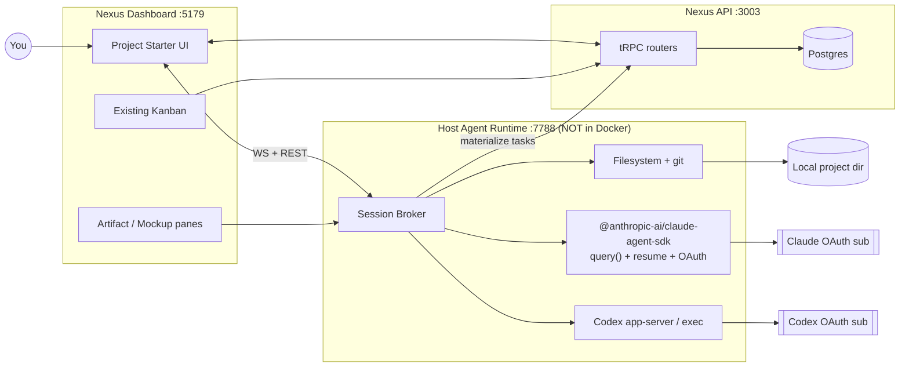
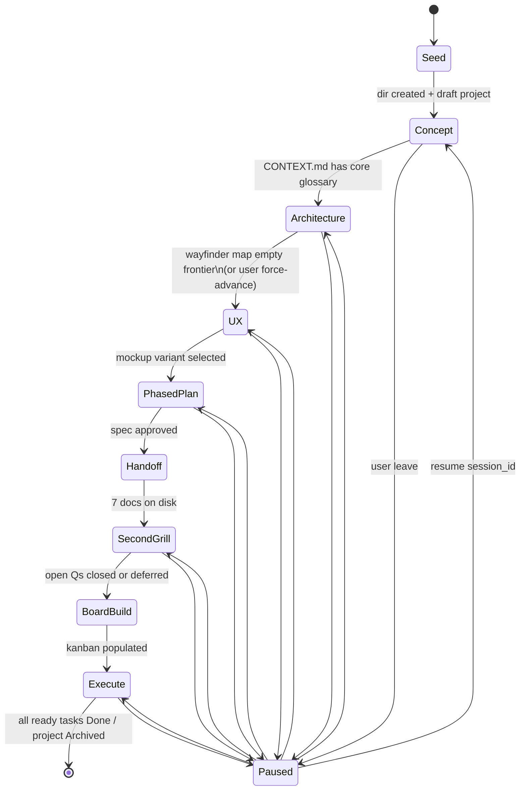
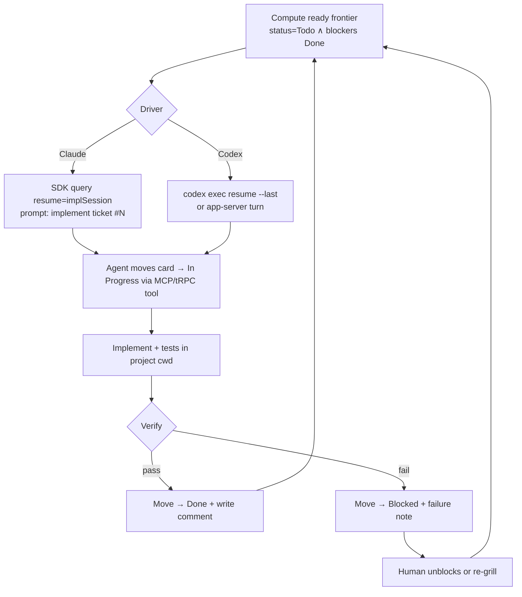

# FEAT-003 — Project Starter (Idea → Wayfind → Grill → Handoff → Kanban → Code)

**Status:** design / multi-plan (no implementation yet)  
**Owner surface:** Nexus dashboard (`apps/dashboard`) + host-side Agent Runtime  
**Drivers:** Claude Code (OAuth sub) + Codex CLI (OAuth sub) — **no API keys**  
**Skill spine:** Matt Pocock [`wayfinder`](https://github.com/mattpocock/skills/blob/main/skills/engineering/wayfinder/SKILL.md) + [`grill-with-docs`](https://github.com/mattpocock/skills/blob/main/skills/engineering/grill-with-docs/SKILL.md) (+ `prototype`, `to-spec`, `to-tickets`, `implement`)  
**Related local skills:** `AI Agent:Skills Catalog/{grill-me-with-docs,grill-me-chat,handoff-chat,project-creation-chat-instructions}`

---

## 1. Problem

Starting a greenfield project today is a pile of disconnected chats:

1. You brainstorm an idea in a terminal.
2. You (maybe) run `/grill-me` or `/wayfinder` by hand.
3. Handoff docs scatter across folders.
4. You manually create a Nexus project + kanban cards.
5. A coding agent starts cold, re-asks everything, and drifts.

You want Nexus to be the **guided factory**:

> idea → concept lock → architecture → UX mockups → phased plan → handoff pack → second grill (coding agent) → kanban ops board → Claude/Codex execute against the board

…with results rendered **natively in the dashboard**, not only as a scrolling TTY. Claude/Codex must drive via **existing OAuth subscriptions**, minimizing one-shot `claude -p` tax and never requiring API keys.

---

## 2. Product promise (one sentence)

**Project Starter** is a multi-phase, visual workshop inside Nexus that runs Matt Pocock’s idea→ship skill chain through a host-side agent runtime (Claude Agent SDK + Codex app-server), writes a local project directory + handoff pack, materializes a Nexus project + kanban board as the single ops surface, then hands the board to Claude or Codex to implement.

---

## 3. End-to-end journey (canonical)

```text
┌──────────┐   ┌─────────────┐   ┌──────────────┐   ┌────────────┐   ┌─────────────┐
│ 0. Seed  │──▶│ 1. Concept  │──▶│ 2. Arch lock │──▶│ 3. UX +    │──▶│ 4. Phased   │
│ idea +   │   │ grill-with- │   │ wayfinder    │   │ mockups    │   │ plan        │
│ directory│   │ docs        │   │ map+tickets  │   │ /prototype │   │ /to-spec    │
└──────────┘   └─────────────┘   └──────────────┘   └────────────┘   └──────┬──────┘
                                                                             │
     ┌───────────────────────────────────────────────────────────────────────┘
     ▼
┌──────────────┐   ┌────────────────┐   ┌──────────────────┐   ┌────────────────────┐
│ 5. Handoff   │──▶│ 6. Coding-agent│──▶│ 7. Impl plan +   │──▶│ 8. Run board       │
│ pack on disk │   │ second grill   │   │ /to-tickets →    │   │ Claude|Codex pull  │
│ + Nexus proj │   │ (open Qs only) │   │ kanban materialize│   │ tasks, update board│
└──────────────┘   └────────────────┘   └──────────────────┘   └────────────────────┘
```

### Phase contracts

| # | Phase | Skill(s) | Human role | Agent role | Artifacts written |
|---|---|---|---|---|---|
| 0 | **Seed** | — (deterministic UI) | Name, one-liner idea, parent dir, driver preference | Validate path, scaffold empty dir + git | `<dir>/`, `.nexus-starter.json`, Nexus `projects` row (draft) |
| 1 | **Concept lock** | `grill-with-docs` (+ domain-modeling) | Answer one Q at a time | Interview; update `CONTEXT.md` + ADRs live | `CONTEXT.md`, `docs/adr/*`, concept card in UI |
| 2 | **Architecture** | `wayfinder` (chart + work) | Resolve HITL tickets (grilling/prototype) | Chart map, AFK research, claim/resolve tickets | `.scratch/starter/map.md`, decision tickets, Decisions-so-far |
| 3 | **UX design** | `prototype` (UI branch) | Pick variants, annotate | Generate 3–5 mockup variants + flows | `docs/ux/*`, mockup gallery, selected variant ADR |
| 4 | **Phased plan** | `to-spec` | Approve seams + stories | Synthesize PRD/spec from prior phases | `docs/spec.md` (or `.scratch/*/spec.md`) |
| 5 | **Handoff** | `handoff` (catalog) | Confirm ready | Emit 7 docs; no invention | `PRD.md`, `user-stories.md`, `tech-spec.md`, `plan.md`, `CLAUDE.md`, `handoff.md`, `README.md` |
| 6 | **Second grill** | `grill-with-docs` (coding agent persona) | Answer remaining open Qs only | Read handoff, grill **only** `handoff.md` open questions + contradictions | Updated ADRs/CONTEXT, closed open-Qs list |
| 7 | **Impl plan → board** | `to-tickets` | Approve slice granularity | Vertical-slice tickets + blockers → Nexus tasks | Nexus statuses + tasks on project kanban, `.scratch/*/issues/*` mirror |
| 8 | **Execute** | `implement` (+ tdd, code-review) | Watch board, unblock HITL | Pull ready frontier task, implement, move card, PR/commit | Code in `<dir>`, board progress, session logs |

**Hard rule (from wayfinder):** produce **decisions, not deliverables** until phase 8. The pull to code early is the signal the map is done — not a cue to skip phases.

---

## 4. Flowcharts

### 4.1 System context



### 4.2 Phase state machine



### 4.3 Single long-lived agent turn (minimize `-p`)

```mermaid
sequenceDiagram
  participant UI as Starter UI
  participant RT as Host Runtime
  participant SDK as Claude Agent SDK
  participant CLI as claude binary (OAuth)
  participant Disk as Project dir

  UI->>RT: WS startPhase(concept, {cwd, skills})
  RT->>SDK: query({ prompt: /grill-with-docs, options:{cwd, resume?} })
  SDK->>CLI: spawn once (uses keychain OAuth)
  CLI-->>SDK: stream assistant + tool_use
  SDK-->>RT: SDKMessage frames
  RT-->>UI: typed events (question, doc_write, thinking)
  UI-->>UI: render QuestionCard + live CONTEXT.md diff
  User->>UI: answer
  UI->>RT: WS userMessage(text)
  RT->>SDK: push into same session (no new -p)
  Note over SDK,CLI: ONE process per phase;\nresume session_id across reloads
  CLI->>Disk: write CONTEXT.md / ADR
  Disk-->>RT: fs watch
  RT-->>UI: artifact_updated
```

### 4.4 Execute loop (kanban as ops board)



---

## 5. UI layout & mockups

Full interactive HTML mockups:  
[`project-starter/mockups.html`](./project-starter/mockups.html) (open in browser).

### 5.1 Information architecture

```
/team/[team]/projects                          ← existing grid; new CTA "Start from idea"
/team/[team]/starter                           ← workshop home (list in-flight starters)
/team/[team]/starter/[id]                      ← active workshop shell
/team/[team]/starter/[id]/concept
/team/[team]/starter/[id]/architecture        ← wayfinder map viz
/team/[team]/starter/[id]/ux
/team/[team]/starter/[id]/plan
/team/[team]/starter/[id]/handoff
/team/[team]/starter/[id]/grill-2
/team/[team]/projects/[projectId]/board        ← existing kanban (execute home)
```

### 5.2 Workshop shell (all phases)

```
┌─ Nexus ──────────────────────────────── Sidebar ┬──────────────────────────────────────────┐
│ Projects > Starter > acme-ops                   │ Phase rail (horizontal)                  │
│                                                 │ ○ Seed ● Concept ○ Arch ○ UX ○ Plan …    │
├──────────────────────────┬──────────────────────┴──────────────────────────────────────────┤
│                          │                                                                  │
│  LEFT: Dialogue          │  RIGHT: Living artifacts                                         │
│  ────────────────────    │  ┌ tabs: CONTEXT | ADRs | Map | Mockups | Spec | Handoff ┐     │
│  Agent question card     │  │                                                       │     │
│  (one at a time)         │  │  markdown preview / mermaid / mockup iframe           │     │
│                          │  │  + diff pulse when agent writes disk                  │     │
│  [Recommended: …]        │  │                                                       │     │
│                          │  └───────────────────────────────────────────────────────┘     │
│  Your answer             │                                                                  │
│  ┌────────────────────┐  │  BOTTOM-RIGHT: session strip                                     │
│  │                    │  │  driver: Claude · session abc123 · tokens · Resume               │
│  └────────────────────┘  │                                                                  │
│  [Send]  [Accept rec]    │  [◀ Back]                    [Advance phase ▶]                   │
└──────────────────────────┴──────────────────────────────────────────────────────────────────┘
```

### 5.3 Seed phase

- Big idea textarea (“What are we building?”)
- Project name → kebab slug
- **Directory picker** (host runtime lists `~/code`, `~/Projects`, …; user confirms absolute path)
- Driver default: Claude (discovery) / Codex (execute) — editable per phase
- Stack hints optional (blank = grilled later)
- Primary CTA: **Create workspace & begin concept lock**

### 5.4 Concept phase (grill-with-docs)

- Question stack: current Q, recommended answer chip, freeform reply
- Right pane auto-opens `CONTEXT.md`; glossary terms highlight as they’re locked
- ADR toast: “Hard-to-reverse decision detected — draft ADR?” → Accept / Skip
- Progress: “Branches resolved 6/N · open contradictions 1”

### 5.5 Architecture phase (wayfinder map)

Reuse the spirit of Dimon94’s map-dashboard + Linear:

```
┌ Destination ─────────────────────────────────────────────────────────────┐
│ “Ship a local ops dashboard that turns ideas into kanban-driven builds”  │
├─ Frontier (ready) ──────────┬─ Blocked ─────────────┬─ Fog ──────────────┤
│ ● Pick monorepo shape       │ ○ Auth model          │ ~ billing later    │
│ ● Research: Claude SDK auth │   (blocked by monorepo)│ ~ multi-tenant     │
├─ Decisions so far ──────────┴───────────────────────┴────────────────────┤
│ ✓ Local markdown tracker — gist…                                         │
│ ✓ Host runtime outside Docker — gist…                                    │
└─ [Claim next] [Open grilling] [Run AFK research batch] ──────────────────┘
```

Graph view (optional toggle): DAG of tickets with blocking edges (react-flow or mermaid).

### 5.6 UX phase

- Gallery of 3–5 prototype variants (iframe or static HTML from `/prototype`)
- Side-by-side compare, annotation pins
- “Select variant B” → writes ADR + locks design tokens note

### 5.7 Handoff phase

- Checklist of 7 docs with completeness meters (handoff skill hard rules)
- Red flags if `handoff.md` can’t be populated → block generate, return to grill
- CTA: **Seal handoff & start coding-agent grill**

### 5.8 Execute (kanban)

Existing Nexus kanban columns, augmented:

| Column | Meaning in Starter mode |
|---|---|
| Backlog | Not yet unblocked |
| Todo | Ready frontier |
| In Progress | Claimed by driver session |
| In Review | Waiting code-review skill / human |
| Blocked | Needs human / re-grill |
| Done | Verified |

Task card extras: driver badge (Claude/Codex), session link, verification criteria from ticket, “Open agent log”.

---

## 6. Agent runtime — the hard part (OAuth, minimize `-p`)

### 6.1 Constraint summary

| Constraint | Implication |
|---|---|
| No API keys; Claude + Codex OAuth only | Runtime **must run on the host** (keychain / `~/.claude` / `~/.codex`), not inside the API container |
| Minimize `claude -p` | Prefer **one long-lived session per phase** with multi-turn input, not one process per question |
| Native UI, not just TTY | Parse structured agent events → React components; optional raw log drawer |
| Docker dashboard still useful | Dashboard talks to host runtime via `host.docker.internal:7788` or dashboard-on-host dev mode |

### 6.2 Primary mechanism: Claude Agent SDK (recommended)

Package: [`@anthropic-ai/claude-agent-sdk`](https://www.npmjs.com/package/@anthropic-ai/claude-agent-sdk) (v0.3.x).

```ts
import { query } from "@anthropic-ai/claude-agent-sdk";

// ONE session for the whole Concept phase
const q = query({
  prompt: {
    type: "asyncIterable", // push user answers over time
    stream: userAnswerStream,
  },
  options: {
    cwd: projectDir,
    // OAuth from local CLI login — tokenSource: 'oauth'
    permissionMode: "acceptEdits", // or bridge prompts to UI
    allowedTools: ["Read", "Write", "Edit", "Glob", "Grep", "Skill"],
    // Preload Matt Pocock skills from project .claude/skills
    // resume: priorSessionId across page reload
  },
});

for await (const msg of q) {
  // map SDKMessage → WS events for the dashboard
}
```

**Why this beats raw `-p` loops**

- Programmatic multi-turn without shelling a new process each answer  
- `resume` / `forkSession` / `getSessionMessages` for reload-safe workshops  
- `listSessions` for the Starter home screen  
- Skills load from the project’s `.claude/skills` (we vendor wayfinder + grill-with-docs into the new dir at Seed)  
- Still uses the **same OAuth subscription** as interactive `claude`  
- Permission prompts can be forwarded to the dashboard (`canUseTool` / control messages) instead of blocking a hidden TTY

Raw CLI equivalent (fallback if SDK gaps appear):

```bash
claude -p --output-format stream-json --input-format stream-json \
  --replay-user-messages --include-partial-messages \
  --cwd "$PROJECT_DIR"
# keep stdin open; write user turns as stream-json messages
```

Still **one** `-p` process per phase — not per question.

### 6.3 Codex path (OAuth, no key)

| Mode | Use |
|---|---|
| `codex app-server --listen ws://127.0.0.1:7790` | Long-lived WS protocol for Execute phase + AFK lanes |
| `codex exec resume --last` | Continue implementation session |
| `codex mcp-server` | Optional: expose Codex as MCP tool **to** Claude during dual-driver runs |

Role split (default policy):

- **Claude** — Concept, Architecture HITL, UX critique, Second grill, code-review  
- **Codex** — AFK research batches, Execute lane implementation  

User can override per phase in Seed settings.

### 6.4 Host runtime shape (`nexus-agent-runtime`)

New small Bun/Node package (repo root or `app/packages/agent-runtime`):

```
agent-runtime/
  src/
    server.ts          # WS + HTTP on 127.0.0.1:7788
    sessions/
      claude.ts        # SDK wrapper
      codex.ts         # app-server client
    fs/
      scaffold.ts      # mkdir, git init, skill vendor
      watch.ts         # chokidar → artifact_updated events
    nexus/
      materialize.ts   # call API to create project/tasks
    protocol.ts        # zod event schema shared with dashboard
  bin/nexus-runtime
```

**Security**

- Bind `127.0.0.1` only  
- Dashboard presents a runtime pairing token (file `~/.nexus/runtime.token`)  
- Path allowlist: user-confirmed roots only  
- Never relay raw keychain secrets to the browser  

**Docker note:** API container does **not** spawn Claude. Only the host runtime does. Compose adds no new privileged mounts beyond what Seed already needs for path browse (optional: none — runtime stays host-native, dashboard reaches it via browser→localhost).

> Important: if the dashboard runs **inside** Docker, browser WS to `localhost:7788` still works (browser is on host). Server-side calls from API→runtime should use `host.docker.internal`. Prefer **browser→runtime** for agent streams to avoid extra hops.

### 6.5 Creative alternatives considered

| Idea | Pros | Cons | Verdict |
|---|---|---|---|
| **A. Host Runtime + Claude Agent SDK + Codex app-server** | OAuth native, multi-turn, structured events, resume | New daemon to install/run | **Recommended** |
| **B. node-pty + xterm.js embed** | Faithful CLI, zero protocol work | Not “native” UI; hard to extract Q/A; brittle | Escape hatch only (“Terminal drawer”) |
| **C. One `claude -p` per question** | Simple | Worst OAuth/rate/latency; no memory without manual resume | Reject |
| **D. API keys in `.env` via AI SDK** | Fits existing `apps/api` chat | Violates “no API keys” | Reject for Starter |
| **E. Orca worktrees + orca-cli spawn** | Great isolation for Execute lanes | Heavier UX; discovery phases awkward | Optional Execute backend later |
| **F. Codex as only driver** | One stack | Weaker HITL grilling UX today | Secondary |
| **G. `claude` remote-control / bridge export** | Cloud UI pairing | Extra moving parts; not local-first | Out of scope v1 |

---

## 7. Three full plans (pick one)

### Plan A — “Workshop Native” (recommended)

**Thesis:** Build the Starter as a first-class Nexus workshop UI; agents are invisible infrastructure behind a host runtime.

| Slice | Deliverable |
|---|---|
| A0 | Host runtime MVP: health, path browse, scaffold dir, Claude SDK single session echo |
| A1 | Seed UI + draft Nexus project + skill vendoring (mattpocock skills subset + handoff) |
| A2 | Concept phase UI + grill-with-docs session + CONTEXT/ADR live preview |
| A3 | Wayfinder map UI + local markdown tracker + research AFK batch |
| A4 | UX prototype gallery phase |
| A5 | to-spec + handoff generation with hard-rule gates |
| A6 | Second grill phase (coding-agent system prompt) |
| A7 | to-tickets → Nexus kanban materialize (statuses, tasks, blockers as deps) |
| A8 | Execute driver (Claude and/or Codex) pulling Todo cards via tools |
| A9 | Polish: resume, pairing, session strip, failure UX |

**Effort:** L–XL (multi-week)  
**Risk:** Medium (SDK + UX)  
**OAuth fit:** Excellent  
**Minimize `-p`:** Excellent (1 session/phase)

---

### Plan B — “Thin Shell + Skill Orchestra” (fastest path to value)

**Thesis:** Don’t build a rich workshop first. Build a **runbook UI** that launches scripted skill phases in the host runtime and streams a structured log + artifact list. Kanban materialize still happens at the end.

```text
UI = phase checklist + log + artifact links
Brain = shell scripts invoking skills via SDK with fixed prompts
```

| Slice | Deliverable |
|---|---|
| B0 | Runtime + `starter run --phase concept` CLI |
| B1 | Dashboard page that tails runtime events |
| B2 | Scripted chain: seed→grill→wayfind→spec→handoff→tickets |
| B3 | Import `.scratch/*/issues` → Nexus tasks |
| B4 | Execute: `starter exec --driver codex` loops ready tasks |

**Effort:** M  
**Risk:** Low–Medium  
**UX:** Functional, not delightful  
**Upgrade path:** Each phase script becomes a Plan A panel later  

**Best if:** you want to dogfood the skill chain this week.

---

### Plan C — “Dual-Lane Factory” (max autonomy)

**Thesis:** After handoff, split Execute into parallel Codex lanes (worktrees) coordinated by a Claude conductor — inspired by [Dimon94/wayfinder-implement-orchestrator](https://github.com/Dimon94/wayfinder-implement-orchestrator).

| Slice | Deliverable |
|---|---|
| C0 | Plan A through Handoff (or Plan B chain) |
| C1 | Conductor session owns map frontier |
| C2 | Per-lane git worktrees + Codex exec |
| C3 | Live map dashboard (DAG + swimlanes) inside Nexus |
| C4 | Integration ticket + human review gate |

**Effort:** XL  
**Risk:** High (merge conflicts, runaway cost on OAuth rate limits)  
**When:** After Plan A Execute works single-lane  

---

### Plan comparison

| Criterion | A Workshop Native | B Thin Shell | C Dual-Lane |
|---|---|---|---|
| Time to first sealed handoff | Medium | **Fast** | Slow |
| Visual walkthrough quality | **High** | Low | High (later) |
| OAuth / no-key | **Yes** | **Yes** | **Yes** |
| Minimize agent process thrash | **Yes** | Medium | Medium |
| Kanban-as-ops-board | **Yes** | Yes | Yes + lanes |
| Fits Nexus design language | **Yes** | Weak | Yes |
| Dogfood Matt Pocock chain faithfully | **Yes** | Yes | Yes + orchestrator |
| Recommended default | **✅** | MVP wedge | Phase-2 autonomy |

**Suggested sequencing:** ship **B0–B3 in a spike week** to validate OAuth sessions + skill fidelity, then build **A** UI on the same runtime protocol, keep **C** as a future Execute mode flag.

---

## 8. Data model (Nexus)

Additive tables (draft):

```sql
project_starters (
  id text pk,
  team_id text not null,
  project_id text null,              -- set once Nexus project created
  name text not null,
  slug text not null,
  idea text not null,
  root_path text not null,           -- absolute host path
  phase text not null,               -- seed|concept|architecture|ux|plan|handoff|grill2|board|execute|done
  driver_discovery text default 'claude',
  driver_execute text default 'codex',
  claude_session_id text null,
  codex_session_id text null,
  runtime_state jsonb default {},    -- map path, fog, counters
  created_by text not null,
  created_at, updated_at
)

project_starter_events (
  id text pk,
  starter_id text not null,
  phase text not null,
  kind text not null,                -- question|answer|artifact|decision|error|status
  payload jsonb not null,
  created_at
)

project_starter_artifacts (
  id text pk,
  starter_id text not null,
  kind text not null,                -- context|adr|map|ticket|mockup|spec|handoff_doc
  relative_path text not null,
  title text,
  meta jsonb,
  updated_at
)

-- task linkage for execute
tasks.starter_ticket_key text null   -- e.g. "07-auth-model" mirroring .scratch issue
tasks.driver text null               -- claude|codex
tasks.agent_session_id text null
```

Disk remains source of truth for docs (same philosophy as Knowledge vault + Skill library). DB indexes for UI + board.

### Seed filesystem layout

```text
/<parent>/<slug>/
  .git/
  .nexus-starter.json          # { starterId, phase, sessions }
  .claude/
    skills/                    # vendored: wayfinder, grill-with-docs, prototype, to-spec, to-tickets, implement, ...
    CLAUDE.md                  # grows over phases; sealed at handoff
  .scratch/
    starter/
      map.md
      issues/01-....md
      spec.md
  CONTEXT.md
  docs/adr/
  docs/ux/
  README.md                    # appears at handoff
  PRD.md
  ...
```

Local markdown tracker matches Matt’s `issue-tracker-local.md` so skills run unchanged. At BoardBuild, runtime translates issues → Nexus tasks (and keeps a bidirectional key).

---

## 9. Protocol (dashboard ↔ runtime)

Zod-typed WS messages (sketch):

```ts
// client → runtime
type ClientMsg =
  | { type: "pair"; token: string }
  | { type: "browse"; path: string }
  | { type: "scaffold"; name: string; parent: string; idea: string }
  | { type: "start_phase"; starterId: string; phase: Phase; driver: "claude"|"codex" }
  | { type: "user_message"; starterId: string; text: string }
  | { type: "permission_response"; requestId: string; allow: boolean }
  | { type: "advance_phase"; starterId: string }
  | { type: "materialize_board"; starterId: string }
  | { type: "exec_loop_start"|"exec_loop_stop"; starterId: string };

// runtime → client
type ServerMsg =
  | { type: "ready"; version: string }
  | { type: "session"; sessionId: string; driver: string }
  | { type: "assistant_delta"; text: string }
  | { type: "question"; id: string; prompt: string; recommended?: string }
  | { type: "artifact_upsert"; path: string; kind: string }
  | { type: "decision"; title: string; gist: string }
  | { type: "permission_request"; requestId: string; tool: string; input: unknown }
  | { type: "phase_gate"; canAdvance: boolean; reasons: string[] }
  | { type: "task_event"; taskId: string; status: string }
  | { type: "error"; message: string; recoverable: boolean };
```

Dashboard renders **question** events as cards (native), **assistant_delta** into a collapsible “reasoning” stream, **artifact_upsert** into the right pane via runtime static file read or `read_artifact` RPC.

---

## 10. Skill packaging

At Seed, vendor (copy or submodule pin) from `mattpocock/skills`:

- `engineering/wayfinder`
- `engineering/grill-with-docs` (+ grilling, domain-modeling)
- `engineering/prototype`
- `engineering/to-spec`
- `engineering/to-tickets`
- `engineering/implement`
- `engineering/research`
- `engineering/code-review`
- `engineering/setup-matt-pocock-skills` **pre-answered** with **local markdown** tracker

Plus catalog:

- `handoff` (from Skills Catalog `handoff-chat.md` → proper `SKILL.md`)
- optional `project-creation` system preamble

Pin version in `.nexus-starter.json` → `skillsPin: "mattpocock/skills@<sha>"` for reproducibility.

---

## 11. Handoff → second grill → board (detail)

```text
Handoff skill writes 7 docs
        │
        ▼
Coding-agent grill system prompt:
  "You are the implementing agent. Read README→handoff.md.
   ONLY ask about open questions, contradictions, and missing
   verification criteria. One question at a time. Update docs inline.
   Do not redesign settled decisions unless contradictory."
        │
        ▼
Gate: openQuestions.count == 0 OR all marked deferred-with-owner
        │
        ▼
to-tickets → approve slices with user
        │
        ▼
materialize:
  ensure project statuses
  create task per issue (title, description=body, verification block)
  encode Blocked-by as task relations / blocked status
  put unblocked in Todo, blocked in Backlog
        │
        ▼
User hits Start execution
  driver loops ready frontier until empty or stop
```

---

## 12. Verification strategy (when building)

| Layer | Gate |
|---|---|
| Runtime unit | scaffold path safety, protocol zod, session resume mock |
| Skill fidelity | fixture idea (“todo cli”) produces CONTEXT + ≥1 ADR + map |
| UI | RTL: question card submit, phase gate disabled when incomplete |
| E2E (host) | OAuth present → full concept phase 3 questions → files on disk |
| Board | N issues → N tasks, blocker topology preserved |
| Execute dry-run | driver claims 1 task, moves columns, no code required (mock tool) |

---

## 13. Risks & mitigations

| Risk | Mitigation |
|---|---|
| OAuth rate limits / weekly caps | Phase sessions > chatty `-p`; cache research; allow pause |
| SDK behavior drift | Pin SDK + skills SHA; runtime compatibility test |
| Agent codes during wayfind | System prompt + tool deny (`Bash` limited) until Execute |
| Docker/host split confuses paths | Only host runtime touches disk; UI shows host paths only |
| Handoff invents details | Enforce handoff skill hard stop; gate on open Qs |
| Kanban topology loss | Store `Blocked by` on task meta; visual dependency drawer |
| User abandons mid-grill | resume session_id + event log replay |

---

## 14. Implementation roadmap (if Plan A after B spike)

**Week 0 — Spike (Plan B core)**  
Runtime health, Claude SDK OAuth session, scaffold, stream 1 grill question to a stub HTML page.

**Week 1 — Seed + Concept**  
Dashboard routes, pairing, CONTEXT live preview.

**Week 2 — Wayfinder map**  
Local tracker + map UI + research batch.

**Week 3 — UX + Spec + Handoff**  
Prototype gallery, to-spec, handoff gates.

**Week 4 — Second grill + Board + Execute single-lane**  
Materialize kanban, Claude/Codex exec loop, dogfood Starter **on itself** (meta).

---

## 15. Open decisions for you

1. **Default plan:** A, B→A, or straight C?  
2. **Default execute driver:** Codex, Claude, or ask every project?  
3. **Directory roots allowlist:** e.g. only `~/code` + `~/Projects`?  
4. **Tracker:** local markdown only (v1), or also GitHub issues for wayfinder maps?  
5. **Should Starter create the Nexus project at Seed or only at Handoff?** (rec: draft at Seed, full at BoardBuild)  
6. **Meta:** build Starter inside this repo as FEAT-003, or is Starter itself the first project born from a manual run of the skill chain?

---

## 16. What “done” looks like (acceptance sketch)

Given OAuth-logged `claude` and `codex` on the host and the runtime running,

1. From Projects, **Start from idea** → enter idea + pick `~/code/acme`  
2. Complete Concept with ≥5 locked glossary terms visible in UI and on disk  
3. Architecture map shows ≥3 resolved decisions and empty or acknowledged fog  
4. Select a UX mockup variant  
5. Seal handoff → 7 docs present, `handoff.md` lists zero unacknowledged open Qs after second grill  
6. Board shows vertical-slice tasks; blockers respected  
7. Start execution → driver moves a task In Progress → Done with verification note  
8. Reload mid-phase → session resumes without re-asking settled questions  

---

## 17. References

- Matt Pocock skills: https://github.com/mattpocock/skills  
- Wayfinder skill: `skills/engineering/wayfinder/SKILL.md`  
- Grill-with-docs: `skills/engineering/grill-with-docs/SKILL.md`  
- Local tracker: `setup-matt-pocock-skills/issue-tracker-local.md`  
- Implement orchestrator (lane ideas): https://github.com/Dimon94/wayfinder-implement-orchestrator  
- Claude Agent SDK: `@anthropic-ai/claude-agent-sdk`  
- Codex: `codex app-server`, `codex exec`, `codex mcp-server`  
- Local catalog: `AI Agent:Skills Catalog/{grill-me-with-docs,handoff-chat,project-creation-chat-instructions}`  
- Nexus existing surfaces: projects grid, kanban (`components/tasks-view/kanban`), chat AI, knowledge vault path patterns  

---

## 18. Appendix — ASCII full-feature flow (print-friendly)

```
YOU                     NEXUS UI                    HOST RUNTIME                 DISK / BOARD
 │                         │                             │                          │
 │ Start from idea         │                             │                          │
 │────────────────────────▶│ scaffold + pair             │                          │
 │                         │────────────────────────────▶│ mkdir, git, vendor skills│
 │                         │                             │─────────────────────────▶│
 │                         │                             │                          │
 │◀── question cards ──────│◀── SDK grill session ───────│                          │
 │ answers ───────────────▶│────────────────────────────▶│ write CONTEXT/ADRs ─────▶│
 │                         │                             │                          │
 │ wayfind HITL            │ map UI                      │ claim/resolve tickets ──▶│
 │ mockup pick             │ gallery                     │ /prototype HTML ────────▶│
 │ approve spec            │                             │ /to-spec /handoff ──────▶│
 │ second grill answers    │                             │ close open Qs ──────────▶│
 │ approve tickets         │                             │ /to-tickets              │
 │                         │ materialize board ─────────▶│ tRPC create tasks ──────▶│ KANBAN
 │ Start execution         │                             │                          │
 │                         │ exec loop ─────────────────▶│ Claude/Codex implement ─▶│ code+cards
 │ watch progress          │◀── task_event ──────────────│                          │
```
